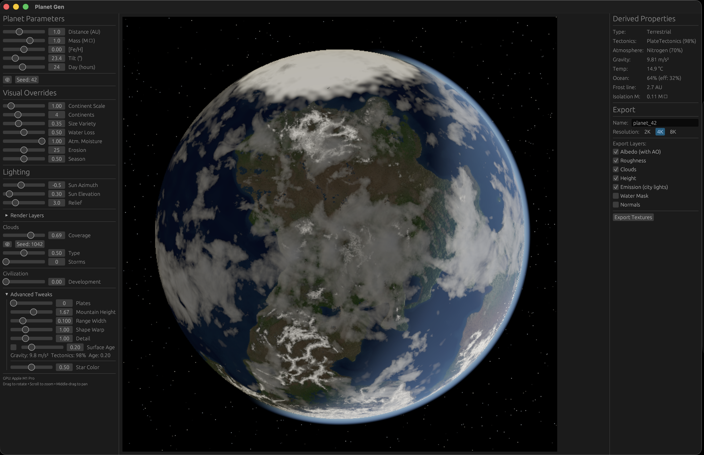
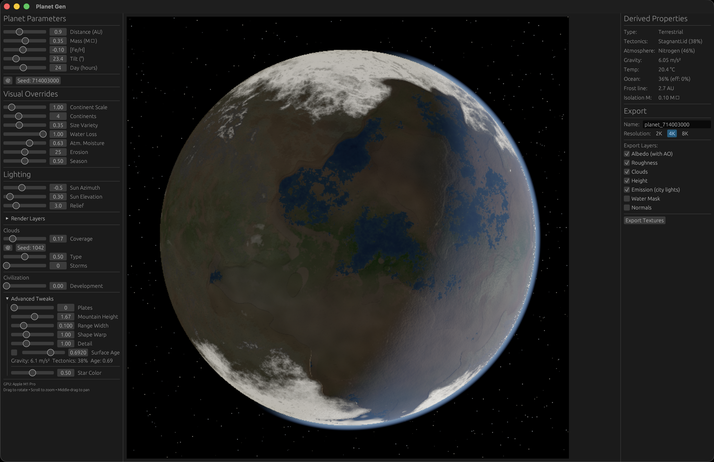

# Planet Gen

GPU-accelerated procedural planet generator for VFX. Produces physically plausible rocky planets with plate tectonics, terrain, biomes, climate, clouds, and oceans from a handful of input parameters.

Built with Rust, wgpu (WebGPU), and egui.

<p align="center">
  
</p>
<p align="center">
  
</p>

## Quick Start

```
cargo run --bin planet-gen
```

Requires a GPU with Vulkan, Metal, or DX12 support (most GPUs from 2018+).

## Features

- **Plate-driven continents** — Voronoi plate assignment on sphere, plate type controls land/ocean elevation with smooth boundary blending
- **Continent controls** — sliders for number of continents (1-10), size variety (equal to supercontinent), and continental scale (noise frequency)
- **Whittaker biome system** — temperature x moisture lookup with altitude zonation (forest, alpine, rock, snow)
- **Hadley cell climate** — latitude-driven temperature, wind-terrain rain shadows, continentality effects
- **Cloud layers** — stratus/cumulus blend, orographic lift, cyclone storm systems with spiral arms
- **Atmosphere** — Mie scattering haze, star color temperature tinting
- **Night lights** — procedural city lights with cloud occlusion and scattered glow
- **GPU-rendered preview** — real-time cubemap-sampled sphere with diffuse + specular lighting, AO, normal mapping
- **Progressive erosion** — GPU hydraulic erosion with moisture-weighted intensity
- **Selective EXR export** — height, albedo, normal, roughness, AO, water mask at up to 8K resolution

## Usage

The app opens with a sidebar of planet parameters and a 3D preview.

**Physics Parameters:**
- **Distance (AU)** — Distance from star. Affects planet type and temperature.
- **Mass (M_Earth)** — Planet mass. Affects gravity, tectonics, terrain roughness.
- **[Fe/H]** — Stellar metallicity. Shifts the frost line.
- **Tilt** — Axial tilt (0-90 deg). Affects seasonal variation and biome bands.
- **Day (hours)** — Rotation period. Affects wind patterns and terrain lacunarity.
- **Seed** — Random seed for all procedural generation.

**Continent Controls:**
- **Continents (1-10)** — Number of distinct landmasses. Directly sets continental plate count.
- **Size Variety (0-1)** — Continent size distribution. 0 = equal sizes, 1 = supercontinent + islands.
- **Continental Scale (0.5-4)** — Controls noise frequency for continent shape. Lower = bigger features.

**Visual Overrides:**
- **Mountain scale / Detail** — Terrain feature amplitude
- **Water Loss** — Sea level control (0 = ocean world, 1 = desert world)
- **Cloud coverage / type / storms** — Atmosphere visuals
- **Season** — Winter/equinox/summer for biome and cloud response
- **Star color** — Blue O-star to red M-dwarf, tints all lighting

**Preview:** Drag to rotate, scroll to zoom, middle-click to pan. View modes: Normal, Heightmap, Biome, Climate, Plates.

**Export:** Select layers via checkboxes (height, albedo, normals, roughness, water mask), choose resolution, and export as equirectangular EXR files.

## Architecture

```
User Parameters
     |
     v
PlanetParams --> DerivedProperties (physics model)
     |                    |
     v                    v
generate_plates()    PreviewUniforms
     |                    |
     v                    v
TerrainComputePipeline   preview_cubemap.wgsl
  (plates.wgsl)          (fragment shader)
     |                        |
     v                        v
 TectonicTerrain         Lit sphere with
  (6-face cubemap)       biomes, clouds,
     |                   atmosphere, cities
     v
 ErosionPipeline
  (erosion.wgsl)
     |
     v
  EXR Export
```

**Terrain pipeline:** Plate centers (Fibonacci sphere) are uploaded to GPU. The `plates.wgsl` compute shader assigns each pixel to the nearest plate via Voronoi, then generates heightmap from plate type elevation + noise detail + mountain ridges + ocean floor variation.

**Preview pipeline:** Fragment shader samples the height cubemap, computes temperature/moisture/biomes per pixel, applies Whittaker lookup, renders with lighting, clouds, atmosphere, and night lights.

## Project Structure

```
src/
  main.rs             -- App entry point
  app.rs              -- egui UI, parameter sliders, pipeline orchestration
  gpu.rs              -- wgpu device singleton
  planet.rs           -- Planet physics model and derived properties
  plates.rs           -- CPU plate generation (Fibonacci sphere, Voronoi, clustering)
  terrain_compute.rs  -- GPU terrain compute pipeline + erosion pipeline
  preview.rs          -- Preview renderer (cubemap upload, render-to-texture)
  export.rs           -- Tiled equirectangular EXR export with selective layers
  cube_sphere.rs      -- Cube-to-sphere coordinate mapping
  noise.rs            -- GPU noise test harness
  shaders/
    plates.wgsl           -- Terrain compute: plate assignment + terrain generation
    preview_cubemap.wgsl  -- Preview fragment: biomes, climate, clouds, atmosphere
    erosion.wgsl          -- Hydraulic erosion simulation
    normal_map.wgsl       -- Normal map from heightmap (export)
    albedo_map.wgsl       -- Albedo map with biome colors (export)
    roughness_map.wgsl    -- Roughness map (export)
    ao_map.wgsl           -- Ambient occlusion map (export)
    noise.wgsl            -- 3D simplex noise
    cube_sphere.wgsl      -- Cube-to-sphere mapping
```

## Roadmap

See [Plans.md](Plans.md) for the full implementation plan.

- [x] Phase 1-3: Scaffold, cube-sphere, planet physics
- [x] Phase 4: Biomes, climate, atmosphere, craters
- [x] Phase 5.1-5.12: Export, clouds, cities, visual polish, GPU plate terrain
- [x] Phase 5.13: Wire continent controls to terrain pipeline
- [ ] Phase 7: Blender importer addon
- [ ] Phase 8: Advanced visual features (lava, rings, ocean glint)
- [ ] Phase 9: Advanced tectonics (plate motion simulation)
- [ ] Phase 10: Polish & distribution

## License

MIT
