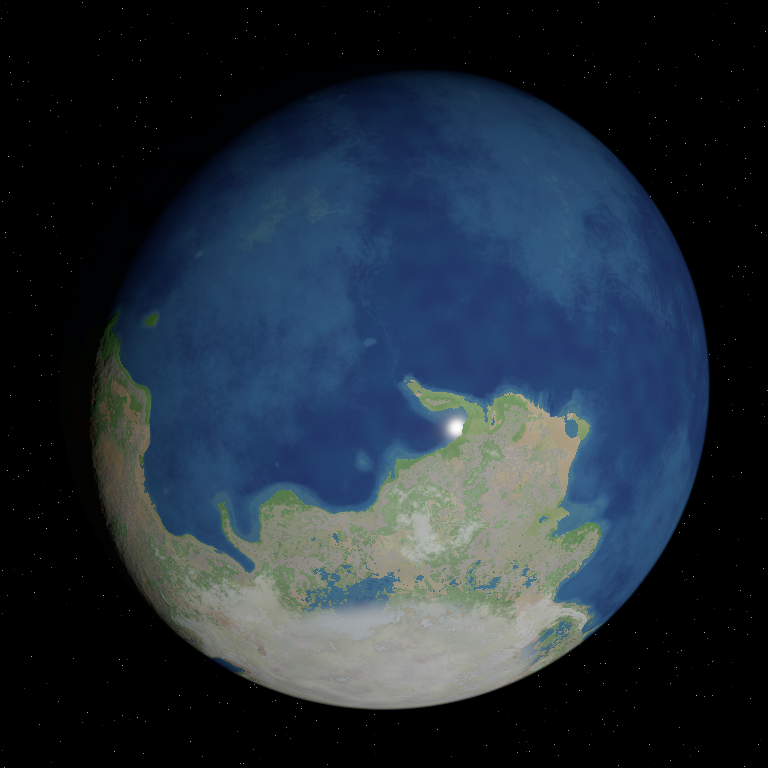
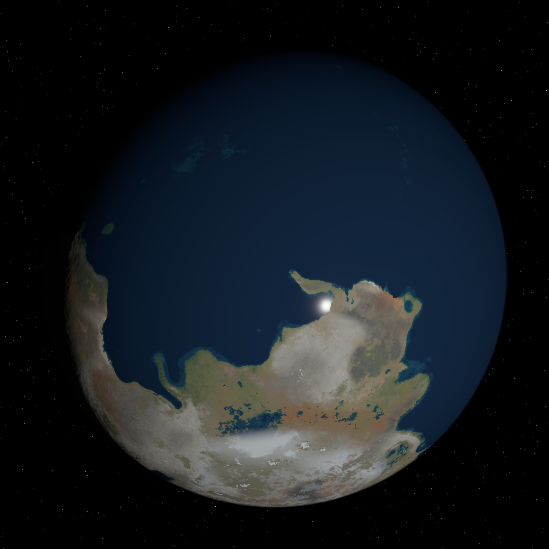
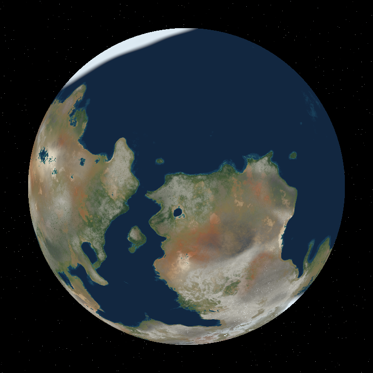
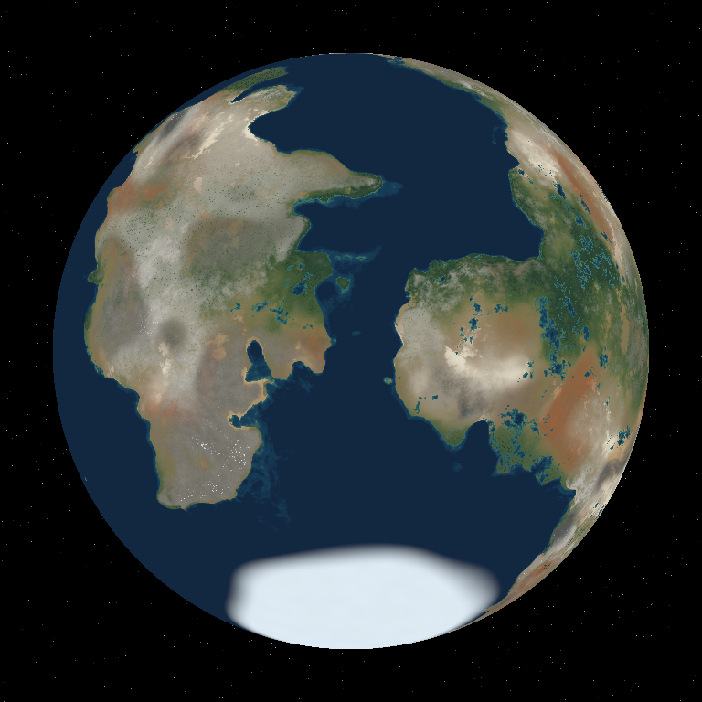
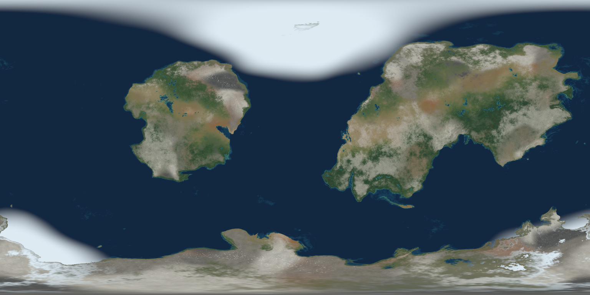

# Earth-like albedo review

Validated on an NVIDIA RTX 4090, 8 October 2026. The release application has been rebuilt.

## Visual comparison

Same seed (42), terrain, camera, lighting, 768px renderer, and 384px wind field. Clouds and atmosphere are hidden to expose the surface.

| Before | After |
| --- | --- |
|  |  |

The previous surface used bright vegetation, broad altitude color bands, and a blue depth gradient that exposed too much deep seabed structure. The new surface has darker forests, gradual rain-shadow transitions, regional mineral colors, and dark open water with color restricted to shallow shelves.

## Material changes

- Shared linear-reflectance palette for preview and exported albedo.
- Independent planet seed for coherent pale, beige, iron-rich red, and occasional dark mineral regions. Cloud changes cannot recolor the ground. Fields use spherical coordinates, including across the longitude seam.
- Soil, sand, grass, conifer, deciduous forest, and rainforest mixtures depend on temperature and moisture. Regional substrate shows through where vegetation is sparse.
- Temperature and terrain slope control exposed rock. Snow still depends on cold, moisture, elevation, and retention on slopes. The former broad mountain color bands and global elevation tint are removed.
- Shallow-water color responds to depth, temperature, and regional sand. Deep water stops revealing seabed relief. Beaches are narrow, slope-limited, and darker at the waterline.
- Wet lowland incisions receive riparian vegetation and dark sediment/water colors; dry basins and high terrain do not.
- Albedo PNG RGB is now encoded as sRGB and tagged accordingly, matching Blender's existing albedo import setting. Alpha, roughness, AO, and water-mask values remain linear. The earlier export wrote linear RGB directly into an sRGB texture, making it too dark.
- Export albedo now respects the climate-moisture setting independently of the sea-level control.

## Additional views

These albedo views omit illumination so material differences can be inspected directly.

| Seed 42 | Seed 73 |
| --- | --- |
|  |  |

Actual 1536 × 768 exported PNG, seed 211:



## Validation

Passed:

- GPU material contracts: deterministic seeds; different seeds change mineral regions at fixed terrain/climate; pale, red, and beige ground all present; wet forests darker and greener than dry ground; finite bounded colors; longitude continuity; drainage suppressed on dry/high terrain; deep-water color independent of further depth.
- Preview fixtures for Earth, dry worlds, frozen worlds, and highlands; snow/roughness and ice-toggle behavior; surface seed changes the ground while cloud seed does not.
- Byte-identical tiled versus monolithic GPU map output, including albedo's neighbor sampling.
- Small full export through the production pipeline.
- sRGB reference values, staged PNG encoding, alpha and scalar preservation, and atomic PNG writer tests. Export metadata confirms 1536 × 768, RGBA8, sRGB.
- Live/offscreen color parity and night/cloud lighting regression test. The full seed-42 capture reports a maximum live/PNG difference of 1 byte per channel.
- Four camera directions in both lit and unlit modes for seeds 42, 73, and 211; visual inspection of land-rich views and the equirectangular export.
- `cargo check --all-targets --features validation`, release application build, and `git diff --check`.

The full unrelated weather test suite was not rerun. Existing OpenEXR environment and unused-code warnings remain.

## Limits

Drainage coloring is a local terrain-incision approximation. It does not compute connected catchments, river discharge, persistent lakes, or a new river water mask. The erosion system's flow accumulation is not yet retained as a material input.

Preview and export share the palette, but export still estimates continental moisture from local elevation; it does not sample the preview's wind/continentality cubemap. Their detailed biome boundaries can therefore differ. Existing continent geometry and polar-cap geometry remain visible in the comparisons.

## Reproduce

```sh
rtk cargo run --release --bin surface_capture -- output/albedo-review/42 42 768
rtk cargo run --release --bin surface_capture -- output/albedo-review/73 73 768
rtk cargo run --release --bin surface_capture -- output/albedo-review/211 211 768 --export
rtk cargo run --release --bin realism_capture -- output/albedo-review/full-42 42 768
rtk cargo test --release --lib earth_surface_materials_follow_climate_seed_and_terrain
rtk cargo test --release --lib land_material
rtk cargo test --release --lib tile_local_gpu_maps_match_monolithic_output
rtk cargo test --release --lib albedo_png_encodes_linear_reflectance_as_srgb
rtk cargo test --release --lib staged_png_policy_preserves_masks_and_uses_documented_scalar_depths
```

`surface_capture` saves four lit and four unlit globe images. Its optional export uses matching generation parameters and writes the production albedo PNG plus AO. Captures use uneroded terrain to isolate material behavior.
