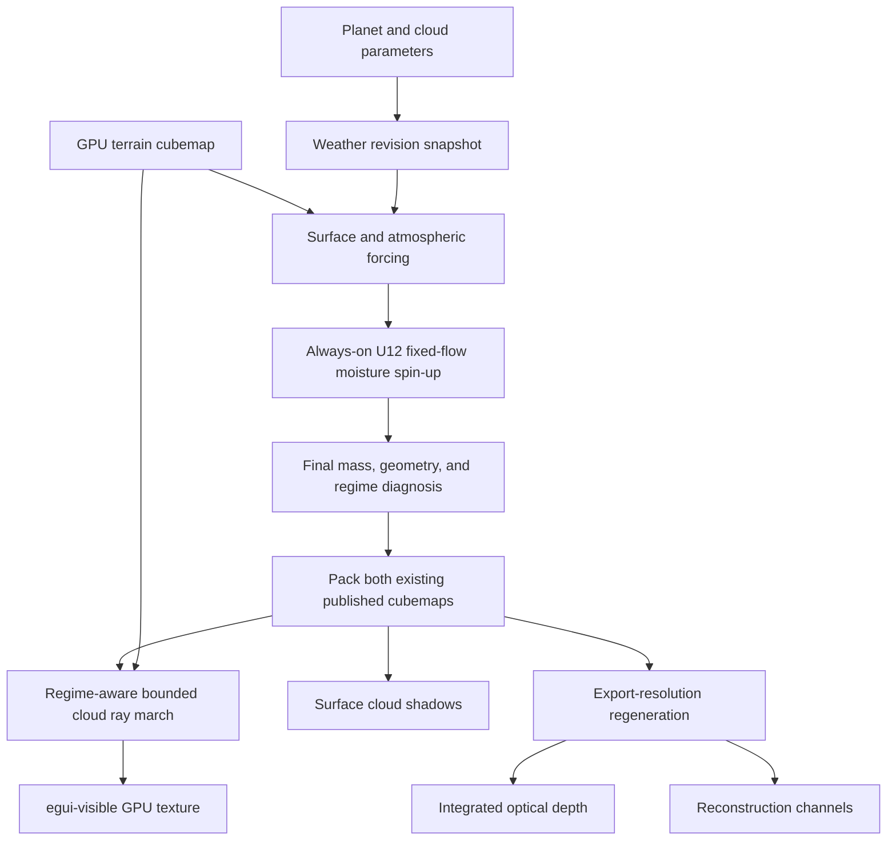
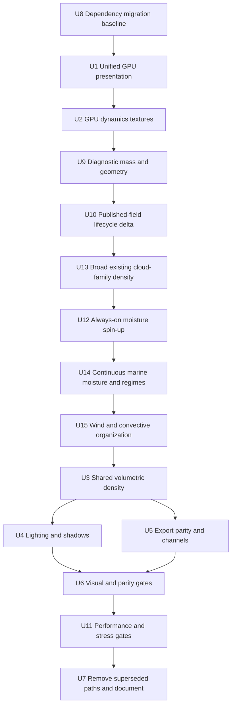
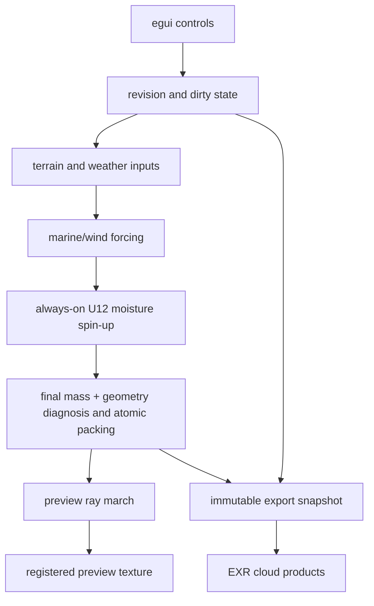

# feat: Add shallow volumetric clouds

## Summary

Keep the completed unified GPU foundation and always-on U12 moisture spin-up, then replace the remaining stamped/mask-like cloud interpretation with continuous causal weather regimes. Existing wind, pressure, moisture, temperature, terrain, latitude, season, and rotation inputs produce overlapping low, deep/storm, and high/cirrus mass plus physical geometry; procedural detail only shapes eligible mass into decks, cells, fronts, towers, downshear anvils, or fibres. The same snapshot, algorithms, and two-cubemap field contract drive preview lighting, surface shadows, and export.

---

## Problem Frame

The original shell, readback, and weather-lifecycle problems are structurally addressed, but the current visual result remains artificial. `src/shaders/weather_field.wgsl` stamps a fixed inventory of sheets, ellipses, fronts, convective regions, and storms; `src/shaders/cloud_density.wgsl` then thresholds more noise inside those masks. This varies density without varying meteorological cause, topology, vertical structure, or lifecycle. A single character scalar also makes stratus, convection, frontal cloud, and cirrus mutually exclusive where real systems overlap vertically.

The revised problem is therefore not "more cloud noise." The generator must reproduce the correlations that make cloud forms readable from orbit: moisture transported into convergence, marine decks capped by inversions, trade cumulus growing from ocean flux, frontal layering along temperature gradients, convective towers with anvils spreading downshear, and windward uplift with lee drying. Fine cloud elements may remain procedural, but their location, scale, altitude, thickness, and orientation must follow a shared causal weather state (see origin: `docs/brainstorms/2026-03-31-cloud-layer-requirements.md`).

**User-problem trace:**
- **R1:** Ensure marine regimes are no longer underrepresented with continuous marine moisture, cool marine decks, and warm trade cumulus, while retaining valid land orographic enhancement.
- **R2:** Remove hard mask-like lines by eliminating additive-noise occupancy thresholds and rendering continuous mass erosion.
- **R3:** Make the Wind Strength slider invalidate weather and materially scale transport, convergence, and terrain response.
- **R4:** Replace storm opacity bias with localized convective towers and downshear anvils; cyclone eyes and spiral bands are deferred.

---

## Requirements

- R1-R4. Render low, deep, and high clouds as bounded layers with spatially varying altitude, thickness, vertical density, and visible limb depth. U14 owns R1/R2 field work, U15 owns R3/R4 field work, and U3 owns the rendered outcomes for all four requirements.
- R5-R9. Generate a deterministic weather state driven by climate and dynamics without coastline outlines, latitude bands, or global grey veils.
- R10-R12. Integrate optical depth, self-shadowing, forward scattering, and surface shadows from one density field.
- R13-R15. Preserve deterministic controls and use the same weather state for preview and both export products.
- R16-R18. Keep interactive work GPU-resident, meet the 30 FPS baseline target, and maintain deterministic visual references.

**Revised interpretation of R5-R9:** structured weather is generated from always-on bounded transport, continuous marine moisture, wind-scaled convergence/orography, stability, moisture, temperature, and scale-separated eligibility rather than independent cloud-shape stamps. Noise may perturb boundaries and unresolved detail only after coarse cloud mass exists.

**Origin flows:** F1 (interactive planet preview), F2 (cloud export)

F1 regenerates weather only for density-affecting inputs. Camera and lighting changes rerender the current ready weather state without invalidating it.

**Origin acceptance examples:** AE1 (volumetric limb), AE2 (coherent weather), AE3 (coverage and performance), AE4 (lighting and shadows), AE5 (preview/export parity)

---

## Scope Boundaries

- Target Earth-like rocky planets only.
- Define the visual-fidelity envelope provisionally as 0.75-1.5 Earth radii, 0.5-2.0 Earth gravities, 8-72 hour rotation, 0.3-1.0 bar surface-pressure proxy, and -40 to 40 C base temperature. Inputs outside it must remain finite and deterministic but are not required to reproduce Earth cloud taxonomy in this phase.
- Use a shallow planet-scale volume, not a general voxel atmosphere.
- Do not add ground-level or flight-level cloud rendering.
- Do not add a forecast, continuously evolving weather, full primitive-equation atmosphere, or cloud-resolving 3D fluid volume.
- Permit one fixed-step, low-resolution, deterministic spin-up that resets from the parameter snapshot whenever weather-affecting inputs change. It exists only to produce a static authored weather state.
- Do not replace the geological terrain pipeline.
- Do not add non-rocky, icy, or gas-giant cloud regimes.
- Do not add cyclone eyes, eyewalls, or spiral rainbands in this phase; storms are towers plus downshear anvils only.
- Do not preserve the old shell renderer or duplicated cloud export algorithm as compatibility modes.

### U12 Activation Record

- U12 was activated because U9 repeatedly failed independent visual topology review. The bounded fixed-step moisture transport and phase change path is therefore intentionally always-on for weather generation; do not add a new runtime baseline branch solely to preserve the original conditional wording.

### Deferred to Follow-Up Work

- Temporal reprojection or temporal upscaling: add only if the short stable ray march misses a measured quality or frame-time target.
- Animated weather advection: defer until the static weather field, seams, and deterministic parity are validated.
- Close-range cloud LODs and 3D detail textures: defer until planet-scale rendering demonstrates a concrete need.
- Dynamically coupled moist shallow-water flow requires a separate future plan and evidence that fixed-flow assumptions, rather than cloud diagnosis or rendering, caused an accepted-case failure.
- Learned cloud detail requires a separate future plan, independent training targets, and evidence that the physical/procedural detail pass is the remaining problem.

---

## Context & Research

### Relevant Code and Patterns

- U8, U1, and U2 are completed foundations: eframe/egui 0.33 and wgpu 27 share one interactive device and queue; the preview target is persistent and GPU-visible; wind/continentality and pressure are persistent filterable `Rgba16Float` cubemaps.
- `src/weather.rs` already owns deterministic snapshots, front/back weather textures, latest-wins revision coalescing, and asynchronous queue completion. It should own the additional spin-up pipelines rather than adding another subsystem.
- `src/shaders/wind_field.wgsl` currently generates analytic tangent wind independently from pressure. `pressure.r` stores absolute pressure while GBA are unused. The revision must derive or at least reconcile pressure gradient, convergence, vorticity, and wind instead of treating low pressure as convergence.
- `src/shaders/weather_field.wgsl` currently stamps 2 sheets, 4 fronts, and 6 convective ellipses, samples only a global moisture scalar, and uses a short nearest-height difference for terrain forcing. These are the immediate sources of repeated topology and coastline-shaped artifacts.
- `src/shaders/cloud_density.wgsl` currently thresholds noise by one character scalar and reconstructs cyclone geometry independently from the weather field. It cannot represent low cloud, deep towers, and high anvil or cirrus at the same location.
- `src/shaders/preview_cubemap.wgsl` has an eight-level density estimate and basic lighting, but does not yet perform the planned bounded front-to-back optical-depth march or render cloud depth through the atmosphere-only limb path.
- `src/export.rs` still compiles the independent `src/shaders/cloud_map.wgsl`; `src/bin/sweep.rs` cannot provide a separate weather texture; `src/bin/perf_bench.rs` does not measure cloud work.

### Meteorological Formation Model

Approximate heights are above local surface and vary with latitude: WMO high-cloud ranges are roughly 3-8 km in polar regions, 5-13 km in temperate regions, and 6-18 km in tropical regions. The plan uses ranges as conditional priors, not rigid bands.

| Regime | Orbital shape | Typical vertical extent | Causal eligibility and evolution | Procedural remainder |
|---|---|---|---|---|
| Marine stratus / stratocumulus | Broad smooth or cellular decks; closed cells, open cells, rolls, and downstream breakup | Base near surface-1.5 km; top about 0.7-2 km; usually a few hundred metres to 1 km thick | Cool moist ocean boundary layer, strong inversion, subsidence aloft, cloud-top cooling, weak-to-moderate wind; warmer downstream water or land heating breaks the deck | Cell walls, holes, tessellation, drizzle pockets, scalloped edges |
| Trade cumulus / cloud streets | Detached small bright cells, popcorn fields, or parallel streets aligned with low wind | Base about 0.5-1 km; top about 1.5-3 km; congestus may reach 4-8 km | Surface evaporation/heating, lifting-condensation level, shallow instability capped by an inversion; convergence clusters cells and shear organizes streets | Individual cell positions, cauliflower lobes, gaps, roll spacing |
| Deep convection / cumulonimbus | Bright towers, clustered cells, squall lines, dark cores and shadows, smooth/fibrous anvils downshear | Base about 0.5-2 km; top 8-13 km temperate or 12-18 km tropical | Deep moisture, instability, inhibition release, convergence/front/terrain/land-heating trigger; precipitation removes water and upper divergence/shear spreads anvil ice | Tower lobes, overshoots, cell breakup, precipitation streaks, anvil fibres |
| Broad frontal cloud | Asymmetric multilayer shield or band | High cloud descends from 5-13 km toward low cloud below 2 km; convective frontal tops may reach tropopause | Horizontal temperature/humidity gradient, convergent deformation, and broad ascent | Ragged bands, embedded cells, small gaps, precipitation texture |
| Orographic cloud / rain shadow | Windward ridge banks and caps, stationary lenticular lenses, sharp lee clearing | Base at local lifting-condensation level; shallow caps often 0.1-3 km thick, deep convection may reach tropopause | Positive cross-ridge wind/elevation gradient, humidity, stability, ridge height; precipitation removes moisture and descending lee air warms/dries | Lens count, edge detail, rotor texture, local cells |
| High cirrus | Thin filaments, hooks, veils, jet bands, and anvil debris | WMO high-cloud ranges; often about 0.1-3 km thick | Upper-level ice saturation, frontal/jet ascent, gravity waves, or convective detrainment; upper wind and shear stretch while sedimentation/sublimation erode | Wisps, fall streaks, hooks, optical-depth variation |

The scientific model identifies surface type/heating, elevation, wind, pressure/temperature gradients, humidity, convergence, stability, shear, lift, and tropopause as useful causes. The diagnostic baseline approximates these from existing wind, pressure, global climate moisture/temperature, terrain, latitude, and season instead of persisting every diagnostic. U9 repeatedly failed independent visual topology review, so U12 now always transports separate vapor/condensate reservoirs. Neither path resolves droplets, kilometre-scale towers, or full vertical fluid dynamics.

### Institutional Learnings

- `docs/research/performance-visual-comparison.md` records that a 30-step 256-square per-face semi-Lagrangian cloud advection cost about 120 ms and produced face seams, stretched noise bands, and blocky modulation. Do not revive its planar offsets, independent faces, or noise-as-initial-condition design.
- `docs/solutions/architecture/tectonic-terrain-architecture-2026-03-30.md` establishes that sphere-space sampling and standard cubemap conventions avoid face discontinuities; custom neighbor operations still require seam-aware handling.
- `docs/research/cloud-rendering.md` recommends cheap coverage rejection before detail work, front-to-back integration, early transmittance termination, and limited shadow samples.
- The superseded `docs/plans/2026-03-31-003-feat-cloud-layer-v2-plan.md` remains useful failure evidence: threshold cliffs, latitude multiplication, flat alpha, and dominant procedural cyclones should not return.
- U12's activation condition was evaluated and triggered by U9's repeated visual-topology failures. It resets from U9 diagnostics, runs at coarse resolution, and backtraces through world-space cube directions with a fixed small pass count. It must not repeat the failed per-face planar advection or use noise as its primary initial state.

### Scientific and Production Research

- Hartney, Bendall, and Shipton, *Exploring Forms of the Moist Shallow-Water Equations* (2025), provides the useful reduced state: horizontal flow, depth/buoyancy, vapor, cloud water, rain, saturation conversion, latent heat, and mountain-triggered cloud. The plan borrows the moisture reservoirs and phase changes, not its finite-element solver.
- Zhou, Xue, and Shen, *HOPE* (2025), demonstrates GPU-oriented shallow-water computation on a cubed sphere and confirms that cross-panel vector rotation, shared edge fluxes, and corner treatment are required even when the equations are sound.
- Yang et al., *Real-Time Fluid Simulation on the Surface of a Sphere* (2019), demonstrates hundreds of stable spherical transport steps per second at comparable cell counts. The plan borrows world-space tangent transport and fixed-step GPU iteration, not its latitude-longitude grid or incompressibility solve.
- Harris et al., *Simulation of Cloud Dynamics on Graphics Hardware* (2003), shows the minimal transported thermodynamic state: potential temperature, water vapor, condensed water, buoyancy, and latent heating. It supports a reduced phase-change pass without requiring a planet-wide 3D volume.
- Amador Herrera et al., *Weatherscapes* (2021), featured by Two Minute Papers as "New Weather Simulator: Almost Perfect!", demonstrates rich local 3D cloud microphysics and terrain/weather coupling. Its 3D CUDA solver is a visual and process reference, not an architecture suitable for a whole-planet preview.
- Dobashi et al., *A Simple, Efficient Method for Realistic Animation of Clouds* (2000), and reaction-diffusion work by Witkin/Kass and Turk support cheap local growth/extinction or cellular breakup after coarse cloud mass exists. These methods must not choose synoptic placement.
- Schneider's *Horizon Zero Dawn* and *Nubis* work remains the rendering basis: bounded layers, weather controls, vertical profiles, Beer-Lambert extinction, phase lighting, and cheap rejection.
- WMO, NOAA, NASA, Met Office, and UCAR provide formation, height, frontal, orographic, and cloud-street constraints summarized above.

### Simulation and Parallelism Decision

| Option | Strength | Failure or cost | Decision |
|---|---|---|---|
| Independent procedural generators | All formations can dispatch in parallel and are cheap | Repeats stamped topology; systems disagree about moisture, wind, altitude, and overlap; this is the current failure | Reject as the primary generator |
| Causal diagnostic mass from climate fields | One parallel pass; deterministic, inexpensive, and directly addresses stamped placement | Cannot evolve transport history or cyclone lifecycle | Chosen baseline; judge across seeds before adding iteration |
| Fixed-flow moisture spin-up | Parallel work per texel/pass; adds transport, condensation, rainout, and broad depletion | Iterations are sequential; needs ping-pong state and cross-face sampling | Required active U12 after the evaluated baseline failed named tests |
| Dynamically coupled moist shallow water | Can grow balanced vortices, fronts, and waves instead of relying on initialized pressure/wind | Larger implementation, stability, seam, tuning, and latency burden | Deferred to a separate plan |
| Planet-wide 3D cloud solver / full NWP | Highest physical fidelity | Far beyond memory, latency, vertical-state, and authoring scope | Reject |

The chosen diagnostic path runs all texels and all six faces in parallel in one bounded generation. U12 is active because its condition was evaluated and triggered: one simulation iteration cannot run concurrently with the next because each consumes the previous state, but texels/faces remain parallel within each iteration. U12 starts with 128 square per face and 16 iterations, then measures only the nearest smaller/larger variant needed to find a passing bound; this work remains asynchronous while the last-good field is visible.

### Machine Learning Assessment

Global learned forecasters such as GraphCast, Pangu-Weather, FourCastNet, GenCast, and NeuralGCM require complete Earth reanalysis states, large Earth-specific weights, and do not emit renderable cloud optical depth for arbitrary planets. Learned downscalers and neural cellular automata could later add residual detail, but this repository has no independent high-fidelity training targets. No ML runtime, model, data pipeline, or architectural seam is active in this plan.

---

## Key Technical Decisions

- **One interactive GPU stack:** Upgrade to eframe/egui 0.33 and wgpu 27. The interactive app uses eframe's adapter, device, and queue; headless binaries and GPU tests retain one standalone context per process.
- **Persistent GPU fields:** Keep dynamics and weather textures allocated across frames. Recreate them only when resolution or format changes; regenerate content through explicit dirty revisions.
- **Portable half-float cubemaps:** Use `Rgba16Float` for filterable compute-written dynamics and weather fields after validating storage, sampling, filtering, six-layer array, and cube-view support. Fail clearly on unsupported adapters rather than adding speculative format fallbacks.
- **Causal diagnostic baseline:** Generate one static weather result directly from the existing climate/dynamics snapshot. Signed convergence, broad orographic response, moisture, temperature, stability, wind, latitude, season, and rotation choose mass and geometry; no fixed inventory of cloud systems remains.
- **Simulate correlations, synthesize texture:** Preserve causal low-frequency relationships and use procedural work only for unresolved cells, fibres, holes, and edges inside eligible mass.
- **Activated fixed-flow spin-up:** U9 repeatedly failed independent visual topology review, activating U12. The 128-square, 16-iteration vapor/condensate transport now runs for every weather generation and preserves the same published field ABI so rendering/export do not branch.
- **Continuous marine regimes:** U14 derives continuous `marine_fraction` from continentality, then applies ocean evaporation/inversion and trade-cumulus response with weaker land evapotranspiration. It encodes regimes through low mass and geometry, not an additive-noise occupancy threshold or isocontour.
- **Wind and convective organization:** U15 replaces private Rust/WGSL padding names with named reserved fields, preserving every byte size and offset after layout validation. `wind_scale` is 0 calm, 1 current baseline, and 2 strong; it invalidates weather and uses a fixed physical integration interval with more deterministic substeps, rather than shrinking the physical interval, to retain slider response while keeping every substep below 0.75 texel. A `marine-stability proxy` and a `diagnostic anvil-advection direction` organize eligible response. Storm controls are deterministic convective catalysts, never an opacity or guaranteed-storm-inventory control.
- **Overlapping mass fields, not one cloud character:** Replace the single mutually exclusive character channel with separate low liquid, deep convective, and high ice/stratiform contributions plus geometric/environmental diagnostics. A location may contain low deck, tower, and anvil simultaneously.
- **World-space cubemap operations:** Sample broad gradients and U12 backtraces by normalized sphere direction. No planar per-face offsets; any finite-difference stencil must validate edge/corner neighbors.
- **No active cyclone anatomy:** This phase does not diagnose or render cyclone curvature, comma heads, eyes, spirals, eyewalls, or rainbands. Those require unavailable pressure/temperature and vertical-flow evidence and remain deferred.
- **Short physically based march:** Begin with eight view samples inside the bounded layer, front-to-back Beer-Lambert integration, world-stable start jitter, cheap occupancy rejection, and transmittance early exit.
- **Minimal light sampling:** Start with one local sun-direction density sample plus ambient height lighting. Add a coarse long-range sample only when references prove local shadowing insufficient.
- **Shared density include:** Preview and export compile the same weather interpretation, vertical profiles, and density functions. Export may evaluate at another resolution but cannot maintain a separate algorithm.
- **Snapshot export:** Export captures immutable click-time parameters and deterministically regenerates matching bounded-resolution fields for tiled output evaluation; later UI edits do not alter an active export.
- **Both export products:** Produce integrated optical depth for direct material use and reconstruction channels for downstream volumetric reconstruction.
- **Front/back revision state:** Track requested, submitted, and ready revisions. Generate into back resources, coalesce rapid edits to the latest request, and swap only a completed current revision; failures leave the front resources untouched.
- **Bounded export memory:** Export uses bounded-resolution weather fields and tiled density integration/readback. Final output resolution must not require a full-resolution six-face weather cubemap.
- **No current ML dependency:** Do not add model runtimes, weights, training data work, or ML-specific interfaces.

### Provisional Published Field Contract

The active baseline persists only fields consumed by preview or export. Optional diagnostics remain debug-time calculations until a measured consumer requires storage.

| Logical field | Channels | Units / range | Resolution and lifetime | Consumers |
|---|---|---|---|---|
| Existing dynamics | World-space tangent wind XYZ; continentality A | Existing normalized wind contract initially; document physical conversion before U12 | Existing persistent U2 cubemap | U9, U12, U14, U15, U3 |
| Existing pressure | Synoptic pressure R | Existing hPa contract; use as a broad relative/anomaly signal, not canonical surface pressure | Existing persistent U2 cubemap | U9 frontal eligibility |
| Cloud mass | Low/deck mass R; deep/storm mass G; high/cirrus mass B; overall occupancy A | Normalized 0-1; occupancy is the union of low, deep, and high mass | Weather resolution, front/back published | U14, U15, U3, U4, U5 |
| Cloud geometry | Base R; low top G; deep top B; high top A | Kilometres above local surface | Weather resolution, front/back published | U3, U4, U5 |

Signed convergence/divergence, broad windward/lee response, the `marine-stability proxy`, marine fraction/regime, frontal eligibility, and the `diagnostic anvil-advection direction` are derived from existing inputs. Do not persist separate textures for them unless profiling or visual validation proves recomputation inadequate. `low + deep` must partition available low/mid condensate or eligibility rather than duplicate it; high mass is independently bounded by cirrus/anvil eligibility and may extend beyond the low/deep footprint. Occupancy is their union and is never overloaded with depletion or another diagnostic. These proxies do not model SST, a vertical wind profile, or upper divergence.

Canonical scalar inputs are resolved before U9 shader work: `planet_radius_km = 6371 * mass_earth^0.27`, rotation rate is radians per second from `rotation_period_h`, and `surface_pressure_bar` is the current `atmosphere_strength` value explicitly treated as a 0-1 bar proxy. The approximately 1013 hPa pressure texture remains a synoptic pattern and is never confused with this surface-pressure proxy.

---

## Open Questions

### Resolved During Planning

- **GPU ownership:** Unify on eframe/egui 0.33 and wgpu 27 using one shared device and queue.
- **Export product:** Export both integrated optical depth and reconstruction channels.
- **Preview/export identity:** Regenerate deterministic export-resolution weather from the same parameter snapshot and WGSL definitions rather than copying preview-resolution texels.
- **Zero coverage:** Retain cached weather but skip cloud integration, cirrus, lighting, and surface-shadow work.
- **Progressive erosion:** Keep the last valid weather field during erosion and regenerate once the final terrain revision is available.
- **Published field ABI:** Use separate low, deep, and high mass plus occupancy, and separate base/low-top/deep-top/high-top geometry. Preserve origin-required export semantics by deriving coverage, thickness, character, and cirrus from this shared state.
- **Canonical physical scalars:** Expose planet radius in kilometres, rotation in radians per second, and the current atmosphere-strength value under the explicit `surface_pressure_bar` proxy name; do not mix it with the synoptic hPa texture.

### Deferred to Implementation

- **Exact sample count:** Start at eight within the allowed 6-10 range and tune only against the visual matrix and 30 FPS gate.
- **Long-range shadow method:** Choose a second density sample or a coarse shadow field after measuring local-shadow quality and cost.
- **Frozen validation protocol:** Use the masks, seeds, effect sizes, and field/image tolerances below before any active-unit implementation; failed results are recorded as failures and cannot be retuned by changing the protocol.
- **Active spin-up budget:** U12 was activated after the condition was evaluated and triggered; start with 128 square per face and 16 fixed iterations, then test only adjacent variants needed to find a passing quality/latency bound.

---

## High-Level Technical Design

> *This illustrates the intended approach and is directional guidance for review, not implementation specification. The implementing agent should treat it as context, not code to reproduce.*



The active path follows the same bounded process for every seed:

```text
marine/wind forcing + existing moisture, pressure, temperature, terrain, latitude, season, and rotation
    -> U12 transport/phase change spin-up
    -> final mass + geometry diagnosis and packing into both existing cubemaps
    -> diagnose overlapping broad cloud families -> synthesize only sub-grid cells, fibres, holes, and edge erosion
```

The active forcing, diagnosis, and packing are GPU-parallel over texels and faces. U12 transport is always-on: each iteration remains parallel over texels/faces but waits for the previous iteration; it is bounded regeneration work, not frame-time work or continuous simulation.

Implementation dependencies are not runtime flow. The implementation order remains `U12 -> U14 -> U15 -> U3 -> {U4, U5} -> U6 -> U11 -> U7`; runtime flow is the forcing-to-spin-up-to-finalization sequence above. Finalization updates both existing cloud mass and geometry cubemaps atomically, preserves their published ABI, writes occupancy as `union(low, deep, high)`, and permits high anvil mass outside the deep footprint.

Weather state follows a latest-wins lifecycle:

```text
missing -> generating(revision N) -> ready(revision N)
   |              |                        |
   |              +-> failed (keep last)  +-> stale after input change
   +----------------------------------------------> generating(revision N+1)
```

---

## Implementation Units



U8, U1, U2, U9, U10, U13, and U12 remain below as architectural traceability for completed work. Active implementation begins at U14. The active dependency order is U12 -> U14 -> U15 -> U3 -> {U4, U5} -> U6 -> U11 -> U7.

### Frozen Validation Protocol

Freeze this protocol before U14 starts. `docs/research/shallow-volumetric-cloud-validation.md` is append-only and uses its frozen schema for every scenario: scenario ID, owning U-ID, fixture, seeds, mask/domain, metric, threshold, measured value, artifact path, result, and reviewer/date. Measured value and result remain unrecorded until evidence exists; pending work is never recorded as a measured `FAIL`. Missing required evidence blocks the owning unit's completion, while recorded evidence is an explicit `PASS` or `FAIL`.

| Protocol item | Frozen definition |
|---|---|
| Eight seeds | `7, 19, 37, 73, 101, 211, 509, 997`; no seed is replaced after a failure. |
| Fixture masks | Use named, checked-in masks for `flat_cool_ocean`, `flat_inland`, `mountain_windward`, `mountain_lee`, `coast_band`, `eligible_convective_core`, and `dry_stable_control`. Exclude terrain outside the named mask from each metric. |
| Component and gap rules | A cloud component is significant at area >=0.25% of one cubemap face. Warm-marine clear-gap fraction is clear pixels / fixture-mask pixels and must be >=0.15. |
| Deep-core rule | Deep-top percentiles use only significant components within `occupied_deep_core = deep_mass >=0.15`, component area >=0.25% face, and total deep mass >=0.02; otherwise report `not applicable`, not a fabricated percentile. |
| Nonzero baseline rule | Relative effects require baseline >=0.02 normalized mass. Below that, use an absolute delta >=0.02; zero-to-nonzero claims use the absolute rule. The dry/stable storm-control fixture is stricter: all field channels are bit-identical at minimum and maximum storm control. |
| U12 source ownership | Initialize vapor and recharge it from one continuous, physically ranked pre-phase source budget. U12 owns phase change and rainout; final diagnosis scales transported `state.y`/`state.z` only. This forbids post-condensation or rendering thresholds, vapor-derived diagnostic mass, additive regime source, condensate-survival curves, and low-bound sweeps, but permits continuous causal participation before phase change. |
| U14 identity versus survival | Supersede the inland whole-field low-mass minimum and warm-trade whole-field mean floor. In frozen fixtures, background causal-source retention q50 must be <=60%; cool deck, warm trade, and windward-orographic causal-source retention p90 must be >=85%; the matched cool-deck and warm-trade rendered low-mass p90 floors are frozen from the approved fixture before evidence. Keep ocean/inland ratio, low/deep ratio, heights, gaps, coast, coverage, seams, determinism, and zero-moisture gates. |
| U14 coverage supersession | Coverage must expand nested causal support and patch extent and clear gaps rather than merely strengthen existing mass. At coverage `.25`, `.5`, and `.75`, each adjacent step must add >=8 percentage points occupied area; nested retained occupied area is >=90%; clear pixels with optical depth `tau < .01` drop >=8 percentage points per step; significant-component area p75 is >=1.3x baseline; clear-gap radius is <=.75x baseline; core `tau` p90 rises <=35%. Land remains occupied >=5% with p90 low mass >=.02 while cool-ocean/inland remains >=1.5x, and the frozen orographic reversal gate remains required. |
| Minimum effects | Flat cool ocean low-mass ratio to inland >=1.5. The obsolete absolute mountain `windward-minus-lee >.15` gate is superseded by frozen matched masks: `A=mean(low windward)-mean(low lee)`, `Df=A_forward-A_calm >=.03`, `Dr=A_reverse-A_calm <=-.03`, span >=.06, calm `|A|<=.01`, and whisper delta `<=.01`; density-only optical-depth deltas use frozen projected masks (`windward p75 >=.02`, `lee p25 <=-.02`). Wind-scale centroid displacement from calm is >=0.5, >=1.0, and >=2.0 texels at 0.5, 1, and 2 respectively. |
| U15 storm minimum effects | In `eligible_convective_core`, Count 0->8 adds >=2 significant localized deep cores and raises occupied-core deep-mass p95 by >=25%, while global mean integrated condensate/column mass changes <=20%. Size 0.3->3 uses the normal production catalyst path with fixture-only physical convergence/lift support fully enabled through `.290` rad and smoothly fading to zero at the fixed nearest-owner association cap `.340` rad; Count retains its `.055` rad fixture. Freeze the first eight ascending seeds satisfying only predeclared input geometry: first four production centers have minimum separation `>.68` rad and each `.340` cap remains outside the 60-degree polar band, yielding `4,40,44,59,62,78,80,84`; mechanically assert the search before evaluating outputs. Associate thresholded Size response to its nearest production-center owner. All four owners require a significant primary component at Size .3 and 3; pair primary top p95 by owner, retain primary area for the component and aggregate area gates, and report satellite count/area ratio. Fragmentation is a hard pre-run bound of at most two significant satellites and total satellite area <=50% of its primary per owner/endpoint, selected from the planned four-core topology rather than output fitting. Aggregate primary area must grow >=1.5x and every paired owner top must rise >=2 km. Anvil high mass extends >=10% beyond the deep footprint, centroid shifts >=0.5 weather texel along the diagnostic anvil-advection direction, and major-axis alignment is <=20 degrees. Dry/stable candidates remain exactly zero and no circular catalyst boundary is visible or correlated. |
| U15 equatorial and wind-ownership supersession | Thermal-equator convergence and equatorial cloud response must converge smoothly with latitude and remain free of rigid latitude bands. Pending focused evidence uses the causal-ocean production fixture and normal U12 pipeline with `W(p)=((1+.10*tanh(y/.08))/1.10)*cross(Y,p)`, Wind 1/2 only, tangent/divergence-free bounded wind, active MUSCL/Hancock transport and active CFL substeps, and every frozen seed. Measure all source-attributable counterfactual response `>=.02` within the frozen corridor; each case owns its spherical centroid/log-map wind frame and weighted Q90-Q10 alongwind length `L` and crosswind breadth `B`. Gates: per case p95 `>=.04`, effective N `>=32`, axis `<=30°`, outside corridor `<=5%`, beyond physical support `<=5%`, boundary shell `<=1%`; L2/L1 `1.50..2.50`, B2/B1 `.80..1.25`, and sharpness ratio S2/S1 `.75..1.25`, where `Gperp` is normalized crosswind geodesic derivative and `S=B*Gperp`; deterministic. Mass, area, isotropic edge, centroid, and components are telemetry only. No PASS until the focused run records evidence. |
| U3 rendered-family wind-ownership supersession | Low/deep fixed mass+geometry renders are Wind-X/Y bit-identical. High uses only local dominant-octave symmetric filtering at stretch `1.20`; higher octaves are isotropic with no speed response or warp. High-only support requires Wind-X/Y MAE `.001-.010`, 90-degree axis rotation `>=60`, median axis-to-wind `<=30`, macro correlation `>=.995`, occupied delta `<=2%`, centroid `<.005`, edge retention `>=.90`, and same-direction `.2/1/2` MAE `<=1e-4`. Existing causal-density, layer, topology, and performance gates remain required. |
| Field/parity/seam/image tolerances | Shared-ray preview/export: optical-depth MAE <=0.03, coverage delta <=0.02, directional correlation >=0.95. Every cubemap edge/corner: normalized field delta <=0.02 and no component split. Fixed-reference image: mean absolute RGB error <=0.03 and no pixel error >0.15 outside the antialiased silhouette. |

### Deferred-Scope Map

| Unit | Deferred rather than implemented in this unit |
|---|---|
| U14 | SST, explicit surface fluxes, a full inversion model, or a persisted marine-regime texture |
| U15 | Vertical wind profile, upper divergence, cyclones, curvature anatomy, guaranteed storm counts, or a wind switch that disables continentality/moisture |
| U3 | Dynamic microphysics, precipitation streaks, overshoots, close-range LOD, and temporal reprojection |
| U4 | Multi-sample long-range self-shadowing unless the single local sample fails its gate |
| U5 | Full-resolution weather cubemaps and a distinct export density algorithm |
| U6 | New rendering features; it validates the implemented fields and images only |
| U11 | Feature tuning; it owns only full stress, lifecycle, and coalescing acceptance |
| U7 | New behavior; it removes superseded paths after every prior gate passes |

### U8. Establish the dependency migration baseline

**Goal:** Upgrade eframe/egui and wgpu to a compatible released pair while preserving current behavior and establishing fixed cloud-off characterization renders.

**Requirements:** R16-R18

**Dependencies:** None

**Files:**
- Modify: `Cargo.toml`
- Modify: `Cargo.lock`
- Modify: `src/main.rs`
- Modify: `src/gpu.rs`
- Modify: `src/app.rs`
- Modify: `src/preview.rs`
- Test: `src/gpu.rs`
- Test: `src/preview.rs`

**Approach:**
- Upgrade eframe/egui to 0.33 and wgpu to 27 without changing GPU ownership or presentation in the same change.
- Resolve compile-time API changes across every binary and test target.
- Capture fixed cloud-off renders and baseline frame timing before replacing presentation.
- Explicitly configure eframe's wgpu renderer so later access to its render state is guaranteed.

**Execution note:** Characterize the existing output before changing device ownership or presentation.

**Patterns to follow:**
- Existing GPU smoke tests in `src/gpu.rs` and deterministic preview tests in `src/preview.rs`.

**Test scenarios:**
- Happy path: all application, library, sweep, benchmark, and export targets compile against the aligned dependency graph.
- Integration: the app starts with the wgpu renderer and produces the fixed cloud-off reference.
- Regression: terrain orientation, camera controls, atmosphere, and non-cloud layer toggles match the pre-migration characterization within tolerance.
- Error path: unavailable wgpu render state fails with the existing clear GPU startup error rather than silently selecting an incompatible renderer.

**Verification:**
- One wgpu version is present in the dependency graph.
- All Cargo targets build and GPU tests pass before U1 changes ownership or presentation.
- Cloud-off reference images and p95 frame time are recorded as the migration baseline.

### U1. Unify GPU ownership and presentation

**Goal:** Align the UI and renderer on one wgpu version, device, and queue, then display the preview through a persistent egui-registered GPU texture without frame readback.

**Requirements:** R16-R17, F1, AE3

**Dependencies:** U8

**Files:**
- Modify: `src/main.rs`
- Modify: `src/gpu.rs`
- Modify: `src/app.rs`
- Modify: `src/preview.rs`
- Test: `src/gpu.rs`
- Test: `src/preview.rs`

**Approach:**
- Build the interactive `GpuContext` from eframe's render state while retaining standalone construction for sweeps, benchmarks, export tools, and GPU tests.
- Let `PreviewRenderer` own the persistent target texture and views; let `PlanetGenApp` own the egui texture registration.
- Render into a persistent sRGB preview target registered once with egui. On resize, register and switch to the replacement before releasing the old registration.
- Construct the app from eframe's `CreationContext` and retain the renderer access needed to update and release native texture registrations; device/queue access alone is insufficient.
- Keep HDR work internal and tone-map into the egui-visible target.
- Submit preview rendering before egui samples the target on the shared queue, and release the registration during shutdown.
- Preserve the existing application layout, camera controls, and offscreen renderer API where they do not force readback.

**Execution note:** Add characterization coverage for current deterministic rendering before replacing presentation.

**Patterns to follow:**
- Existing device/error handling in `src/gpu.rs`.
- Existing preview target and render-pass setup in `src/preview.rs`.
- egui-wgpu native texture registration and render callback lifecycle for eframe/egui 0.33.

**Test scenarios:**
- Happy path: initialize the app on a supported adapter and display the registered preview texture without producing a CPU pixel buffer.
- Integration: rotate, zoom, pan, and change light direction; each action updates the same registered texture and does not recreate the GPU device.
- Edge case: resize the viewport repeatedly; the target is recreated safely and the existing egui texture identity is updated without stale views.
- Stress: repeated resize cycles keep texture registrations and GPU allocations bounded.
- Error path: fail GPU initialization or target allocation; surface the existing user-visible GPU error instead of panicking or showing an invalid texture.
- Regression: render a fixed seed before and after migration with clouds disabled; geometry, orientation, and layer toggles remain visually equivalent within tolerance.

**Verification:**
- The dependency graph contains one wgpu version for application and egui rendering.
- Interactive preview updates contain no synchronous frame readback or `device.poll(Wait)`.
- All application, library, binary, and GPU integration targets remain green after migration.

### U2. Add GPU-resident dynamics textures

**Goal:** Replace CPU-packed wind, continentality, and pressure intermediates with persistent GPU cubemaps usable by later weather generation.

**Requirements:** R5-R6, R16-R17, F1

**Dependencies:** U1

**Files:**
- Modify: `src/app.rs`
- Modify: `src/terrain_compute.rs`
- Modify: `src/shaders/wind_field.wgsl`
- Modify: `src/preview.rs`
- Test: `src/terrain_compute.rs`

**Approach:**
- Allocate validated `Rgba16Float` six-layer compute-writable textures with cube sampling views for interactive dynamics.
- Keep wind, continentality, pressure/convergence, and required climate intermediates on the same queue without CPU mapping or repacking.
- Preserve standalone readback only where headless tests or final export files explicitly require it.
- Use normalized sphere-space coordinates and true cube sampling for seam continuity; avoid per-face advection and planar offsets.

**Patterns to follow:**
- Compute pipeline ownership and matching Rust/WGSL uniform layouts in `src/terrain_compute.rs`.
- Wide continentality smoothing in `src/shaders/wind_field.wgsl` to avoid coastline ghosting.
- Existing `needs_terrain` and `needs_render` separation in `src/app.rs`.

**Test scenarios:**
- Happy path: fixed Earth-like parameters generate finite dynamics channels within documented ranges on all six faces.
- Determinism: identical parameter snapshots generate equivalent dynamics fields.
- Edge case: season values 0.49, 0.50, and 0.51 transition continuously without sign-flip discontinuity.
- Seam: samples approaching every cubemap edge and corner remain continuous within half-float tolerance.
- Error path: unsupported texture capabilities fail clearly before allocation.

**Verification:**
- Normal interactive weather generation performs no GPU-to-CPU map or repack.
- Debug views inspect GPU dynamics channels without triggering readback or alternate generation.

### U9. Generate diagnostic cloud mass and geometry

**Goal:** Replace cloud-shape stamps with one compact causal pass that emits overlapping low, deep/storm, and high/cirrus mass plus physical base/top geometry from existing inputs.

**Requirements:** R5-R9, R13, R15-R16, F1, AE2-AE3

**Dependencies:** U2

**Files:**
- Modify: `src/weather.rs`
- Modify: `src/shaders/weather_field.wgsl`
- Modify: `src/app.rs`
- Modify: `src/preview.rs`
- Modify: `src/planet.rs`
- Test: `src/weather.rs`
- Test: `src/planet.rs`

**Approach:**
- Retain the existing immutable Rust/WGSL weather snapshot and add the canonical planet radius, rotation rate, and surface-pressure proxy. Reuse existing wind, synoptic pressure, continentality, climate moisture, temperature, terrain, latitude, season, seed, coverage, and storm controls.
- Remove the fixed inventory of sheets, fronts, ellipses, and cloud-space cyclone stamps. Seeded sphere-space variation may break symmetry or boundaries but cannot directly create cloud mass.
- Derive signed convergence/divergence from broad world-space samples of the existing tangent wind. Derive broad windward lift/rain-shadow response from wind crossing a smoothed terrain gradient. Neither operation may clamp to face UVs or use raw coastline distance.
- Derive one `marine-stability proxy` from temperature, pressure, moisture, latitude/season, and continentality. Derive a `diagnostic anvil-advection direction` from existing wind only; do not persist separate diagnostic textures or imply an upper-air profile.
- Emit low/deck mass from moist stable or weakly lifting conditions, deep/storm mass from moist unstable convergence or the localized storm control, and high/cirrus mass from frontal/high-level eligibility or deep-cloud detrainment. Partition low versus deep eligibility so the same source mass is not counted twice.
- Produce asymmetric frontal eligibility from broad pressure/temperature change and convergence rather than a fixed ribbon. Existing storms remain localized environmental biases; eye, eyewall, comma, and spiral anatomy are not acceptance requirements.
- Derive base, low top, deep top, and high top from the same stability, temperature, terrain, latitude, and family eligibility used for mass. Apply coverage as a smooth bias over eligible mass across the full control range; zero writes zero mass and occupancy. Write both published fields in the same generation and keep optional diagnostics ephemeral.

**Patterns to follow:**
- Matching `#[repr(C)]`/WGSL layouts and persistent compute ownership in `src/weather.rs`.
- Wide continentality sampling and world-space cube directions in `src/shaders/wind_field.wgsl`.

**Test scenarios:**
- Physical scalars: Earth mass/rotation map to about 6371 km and the expected radians-per-second rate; atmosphere strength reaches the shader unchanged under the explicit bar-proxy contract.
- Happy path: fixed Earth-like inputs produce finite low, deep, high, occupancy, and geometry channels in documented ranges.
- Multi-seed structure: at least eight fixed seeds produce coherent clear/cloudy regions and varied component-size distributions without a fixed count of systems, coastline traces, rigid latitude bands, or a global veil.
- Driver response: stable moist conditions favor shallow mass; unstable moist convergence favors deep mass; dry or divergent conditions remain clear; frontal eligibility forms an asymmetric broad band rather than a seeded ellipse.
- Orography: moist cross-ridge wind produces broad windward cloud and lee clearing; reversing wind reverses the asymmetry without moving terrain.
- Overlap: eligible deep cloud may also produce low base and high anvil/cirrus mass without channel overwrite or duplicated total mass.
- Coverage: occupancy increases continuously from zero through intermediate values; zero writes no mass regardless of seed noise.
- Determinism: identical snapshots match; changing seed changes boundaries/detail without replacing the climate response.
- Seam: broad derivatives and every published channel remain continuous across all cube edges and corners.

**Verification:**
- No shader function writes a cloud formation solely from a seeded geometric mask.
- Detail/noise disabled leaves the broad low, deep, frontal, orographic, and high mass recognizable; removing moisture/mass clears all clouds.
- The completed U2 textures remain inputs rather than duplicated persisted diagnostics.

### U10. Publish the expanded weather fields atomically

**Goal:** Extend the existing latest-wins lifecycle only enough to publish the new mass and geometry fields together while retaining last-good weather.

**Requirements:** R15-R17, F1, AE3

**Dependencies:** U9

**Files:**
- Modify: `src/weather.rs`
- Modify: `src/app.rs`
- Modify: `src/preview.rs`
- Test: `src/weather.rs`

**Approach:**
- Extend the existing requested/submitted/ready counters, immutable snapshot, and front/back resources to cover both published cubemaps as one revision. Do not rebuild the lifecycle as a new job system.
- Keep at most one generation in flight, coalesce intermediate edits, advance completion from the eframe update loop, and never block on device polling.
- Wrap generation in the weather subsystem's serialized validation/out-of-memory error scope. Publish mass and geometry only after queue completion and successful asynchronous scope resolution for the same revision.
- With only two field pairs, publish every completed revision newer than the current front before reusing the old front as back, even when a newer request is pending. This keeps display revisions monotonic and preserves the newest completed result if the next request fails without claiming an unavailable third fallback pair.
- Coverage, terrain, season, rotation, climate moisture/temperature, seed, storms, and dynamics invalidate weather; camera, light, opacity, visibility, and resize do not. Split terrain, dynamics, weather, and render revisions so season or wind changes do not regenerate unrelated geology.
- Retain previous weather during progressive erosion and regenerate once from the final terrain revision.
- U12 extends this same state machine with required bounded 2-4-iteration chunks after preview submission; do not add a separate chunk scheduler.

**Test scenarios:**
- Invalidation: density-affecting controls request weather while presentation-only controls request render only.
- Rapid edits: many seed/season changes coalesce requests; any intermediate completion published before buffer reuse is newer than the visible front, and no later completion can move the display backward.
- Atomic publication: mass and geometry from different revisions can never be sampled together.
- Starvation: continuous edits cannot leave the display indefinitely pinned to an arbitrarily old revision; displayed-versus-requested lag remains observable.
- Edge case: resize during generation preserves weather and only recreates presentation resources.
- Integration: progressive erosion triggers one final weather update, not one per batch.
- Recoverable error: a scoped validation or out-of-memory error leaves both front resources and the ready revision unchanged.
- Fatal error: device loss follows the existing renderer-fatal GPU error path; the plan does not claim last-good textures survive a lost device.

**Verification:**
- No obsolete revision can replace a newer requested state.
- Front/back allocations fit the declared peak preview memory budget.
- Weather latency and coalescing behavior remain observable to U11 instrumentation.

### U13. Interpret broad existing cloud-family density

**Goal:** Preserve the completed broad existing cloud-family density work: interpret U9 mass and geometry as overlapping low-deck, shallow-cell, frontal, orographic, and high/cirrus density without returning to mutually exclusive stamps.

**Requirements:** R5-R9, R13, R15-R16, F1, AE1-AE3

**Dependencies:** U10

**Files:**
- Modify: `src/shaders/cloud_density.wgsl`
- Modify: `src/shaders/preview_cubemap.wgsl`
- Test: `src/preview.rs`

**Approach:**
- Consume the fixed contract exactly: mass = low/deck, deep/storm, high/cirrus, occupancy; geometry = base, low top, deep top, high top. Derive export coverage, thickness, character, and cirrus from these fields rather than replacing origin R14 semantics.
- Diagnose broad families in parallel from the same mass and existing inputs. Families may overlap and weight vertical profiles or sub-grid morphology rather than select one exclusive branch.
- Low deck uses moist stable low mass and remains broad/smooth with restrained cellular breakup. Shallow cells use moist weakly unstable low mass and form detached clusters; organized cloud streets are staged unless ordinary wind-aligned variation is insufficient.
- Broad existing deep/storm density consumes deep mass without claiming R1/R3 field response or localized tower/anvil organization. U14 owns marine field work, U15 owns wind/storm field work, and U3 owns rendered deep cores, towers, and anvils. Overshoots and precipitation streaks are deferred.
- Frontal cloud is one asymmetric broad family driven by U9 eligibility; separate warm/cold/occluded anatomy is staged.
- Orographic cloud uses U9 windward mass and lee clearing directly. High cirrus comes from high mass associated with broad frontal eligibility or deep-cloud detrainment.
- Existing storm controls remain outside U13's completed density claim. U15 owns their eligible field response; they do not create curvature, comma heads, dry slots, eyes, spirals, eyewalls, or explicit rainbands and cannot activate U12 or shallow-water work.
- Apply only low-amplitude sphere-space boundary/detail variation inside eligible mass. Stage cellular automata or reaction-diffusion unless the simple detail pass fails after causal mass is approved.

**Patterns to follow:**
- Existing shared density include and cube sampling in `src/shaders/cloud_density.wgsl`, after removing its preview-global coupling and duplicated cyclone reconstruction.
- WMO height ranges as latitude-dependent priors rather than fixed altitude bands.

**Test scenarios:**
- Low families: stable moist input produces a shallow broad deck while weakly unstable moist input produces detached shallow cells with distinct component scales.
- Broad deep/storm density: supplied deep mass remains distinct from low/high mass; stable or dry supplied mass remains suppressed. U14/U15/U3 validate marine, wind/storm, and tower/anvil outcomes respectively.
- Front: broad gradient/convergence input produces one asymmetric coherent band rather than a symmetric ribbon or fixed ellipse.
- Orography: windward cap/ridge cloud and lee clearing remain anchored to terrain while constituent flow direction changes their side.
- Cirrus: high mass forms sparse wind-stretched fibres; low cloud alone cannot generate global cirrus noise.
- Overlap: supplied low, deep, and high mass can coexist without one channel overwriting another; U3 owns the rendered tower/anvil assertion.
- Detail ablation: disabling detail preserves family centroids, broad silhouettes, and occupancy; disabling mass clears every family.

**Verification:**
- Validation across seeds contains recognizable broad existing density families with distinct scale, altitude, and thickness without requiring a fixed inventory in one seed. R1/R2 field evidence belongs to U14, R3/R4 field evidence belongs to U15, and all rendered R1-R4 outcomes belong to U3.
- Disabling procedural detail leaves coarse meteorological systems recognizable; disabling causal mass leaves no clouds.
- The current 2-sheet/4-front/6-region loop and analytic cyclone stamp are removed.

### U3. Implement shared shallow-volume density and ray marching

**Goal:** Render overlapping low, deep-convective, and high-ice mass through bounded physical layers using one shared density definition.

**Requirements:** R1-R4, R7, R9-R10, R13, R17, F1, AE1-AE3

**Dependencies:** U15, recorded U15 field-level Count evidence

**Files:**
- Modify: `src/shaders/cloud_density.wgsl`
- Modify: `src/shaders/preview_cubemap.wgsl`
- Modify: `src/preview.rs`
- Test: `src/preview.rs`

**Approach:**
- Intersect the camera ray with inner and outer cloud radii and clamp the interval against the planet surface.
- Express cloud altitude in physical distance converted to planet-radius units; clip density below terrain and keep thickness positive.
- Use U9 mass/geometry through U13 family interpretation to evaluate overlapping vertical profiles: inversion-capped low decks, detached shallow cells, deep towers tapering toward tropopause, frontal multilayers, and thin high ice. Do not collapse them back into one character branch.
- Preserve coarse condensate with continuous erosion: cell/fibre functions can redistribute density locally inside eligible mass but cannot threshold a cloudy system into perforated noise, create density in clear air, or leave mask contours. Reuse existing noise calls for bounded altitude-varying meso modulation throughout interiors and fine attenuation-only fringe erosion; never add noise or use noise thresholds.
- Shape convective towers with vertically narrowing cauliflower detail and broad one-sided upper anvils directed by U15's diagnostic anvil-advection direction. Keep high anvil mass valid beyond the low/deep footprint.
- March front-to-back with an eight-sample baseline, world-stable start jitter, coarse occupancy rejection, Beer-Lambert segment transmittance, and early termination near opacity.
- Treat each occupied view step plus its light lookup as a density-evaluation budget; do not run unconditional multi-octave noise in both paths.
- Compare the required 6-sample floor with the 8-sample baseline; add 10 only if neither passes both quality and performance.
- Render cirrus and anvils from upper ice with separate sparse high-altitude profiles, the diagnostic anvil-advection direction, and latitude-dependent tropopause bounds.
- Keep the shared density functions independent of preview-only color composition so export can compile them unchanged.

**Patterns to follow:**
- Atmosphere sphere intersection and bounded marching in `src/shaders/preview_cubemap.wgsl`.
- Sphere-space noise conventions in `src/shaders/noise.wgsl`.
- Existing shader concatenation through `include_str!()` in `src/preview.rs`.

**Test scenarios:**
- Covers AE1: grazing limb views show bounded cloud depth, soft top/base transitions, and no visible shell edge.
- Temporal limb: continuous orbit through grazing angles keeps optical depth stable without popping or shimmer beyond the approved tolerance.
- Covers AE2: coverage 0.5 produces coherent clear and cloudy regions without a global veil.
- Vertical overlap: a deep-convective validation cell contains a low base, vertically developed core, and downshear anvil with no gaps caused by exclusive regime selection.
- Tower/anvil geometry: tower width narrows 40-80% from base to upper core, tops reach 8-16 km, anvil direction is within 20 degrees of downshear, and high mass extends beyond the deep footprint.
- Regime integrity: removing procedural detail preserves each system's coarse silhouette and occupied area within tolerance.
- Detail ablation: disabling detail changes occupied area and centroid by less than 5% and leaves no hard contour line.
- High-coverage density gates: exact optical depth is zero outside causal mass; blurred-system correlation is >=0.95; occupied-area and centroid drift are each <5%; dense-core mean optical-depth drift is <=5%; core residual RMS is 0.08-0.25 and >=50% of fringe residual RMS; edge energy increases by >=4%; no isolated pixels remain; and mean optical depth is monotonic across coverage with the largest increment <=2x the median.
- Screen layers: low, deep, and high clouds remain visually distinct at their respective screen-space altitude/depth layers without collapsing into one blended stratum.
- Wind-detail supersession: evaluate frozen local geodesic patches, not a global 90-degree rotation or image-MAE lower bound. Low local anisotropy median is `.10-.35` with axis median `<=20°` and p90 `<=35°`; deep `|anisotropy|<=.10`; high `.30-.65` with the same axis bounds. The local anti-swirl metric has curvature p95 `<=20°`, closed winding `>=π` in `<1%` of windows, and finite bounded autocorrelation. Wind-X versus Wind-Y radius-4 macro blur has correlation `>=.995`, normalized MAE `<=.01`, occupied delta `<=2%`, and centroid drift `<.005`; full image MAE is only an upper bound `<=.03`. Wind 2 edge ratio is `.80-1.15` with no support, centroid, or frequency change. Exact zero outside causal support remains required.
- Covers AE3: coverage zero produces identical pixels to clouds disabled and bypasses density marching.
- Edge case: camera rays missing the cloud layer contribute no cloud radiance or opacity.
- Edge case: high terrain intersecting the nominal cloud base contains no below-ground density.
- Edge case: very low atmosphere/moisture produces clear skies rather than invalid thickness or NaN values.
- Determinism: frozen seed, camera, light, and jitter index produce stable output.
- Seam: a formation crossing each cubemap edge remains continuous in normal and limb views.

**Verification:**
- Low-cloud rendering no longer samples density at one shell point.
- The visual cloud debug view can isolate integrated density from lighting and atmosphere.
- Eight samples meet the visual baseline before any sample-count increase is considered.
- U3 clouds-on smoke p95 is <=33.3 ms at 768x768 on the named baseline GPU; record `PASS` or `FAIL` before U4 begins.
- After U15 records its field-level Count evidence, assert that the matching rendered global mean optical depth changes <=20% for Count 0->8.
- Freeze the high-coverage density gates above in the validation protocol and record their field-independent density measurements before U4; color is not an acceptance proxy for these gates.
- Append an eight-seed cloud-only contact sheet, contour overlays, tower/anvil renders, and the rendered optical-depth assertion to `docs/research/shallow-volumetric-cloud-validation.md`; mark each result `PASS` or `FAIL` against the frozen component, image, and seam tolerances. U3 owns rendered contour, tower, anvil, density-image, and optical-depth quality; failures cannot redefine the U12 activation result.
- Status: release-518 validated; commit pending. The authoritative 512px local jitter run passed the active low/deep identity and high-only local wind-detail gates; see `docs/research/artifacts/release-518-u3-u15-jitter-2026-07-20/u3_local_metrics.txt`.

### U12. Activated deterministic moisture spin-up

**Goal:** Keep the activated smallest fixed-flow transport and phase-change loop that corrected U9's repeated visual-topology failure while preserving the published field ABI.

**Requirements:** R5-R9, R13, R15-R17, F1, AE2-AE3

**Dependencies:** U13; activated by U9's repeated independent visual-topology failure

**Files:**
- Modify: `src/weather.rs`
- Create: `src/shaders/weather_spinup.wgsl`
- Modify: `src/app.rs`
- Test: `src/weather.rs`

**Approach:**
- Record the activation evidence: U9 repeatedly failed independent visual topology review. The spin-up remains always-on; do not add a runtime baseline branch. Do not use cyclone anatomy or cloud-atlas completeness as activation evidence.
- Allocate low-resolution ping-pong `Rgba16Float` state for vapor, low condensate, upper ice, and one spare/local sink channel; depletion remains transient unless a later consumer is demonstrated.
- Initialize from U9 diagnostics instead of white noise or zero state. Start at 128 square per face and 16 iterations; test an adjacent resolution/count only if the default misses quality or latency.
- Each iteration performs world-space backtraced vapor/condensate transport, broad moisture recovery, saturation/condensation, a simple precipitation sink, and upper-ice detrainment. Add explicit lee drying only if condensation/rainout does not already pass the orographic gate.
- Keep pressure and wind fixed for the first accepted implementation. This makes the pass a bounded advection/phase-change relaxation rather than a weather forecast and avoids a pressure projection or long dynamical equilibration.
- Convert wind to metres per second and include planet radius. Backtrace by angular displacement `wind * physical_interval / radius`; U15 keeps this interval fixed and adds deterministic substeps as needed so every substep remains below 0.75 weather texel without reducing total physical displacement.
- Sample previous state through a cube view using normalized world direction; reproject world-space tangent vectors at the destination. Never clamp to a face or offset face UVs.
- Use fixed iteration count, deterministic hash only where required, no unordered atomics, and no prior-generation history. Schedule bounded 2-4-iteration chunks through U10 if a monolithic submission causes visible frame stalls.
- Partition the final condensate into the existing low/deep/high contract; U13 and every downstream consumer remain unchanged.

**Patterns to follow:**
- Existing front/back weather ownership and asynchronous queue completion in `src/weather.rs`.
- Sphere-space cube sampling used by rendering; explicitly avoid the failed planar per-face advection in `docs/research/performance-visual-comparison.md`.

**Test scenarios:**
- Formation: vapor transported into a convergence/lift zone exceeds saturation and becomes condensate; the same air in divergence or subsidence remains clear.
- Conservation envelope: absent configured source, sink, and boundary relaxation, total vapor plus condensate changes only within the approved semi-Lagrangian error bound.
- Phase change: warming raises saturation capacity and reduces condensate; cooling or lifting increases condensate; rainout removes dense condensate and leaves a deterministic depleted wake.
- Orography: a moist flow crossing a ridge condenses windward and dries leeward; flat terrain removes this asymmetry.
- Shear: deep convective condensate detrains upper ice downshear rather than forming a concentric high-noise halo.
- Determinism: fixed snapshot, timestep, pass count, and seed reproduce the same field on the same adapter/backend.
- Seam: a transported pulse crosses each cube edge and corner without loss, duplication, directional kink, or visible line.
- Edge case: zero moisture or negligible atmosphere remains clear for every iteration and avoids invalid saturation math.
- Parameter envelope: Earth-like radius, gravity, rotation, pressure, temperature, and wind corners remain stable under the angular displacement bound; outside-envelope inputs remain finite.
- Performance: the accepted default reports generation p95 and active-generation preview p95 without requiring a full tuning matrix.

**Verification:**
- Debug captures show vapor supply, transport, condensation, rainout, and upper-ice production as separate stages of one causal result.
- Removing phase change produces no cloud mass even though wind and noise remain present.
- No spin-up pass runs during camera/light-only frames.
- Status: U12 implementation complete. Repeated U9 visual topology failures activated an always-on bounded 128²/16-step spin-up; automated 512px topology, storm, wind-reversal, and seam gates, independent visual QA, corrected generation/render p95, and robust nonuniform conservation drift/redistribution testing all passed.

### U14. Integrate marine forcing into spin-up and regime diagnosis

**Goal:** Correct land-favoring cloud placement with continuous marine forcing that produces cool marine decks and warm trade cumulus without coastline isocontours.

**Requirements:** R1-R2, R5-R9, R13, R15-R17, F1, AE2-AE3

**Dependencies:** U12

**Files:**
- Modify: `src/weather.rs`
- Modify: `src/shaders/weather_field.wgsl`
- Modify: `src/shaders/weather_spinup.wgsl`
- Modify: `src/app.rs`
- Modify: `src/bin/sweep.rs`
- Create: `docs/research/shallow-volumetric-cloud-validation.md`
- Test: `src/weather.rs`
- Test: `src/bin/sweep.rs`

**Approach:**
- Derive continuous `marine_fraction` from continentality and a `marine-stability proxy`; blend stronger marine moisture supply, cool stable low-cloud eligibility, and weaker land evapotranspiration. Do not claim SST, explicit surface fluxes, or a resolved inversion model.
- U12 is the sole moisture source owner: initialize continuous vapor eligibility, recharge it in transport, and convert it through U12 phase change/rainout. Diagnosis may scale transported low/deep condensate continuously but may not create mass from vapor, terrain, marine decks, inland effects, or trade effects. Keep linear U3 weights low `.50`, deep `1.2`, high `.35`, and extinction `1.2`; do not add an optical knee or retune opacity before observing source-flow output.
- Feed marine forcing into U12 initialization/spin-up, then apply final mass and geometry diagnosis before atomically packing both existing cubemaps. Produce cool marine decks through low mass and 0.3-1.2 km geometry, and warm trade cumulus through shallow 1-3 km geometry with gaps.
- Remove additive-noise occupancy thresholds and isocontour formation. Detail only continuously erodes eligible mass; do not persist marine fraction or a regime ID.
- Preserve continentality and surface moisture as active inputs for every wind setting; no wind toggle may bypass them.

**Test scenarios:**
- In matched flat fixtures, cool stable ocean low mass is >=1.5x inland low mass; this corrects underrepresentation of marine regimes without invalidating land orography. Do not require an inland whole-field mean floor.
- Cool marine fixtures produce low/deep ratio >=4 and 0.3-1.2 km thickness.
- Warm marine fixtures produce 1-3 km tops with nonzero clear gaps. Do not require a whole-field trade mean floor; gate its p90 feature mass instead.
- Survival identity gates use frozen fixture samples: background retention q50 <=60%, while cool deck, warm trade, and windward-orographic feature retention p90 >=85%; document the absolute cool-deck and trade p90 floors selected from the frozen fixture.
- Coast-gradient correlation is <0.3 and local gradient is <=1.25x the surrounding band.
- Coverage is continuous and monotonic across its control range; detail-off retains broad marine coverage without a threshold line.
- Coverage `.25`, `.5`, and `.75` expands nested causal support and patch extent instead of only increasing strength: each adjacent step adds >=8 percentage points occupied area, retains >=90% nested occupied area, reduces `tau < .01` clear area by >=8 percentage points, raises significant-component area p75 >=1.3x, reduces clear-gap radius to <=.75x, and raises core `tau` p90 by <=35%. Land remains occupied >=5% with p90 low mass >=.02, cool-ocean/inland remains >=1.5x, and the frozen orographic reversal still passes.
- Fixed snapshots and cube edge/corner probes remain deterministic and continuous.
- Smoke latency: U14 generation p95 and active-generation preview p95 are recorded against the named baseline GPU before U15; either result over 33.3 ms is `FAIL`.

**Verification:**
- Correct the active validation protocol before recording corrected evidence, then record every R1/R2 field result as `PASS` or `FAIL` before U15. Do not include density previews or rendered contour/image assertions here; U3/U6 own those gates.
- Status: U14 active supersession fixtures passed fresh release-512 evidence at `docs/research/artifacts/release-512-2026-07-19/u14_field_metrics.txt`.

### U15. Add weather wind-scale and convective/anvil organization

**Goal:** Make Wind Strength materially organize weather and convert storm controls into eligible towers with downshear anvils rather than an opacity multiplier.

**Requirements:** R3-R4, R5-R9, R13, R15-R17, F1, AE2-AE3

**Dependencies:** U14

**Files:**
- Modify: `src/app.rs`
- Modify: `src/weather.rs`
- Modify: `src/preview.rs` only to remove the dead render-only wind-strength control
- Modify: `src/shaders/weather_field.wgsl`
- Modify: `src/shaders/weather_spinup.wgsl`
- Modify: `src/bin/sweep.rs`
- Test: `src/weather.rs`

**Approach:**
- Rename private Rust/WGSL padding fields to explicit reserved names and add `wind_scale` only in occupied padding, preserving total byte size and every field offset; validate Rust `size_of`/offsets against WGSL layout. Update defaults, fixtures, export snapshots, and UI together. Semantics are 0 calm, 1 current baseline, and 2 strong.
- Include wind scale in immutable weather snapshots and invalidation. Use a fixed physical integration interval and increase deterministic substeps as wind rises, keeping each substep below 0.75 texel/pass without flattening the slider's physical transport response.
- Remove the dead render-only wind-strength path. If a wind-effects toggle remains, redefine it as `wind_scale = 0`; it must still retain continentality, marine forcing, and surface moisture.
- Derive a `diagnostic anvil-advection direction` from the available low-level wind only; do not call it a vertical wind profile or upper divergence and do not persist another texture. Storm controls catalyze localized physically eligible condensation, deep top height, and detrainment, never direct opacity or a guaranteed storm inventory.
- Permit high/anvil mass beyond the low/deep footprint and define occupancy as the union of low, deep, and high mass. Do not add cyclone curvature or anatomy.
- Do not alter preview density, volume marching, rendered contours, towers, anvils, or image quality in U15; U3/U6 own that work.

**Test scenarios:**
- Wind 0, 0.5, 1, and 2 fixtures show monotonic centroid displacement from calm of >=0.5, >=1.0, and >=2.0 texels respectively, with every integration substep <0.75 texel.
- Calm wind suppresses directional ridge asymmetry; U14's frozen matched calm-relative gate validates forward and reversed nonzero flow without moving terrain.
- Count 0->8 in the uniformly eligible `eligible_convective_core` fixture adds >=2 significant localized deep cores and raises occupied-core deep-mass p95 >=25%, while global mean integrated condensate/column mass changes <=20%.
- Size 0.3->3 raises median significant-core area >=50% without mass outside eligible regions; deep-top p95 over significant cores rises >=2 km.
- Eligible deep cores create high/anvil mass extending >=10% beyond the deep footprint; its centroid shifts >=0.5 weather texel along the diagnostic anvil-advection direction and its major-axis alignment is <=20 degrees.
- Thermal-equator convergence and equatorial cloud response converge smoothly with latitude without rigid bands. At Wind 2, mass edge energy is >=70% of Wind 1, centroid displacement from calm is >=2 texels, and total mass delta from Wind 1 is <=20%.
- Dry/stable candidates remain exactly zero, and no circular catalyst boundary is visible or correlated.
- Weather formats/channels remain unchanged, wind changes invalidate weather, and camera/light changes remain render-only.
- All wind settings are deterministic and seamless at cube edges/corners.
- Smoke latency: U15 generation p95 and active-generation preview p95 are <=33.3 ms on the named baseline GPU.

**Verification:**
- Append R3/R4 field-level centroid, asymmetry, Count, Size, eligible-response, dry/stable, ABI-layout, and latency evidence as explicit `PASS` or `FAIL` in `docs/research/shallow-volumetric-cloud-validation.md`. Missing required evidence blocks U15 completion. U15 does not own rendered contour, tower, anvil, or image-quality approval.
- No shader path uses storm control as a direct opacity, analytic cyclone-shape multiplier, or dead render-only wind-strength multiplier.
- Status: release-518 validated; commit pending. The authoritative 512px focused run passed the active shear `.10` production source-to-trail Wind 1/2 ownership gates for all frozen seeds; normal production catalysts retain the actual GPU source-ineligible guard and recorded Count/deep, Size, thermal, Wind 2, anvil, dry/stable, and deterministic-repeat passes. Release-514 remains superseded historical failure evidence. See `docs/research/artifacts/release-518-u3-u15-jitter-2026-07-20/u15_field_metrics.txt`.

### U4. Add volumetric lighting and surface shadows

**Goal:** Derive cloud shading, self-shadowing, forward scattering, and surface shadows from integrated volume density.

**Requirements:** R10-R12, R17, F1, AE4

**Dependencies:** U3

**Files:**
- Modify: `src/shaders/cloud_density.wgsl`
- Modify: `src/shaders/preview_cubemap.wgsl`
- Modify: `src/preview.rs`
- Test: `src/preview.rs`

**Approach:**
- Evaluate sun transmittance from at least one local density sample per occupied view step and combine it with height-dependent ambient sky lighting.
- Use accumulated optical depth to keep tower tops and sun-facing edges bright while dense interiors and bases remain dark; do not reuse the old constant extinction/blend response.
- Use a normalized, bounded forward-scattering phase approximation; avoid unbounded empirical brightening.
- Accumulate premultiplied in-scattering and transmittance, then compose clouds before the existing atmosphere pass and tone mapping.
- Compute surface shadow optical depth from the same weather and density functions at the sun-projected cloud interval, with softness driven by layer altitude and thickness.
- Add a coarse long-range shadow term only if approved backlit and overcast references remain spatially flat.

**Patterns to follow:**
- Existing atmosphere transmittance and in-scattering composition order in `src/shaders/preview_cubemap.wgsl`.
- Existing star color and sun direction inputs so clouds, surface, and atmosphere share illumination.

**Test scenarios:**
- Covers AE4: low-sun dense clouds show a bright sun-facing edge, shaded interior, and aligned soft surface shadow.
- Tower lighting: localized towers show bright tops/edges and dark interiors/bases; shared soft shadows follow the same tower/anvil density rather than an independent mask.
- Happy path: thin clouds remain translucent while dense cores approach opacity without clipping to uniform white.
- Edge case: backlit clouds produce a restrained silver lining without haloing across clear pixels.
- Edge case: night-side clouds retain low ambient visibility but do not emit light.
- Integration: disabling cloud visibility removes both cloud radiance and cloud shadows; changing opacity affects visible composition but not authored weather state.
- Regression: atmosphere-on and atmosphere-off compositions preserve cloud depth and do not double-apply extinction.

**Verification:**
- Visible clouds and surface shadows move consistently with sun direction.
- Lighting adds depth in isolated cloud debug renders before terrain and atmosphere are re-enabled.
- U4 clouds-on lighting smoke p95 is <=33.3 ms at 768x768 on the named baseline GPU; record `PASS` or `FAIL`. U11 retains the full orbit, worst-case, lifecycle, and coalescing gate.

### U5. Unify export and add reconstruction channels

**Goal:** Replace the separate export cloud algorithm with deterministic export-resolution evaluation of the shared weather and density definitions.

**Requirements:** R13-R15, F2, AE5

**Dependencies:** U3

**Files:**
- Modify: `src/export.rs`
- Replace: `src/shaders/cloud_map.wgsl`
- Modify: `src/app.rs`
- Modify: `src/bin/sweep.rs`
- Test: `src/export.rs`

**Approach:**
- Capture an immutable export snapshot containing every density-affecting input; preview visibility and display opacity remain presentation-only.
- Regenerate marine/wind forcing -> always-on U12 spin-up -> final mass + geometry diagnosis and atomic packing, then evaluate the shared density deterministically from the same snapshot and shader definitions at a bounded field resolution. Include `wind_scale`; parity means identical snapshot/algorithms and fixed-resolution ray agreement, not byte-identical textures across different field resolutions. `U12 -> U14 -> U15` remains implementation dependency order only.
- Integrate low/deck, deep/storm, and high/cirrus density vertically into one direct-use optical-depth map so every major preview formation is represented.
- Export the origin-required reconstruction semantics: coverage, cloud base, thickness, broad cloud character, and cirrus. Derive them from the shared low/deep/high mass and geometry fields; additional internal diagnostics are not supported export products in this phase.
- Keep selective export independent from preview layer visibility.
- Stream bounded tile or scanline buffers directly to temporary EXR outputs rather than retaining complete six-face arrays for every product; publish final files only after all selected writers close successfully.
- Advance interactive export through bounded in-flight submissions and asynchronous map-completion channels driven by the eframe update loop. Headless export may block on its standalone device.
- Cap export batch GPU duration through measured tile sizing; if shared-queue p99 latency cannot pass, allow interactive export to use a separate standalone context rather than starving preview submissions.

**Patterns to follow:**
- Existing immutable `ExportConfig`, progress channel, cancellation checks, and EXR writing in `src/export.rs`.
- Existing direct-versus-tiled equivalence tests in `src/export.rs`.

**Test scenarios:**
- Covers AE5: at a shared field resolution, preview and export evaluate identical world-space rays and pass fixed optical-depth error bounds; production-resolution output separately passes coverage, percentile-error, and formation-correlation bounds.
- Happy path: selecting cloud export writes optical depth plus documented reconstruction channels with finite values and expected dimensions.
- Determinism: two exports from the same snapshot match within floating-point tolerance even if UI values change during the second export.
- Control parity: storms, wind, season, climate moisture, and cloud seed affect export; preview visibility and display opacity do not.
- Wind parity: exports at 0, 0.5, 1, and 2 use the same wind scale and meet the preview centroid/directional-correlation tolerance.
- Edge case: coverage zero exports valid all-zero optical depth while reconstruction metadata remains well-formed.
- Seam: exported fields are continuous across all cubemap edges before equirectangular conversion.
- Error path: cancellation or write failure does not publish a complete-looking partial cloud product.
- Performance: 1K, 2K, and 4K exports scale near-linearly with output pixels, and peak GPU/CPU memory remains bounded by tile and weather-field size; 8K is measured where hardware permits and otherwise projected from recorded data.

**Verification:**
- Preview and export compile the same cloud density include.
- The old independent density implementation is no longer reachable.
- Blender/downstream documentation identifies direct-use and reconstruction outputs unambiguously.

### U6. Establish deterministic visual, seam, and parity gates

**Goal:** Make AE1-AE5, multi-seed causal variance, preview/export parity, and seam continuity measurable before old paths are removed.

**Requirements:** R18, AE1-AE5

**Dependencies:** U4, U5, recorded U15 field-level Count evidence

**Files:**
- Modify: `src/bin/sweep.rs`
- Modify: `src/preview.rs`
- Modify: `src/export.rs`
- Modify: `docs/research/shallow-volumetric-cloud-validation.md`
- Test: `src/preview.rs`
- Test: `src/export.rs`

**Approach:**
- Use the frozen eight seeds, masks, camera poses, light directions, season, wind scale (0, 0.5, 1, 2), and jitter indices for the required clear, scattered, overcast, storm, backlit, limb, and polar references. Add compact targeted fixtures for cool marine decks, warm trade cumulus, coast continuity, calm/reversed orography, towers/anvils, and cirrus without expanding the render matrix into a cloud atlas.
- Add isolated cloud-density and cloud-lighting views so failures can be attributed without terrain, ice, atmosphere, or cities.
- Add low/deep/high mass and geometry debug views. U12 requires only the vapor/condensate view needed to explain its failed baseline case.
- Compare preview and export in unlit optical-depth space using coverage, directional correlation, and seam metrics before judging final color renders.
- Enforce the frozen numeric marine, coast, wind, tower/anvil, detail-off, parity, seam, image, and 33.3 ms p95 gates. Recorded measurements are explicit `PASS` or `FAIL`; pending values remain unrecorded, inapplicable values state their reason, and missing required evidence blocks the owning unit's completion.
- Require the minimum causal ablations: detail-off preserves systems, mass/moisture-off clears them, and wind reversal reverses broad orographic asymmetry.

**Patterns to follow:**
- Existing deterministic sweep cases in `src/bin/sweep.rs`.
- Existing timing summaries in `src/bin/perf_bench.rs` and `docs/research/performance-visual-comparison.md`.

**Test scenarios:**
- Covers AE1-AE4: generate the seven required references and verify finite, non-empty outputs where clouds are expected.
- Variety: the fixed multi-seed AE2 set varies family mix, component scale, altitude, thickness, and orientation without repeating a fixed inventory or reducing to dense noise plus cirrus noise.
- Causality: the targeted U9/U13 cases pass the three minimum ablations and no clouds appear from noise alone.
- Marine/wind: matched flat fixtures meet cool stable ocean low mass >=1.5x inland, cool-marine low/deep ratio >=4 with 0.3-1.2 km thickness, warm 1-3 km trade-cumulus tops with >=0.15 clear-gap fraction, coast-gradient correlation <0.3, monotonic coverage, centroid displacement from calm >=0.5/1.0/2.0 texels at wind 0.5/1/2, and per-substep displacement <0.75 texel. The mountain fixture uses U14's frozen calm-relative reversal gate.
- Convective geometry: after U15 records its field-level Count evidence, storm fixtures meet localized eligible response, rendered global mean optical-depth change <=20% for Count 0->8, dry/stable zero effect with no visible circular footprint, 8-16 km tops only for frozen significant deep-core masks, 40-80% tower narrowing, <=20-degree diagnostic anvil-advection alignment, and anvil extension beyond deep footprint.
- Detail ablation: area and centroid drift remain below 5% with detail disabled.
- Covers AE5: preview/export optical-depth coverage and formation correlation pass the approved thresholds.
- Seam: edge and corner probes pass for dynamics, weather, integrated density, and export projections.
- Regression: clouds disabled preserve the approved surface/atmosphere reference and avoid cloud GPU passes.

**Verification:**
- Every origin acceptance example has an automated metric or deterministic reference case.
- U6 records rendered contour, tower, anvil, global mean optical-depth, fixed-reference image, parity, and seam results as explicit `PASS` or `FAIL`; its optical-depth result depends on recorded U15 field-level Count evidence. Validation documentation records known limits rather than hiding failed cases through hand-picked screenshots.

### U11. Establish performance and lifecycle stress gates

**Goal:** Prove the required interactive frame time, bounded memory, revision coalescing, and failure safety.

**Requirements:** R16-R18, F1-F2, AE3

**Dependencies:** U6

**Files:**
- Modify: `src/bin/perf_bench.rs`
- Modify: `src/bin/sweep.rs`
- Modify: `src/weather.rs`
- Modify: `src/preview.rs`
- Modify: `src/export.rs`
- Modify: `docs/research/shallow-volumetric-cloud-validation.md`
- Test: `src/weather.rs`
- Test: `src/preview.rs`
- Test: `src/export.rs`

**Approach:**
- Measure continuous orbit for ten seconds after warmup and report p95 frame time for clouds-off and clouds-on cases.
- Treat p95 at or below 33.3 ms at a 768x768 render target as the acceptance target on the named baseline GPU. Missing it blocks U7 until optimization succeeds or the requirement is explicitly revised.
- Measure clear, scattered, overcast, storm, grazing-limb, and backlit cases so early exits are not mistaken for worst-case feasibility.
- Record weather-generation latency separately from clouds-on frame cost. U12 also requires active-generation preview p95 and the last-good field to remain visible.
- Retain end-to-end frame p95 as the portable acceptance metric; add GPU timestamps only if a failed gate cannot otherwise be attributed.
- Stress rapid edits, resize, cancellation, and generation failure while tracking revisions, allocations, and validation errors.

**Patterns to follow:**
- Existing benchmark reporting in `src/bin/perf_bench.rs` and fixed-seed cases in `src/bin/sweep.rs`.

**Test scenarios:**
- Covers AE3: ten seconds of continuous orbit meets the p95 frame gate with standard Earth-like scattered clouds.
- Worst case: overcast storm, grazing limb, and backlit cases remain within the documented frame budget or fail the gate explicitly.
- Zero coverage: cloud cost is statistically indistinguishable from clouds disabled and no cloud pass executes.
- Sample variants: 6 and 8 samples report quality and GPU time; test 10 only if both fail.
- Active spin-up: U12's accepted default reports generation and active-preview p95 without a full parameter matrix.
- Memory: persistent preview weather and tiled export remain bounded independently of final output resolution.
- Stress: repeated resize and parameter edits produce no allocation growth, stale revision swaps, validation errors, or leaked egui registrations.
- Failure: cancelling export or forcing weather generation failure preserves last-good preview and leaves no complete-looking partial export.

**Verification:**
- The baseline report identifies adapter, backend, driver, power mode, resolutions, field formats, sample count, and clouds-on/off timings.
- No interactive path performs texture-to-buffer frame readback or synchronous device polling.
- U7 begins only after visual, parity, seam, performance, and lifecycle gates pass.

### U7. Remove superseded cloud paths and update documentation

**Goal:** Delete obsolete shell-only and duplicated cloud paths after the new validation gates pass, then make project tracking reflect the active architecture.

**Requirements:** R13, R16-R18

**Dependencies:** U11

**Files:**
- Modify: `src/shaders/preview_cubemap.wgsl`
- Modify: `src/export.rs`
- Modify: `src/terrain_compute.rs`
- Modify: `README.md`
- Modify: `CLAUDE.md`
- Modify: `Plans.md`
- Modify: `docs/plans/2026-03-31-002-feat-cloud-layer-plan.md`
- Modify: `docs/plans/2026-03-31-003-feat-cloud-layer-v2-plan.md`
- Modify: `docs/research/performance-visual-comparison.md`
- Test: `src/weather.rs`
- Test: `src/preview.rs`
- Test: `src/export.rs`
- Test: `src/bin/sweep.rs`

**Approach:**
- Remove unreachable shell density, old cirrus shell, CPU wind packing, and duplicated export generation after replacement coverage exists.
- Mark both historical cloud plans superseded and add the new phase to `Plans.md`.
- Update architecture and export documentation to describe the persistent weather field, bounded volume, direct GPU presentation, and both export products.
- Keep research history that explains failed advection and shell approaches; mark stale performance numbers rather than deleting the evidence.

**Test scenarios:**
- Cleanup regression: all U14/U15 marine, coast, wind, storm, tower/anvil, detail-off, preview/export, seam, and 33.3 ms p95 fixtures still pass after removal.
- Reachability: repository search and `src/export.rs` integration coverage prove the old shell-only and independent cloud-map paths cannot run.
- Lifecycle: `src/weather.rs` retains wind invalidation and last-good publication while `src/preview.rs` retains no-cloud early exit after obsolete paths are removed.

**Verification:**
- Repository search finds no active references to the old shell-only or independent export density paths.
- Project documentation and plan status agree with the code that runs.
- Full library tests, release build, deterministic visual matrix, export integration, and performance gates pass after deletion.

---

## System-Wide Impact



- **Interaction graph:** Coverage-, climate-, terrain-, rotation-, wind-, storm-, and season-changing controls invalidate weather. Each regeneration applies marine/wind forcing -> U12 spin-up -> final mass + geometry diagnosis and atomic packing; camera, light, opacity, visibility, and resize remain render-only. Export snapshots the authored inputs and deterministically repeats that runtime sequence independently.
- **Error propagation:** GPU setup, allocation, shader, or dispatch failures retain the last-good preview and surface through the existing GPU error UI. Export cancellation or failure reports through the progress channel and does not publish complete-looking partial outputs.
- **State lifecycle risks:** Old weather jobs must not replace newer revisions, and mass/geometry fields must publish atomically. U12 is always-on, so partial iterations never publish. Progressive erosion invalidates weather once at completion.
- **GPU consumers:** The interactive app uses eframe-backed GPU ownership; sweeps, benchmarks, headless export, and GPU tests retain standalone contexts and must remain valid migration targets.
- **Queue contention:** The active diagnostic pass remains bounded. Active U12 chunks share the app queue and must not introduce waits that starve preview rendering.
- **Error ownership:** Replace frame-path nested device error scopes with subsystem-labelled submission/completion results or a serialized scope coordinator. One subsystem cannot consume another's error or clear its last-good state.
- **API surface parity:** Preview, export, debug views, sweep tooling, and Blender-facing outputs must share channel definitions and units.
- **Integration coverage:** Unit tests cannot prove visual depth, seam continuity, device sharing, or preview/export alignment; U6 owns visual/parity validation and U11 owns performance/lifecycle validation.
- **Unchanged invariants:** Terrain generation, biome classification, atmosphere scattering, camera interaction, selective layer export, and non-cloud maps retain current behavior except where GPU ownership migration requires mechanical API updates.

---

## Alternative Approaches Considered

- **Multiple displaced shells:** Lower implementation cost, but cannot satisfy volumetric limb, parallax, or integrated optical depth requirements.
- **Full 3D planet texture:** Better close-up potential, but adds excessive memory, update, LOD, and seam complexity for an interactive globe editor.
- **Keep CPU preview readback:** Avoids dependency migration but directly violates GPU residency and makes the 30 FPS contract structurally fragile.
- **Custom egui-wgpu fork for wgpu 26:** Preserves the current renderer version at permanent maintenance cost; upgrading both sides to a compatible released pair is smaller.
- **Reuse preview-resolution weather for export:** Guarantees texel identity but caps export detail and couples offline output to UI resolution. Deterministic regeneration from shared definitions preserves formations without that ceiling.
- **More independent formation generators:** Cheap and parallel, but repeats the current failure: stamped systems compete by maximum mask and have no shared moisture budget, layered overlap, lifecycle, depletion, or causal relationship to terrain and flow.
- **One-pass diagnostic cloud mass:** Chosen baseline because it directly connects cloud families to existing physical fields with the smallest GPU and code cost. It must pass multi-seed structure, directionality, and rain-shadow gates before iteration is considered.
- **Fixed-flow moisture spin-up:** U12 was triggered when the evaluated diagnostic baseline had a measured failure. It is now required and adds transport and phase change in the active architecture.
- **Moist shallow-water dynamics:** Scientifically stronger for emergent waves, fronts, and cyclogenesis, but materially more code and stability work. It requires a separate future plan rather than expanding this one.
- **Weatherscapes-style 3D simulation:** Produces excellent local clouds but requires a vertically resolved planet-wide fluid and microphysics state, exceeding the memory and generation budget.
- **Global learned weather models:** GraphCast, Pangu-Weather, FourCastNet, GenCast, and NeuralGCM forecast Earth from full reanalysis states; they do not synthesize arbitrary planets or renderable clouds and require large Earth-specific weights.

---

## Risks & Dependencies

| Risk | Likelihood | Impact | Mitigation |
|------|------------|--------|------------|
| Diagnostic pass still looks like field-conditioned noise | Medium | High | Judge multiple seeds with detail disabled; require distinct low/deep/high scales, asymmetric fronts, clear gaps, and broad orographic reversal before accepting it. |
| Always-on spin-up repeats prior seams or stalls interaction | Low | High | Keep world-direction transport and bounded chunks, and require edge/corner plus active-preview p95 tests. |
| Eight-step march remains too expensive | Medium | High | Cheap occupancy rejection, conditional detail, early transmittance exit, half-float fields, and measured sample tuning. |
| Clouds still appear flat with short light sampling | Medium | High | Validate isolated lighting references; add one coarse long-range term only after measured failure. |
| Weather follows coastlines or latitude bands | Medium | High | Use broad terrain/wind derivatives and multi-seed checks; do not multiply final density directly by raw geography or latitude. |
| Preview and export drift again | Medium | High | Shared WGSL density definitions, immutable snapshots, optical-depth parity metrics, and deletion of the duplicate algorithm. |
| GPU memory grows unexpectedly | Low | Medium | Persist only two compact published fields; allocate the coarse ping-pong state required by active U12. |
| Family synthesis becomes another set of stamps | Medium | High | Require families to depend on U9 mass; detail removal preserves systems and mass removal clears them. |
| Old revisions replace newer edits | Medium | Medium | Revision-key generation and atomic latest-wins swap while retaining last-good state. |

---

## Phased Delivery

### Completed foundation

- U8 aligns dependency versions and captures characterization baselines.
- U1 aligns interactive GPU ownership and removes preview frame readback.
- U2 establishes persistent GPU dynamics textures.

### Phase 1: Completed weather foundation

- U9 replaces cloud stamps with diagnostic low/deep/high mass and physical geometry from existing fields.
- U10 atomically publishes expanded mass and geometry through the existing lifecycle.
- U13 records completed broad existing cloud-family density work only; it does not claim R1/R3 field work or tower/anvil organization.

### Phase 2: Marine, wind, and volume

- U12 remains always-on and feeds the existing published ABI.
- U14 owns R1/R2 field work: continuous marine moisture, cool decks, and trade cumulus.
- U15 owns R3/R4 field work: wind-scale transport/organization and storm/anvil field response.
- U3 owns the rendered R1-R4 outcomes through bounded integration of overlapping low, deep, and high cloud mass.

### Phase 3: Lighting and output

- U4 adds lighting and surface shadows.
- U5 unifies export and adds both output products.

### Phase 4: Proof and cleanup

- U6 establishes visual, seam, and parity gates.
- U11 establishes frame-time, memory, and lifecycle gates.
- U7 removes superseded paths and updates tracking only after every gate passes.

---

## Documentation / Operational Notes

- Record the baseline GPU, driver/backend, preview resolution, sample count, weather resolution, persistent memory, generation latency, clouds-on/off timings, and the active U12 spin-up details.
- Document optical-depth units and every reconstruction channel for Blender and other downstream tools.
- Keep unsupported-GPU behavior consistent with existing startup and OOM messaging.
- Update `Plans.md` only as implementation units complete, following repository completion-marker conventions.

---

## Sources & References

- **Origin document:** [docs/brainstorms/2026-03-31-cloud-layer-requirements.md](../brainstorms/2026-03-31-cloud-layer-requirements.md)
- Related code: `src/app.rs`, `src/preview.rs`, `src/terrain_compute.rs`, `src/export.rs`
- Related shaders: `src/shaders/preview_cubemap.wgsl`, `src/shaders/wind_field.wgsl`, `src/shaders/weather_field.wgsl`, `src/shaders/cloud_density.wgsl`, `src/shaders/cloud_map.wgsl`
- Local research: `docs/research/cloud-rendering.md`, `docs/research/performance-visual-comparison.md`, `docs/research/pbr-materials-pipeline.md`
- External: [Horizon Zero Dawn cloudscapes](https://advances.realtimerendering.com/s2015/The%20Real-time%20Volumetric%20Cloudscapes%20of%20Horizon%20-%20Zero%20Dawn%20-%20ARTR.pdf)
- External: [Nubis, Evolved](https://advances.realtimerendering.com/s2022/SIGGRAPH2022-Advances-NubisEvolved-NoVideos.pdf)
- External: [WMO cloud levels](https://cloudatlas.wmo.int/en/clouds-definitions.html)
- External: [WMO orographic cloud influences](https://cloudatlas.wmo.int/en/orographic-influences-on-clouds.html)
- External: [NOAA cloud streets](https://psl.noaa.gov/outreach/education/science/convection/Pattern_s2.html)
- External: [Met Office tropical cyclone facts](https://www.metoffice.gov.uk/research/weather/tropical-cyclones/facts)
- External: [University of Reading Extratropical Cyclone Atlas](https://www.met.reading.ac.uk/~storms/concep/conveyor_belt/)
- External: [Wood, Stratocumulus Clouds (2012)](https://doi.org/10.1175/MWR-D-11-00121.1)
- External: [Hartney et al., Moist Shallow-Water Equations (2025)](https://doi.org/10.1002/qj.70018)
- External: [Zhou et al., HOPE cubed-sphere shallow-water core (2025)](https://doi.org/10.5194/gmd-18-8175-2025)
- External: [Yang et al., Real-Time Fluid Simulation on the Surface of a Sphere (2019)](https://doi.org/10.1145/3320285)
- External: [Harris et al., Simulation of Cloud Dynamics on Graphics Hardware (2003)](https://doi.org/10.1145/1198555.1198793)
- External: [Amador Herrera et al., Weatherscapes (2021)](https://doi.org/10.1145/3478513.3480532)
- External: [Dobashi et al., Efficient Cloud Animation (2000)](https://doi.org/10.1145/344779.344795)
- External: [Growing Neural Cellular Automata (2020)](https://doi.org/10.23915/distill.00023)
- External: [GraphCast](https://www.science.org/doi/10.1126/science.adi2336), [Pangu-Weather](https://www.nature.com/articles/s41586-023-06185-3), [FourCastNet](https://arxiv.org/abs/2202.11214), [GenCast](https://www.nature.com/articles/s41586-024-08252-9), and [NeuralGCM](https://www.nature.com/articles/s41586-024-07744-y) ML alternatives
- Discovery trail: [Two Minute Papers, New Weather Simulator: Almost Perfect!](https://www.youtube.com/watch?v=mY2ozPHn0w4); scientific decisions use the linked original papers above.
- External: [wgpu documentation](https://docs.rs/wgpu/27)

---

## U14 Fixture Semantics Supersession — 2026-07-19

The historical `-10°C` cool-marine dominance fixture is superseded: under the Earth model it represents pack ice, not open water. The matched cool ocean/inland fixture now uses `+5°C` to test open-water stratocumulus. The geographic polar/pack-ice gate remains independent and required; the production persistent-ice transition stays `-15..-6°C`, with `0.25` supply suppression and `0.15` phase penalty unchanged.
