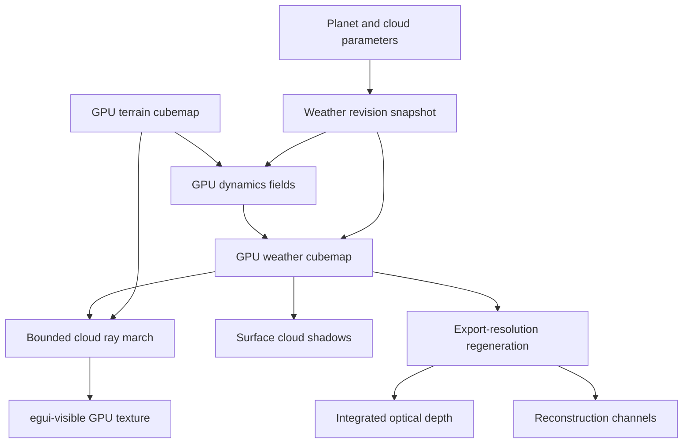
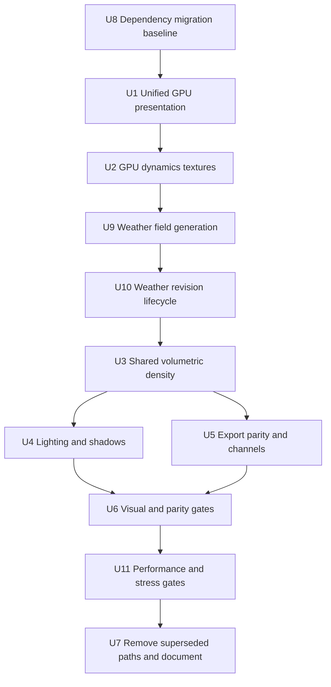
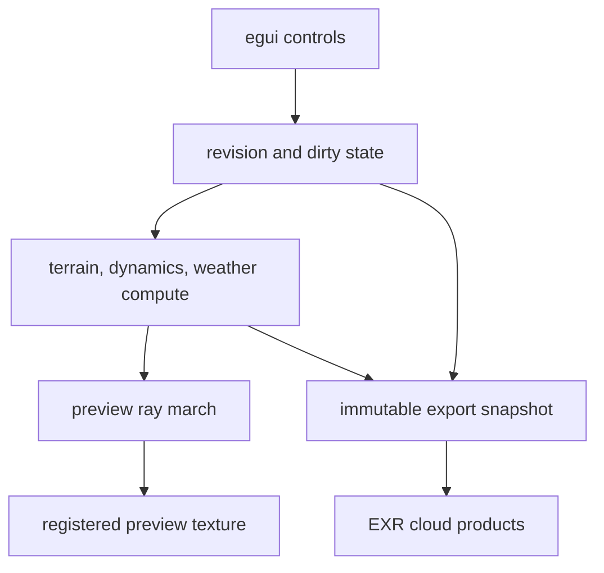

# feat: Add shallow volumetric clouds

## Summary

Unify the UI and renderer on one GPU device, generate a persistent weather cubemap, and consume it through a short bounded cloud ray march. The same weather and density definitions will drive preview lighting, surface shadows, optical-depth export, and reconstruction-channel export.

---

## Problem Frame

The current preview samples cloud density on two thin shells and the exporter implements a separate cloud algorithm. The result cannot produce real depth or reliable preview/export parity, and the current CPU readback path prevents a fully GPU-resident interactive renderer (see origin: `docs/brainstorms/2026-03-31-cloud-layer-requirements.md`).

---

## Requirements

- R1-R4. Render low and high clouds as bounded layers with spatially varying altitude, thickness, vertical density, and visible limb depth.
- R5-R9. Generate a deterministic weather state driven by climate and dynamics without coastline outlines, latitude bands, or global grey veils.
- R10-R12. Integrate optical depth, self-shadowing, forward scattering, and surface shadows from one density field.
- R13-R15. Preserve deterministic controls and use the same weather state for preview and both export products.
- R16-R18. Keep interactive work GPU-resident, meet the 30 FPS baseline target, and maintain deterministic visual references.

**Origin flows:** F1 (interactive planet preview), F2 (cloud export)

F1 regenerates weather only for density-affecting inputs. Camera and lighting changes rerender the current ready weather state without invalidating it.

**Origin acceptance examples:** AE1 (volumetric limb), AE2 (coherent weather), AE3 (coverage and performance), AE4 (lighting and shadows), AE5 (preview/export parity)

---

## Scope Boundaries

- Target Earth-like rocky planets only.
- Use a shallow planet-scale volume, not a general voxel atmosphere.
- Do not add ground-level or flight-level cloud rendering.
- Do not add numerical weather prediction or time-evolving fluid simulation.
- Do not replace the geological terrain pipeline.
- Do not add non-rocky, icy, or gas-giant cloud regimes.
- Do not preserve the old shell renderer or duplicated cloud export algorithm as compatibility modes.

### Deferred to Follow-Up Work

- Temporal reprojection or temporal upscaling: add only if the short stable ray march misses a measured quality or frame-time target.
- Animated weather advection: defer until the static weather field, seams, and deterministic parity are validated.
- Close-range cloud LODs and 3D detail textures: defer until planet-scale rendering demonstrates a concrete need.

---

## Context & Research

### Relevant Code and Patterns

- `src/preview.rs` owns the preview pipeline and currently returns CPU pixels after a blocking readback.
- `src/app.rs` owns persistent pipelines and dirty flags; terrain changes and visual-only changes already have separate update paths.
- `src/terrain_compute.rs` and `src/shaders/wind_field.wgsl` provide compute-pipeline and cubemap-generation patterns, but currently read wind and climate intermediates back to the CPU.
- `src/shaders/preview_cubemap.wgsl` contains reusable sphere intersection, atmosphere marching, climate inputs, cloud lighting order, and cube-direction sampling.
- `src/export.rs` has deterministic parameter snapshots and integration tests, but `src/shaders/cloud_map.wgsl` duplicates and diverges from preview cloud behavior.
- `src/bin/sweep.rs` is the existing deterministic visual-comparison harness; `src/bin/perf_bench.rs` is the existing performance harness.

### Institutional Learnings

- `docs/research/performance-visual-comparison.md` records that per-face semi-Lagrangian cloud advection produced seams, banding, and blocky low-resolution modulation. Do not revive it.
- `docs/solutions/architecture/tectonic-terrain-architecture-2026-03-30.md` establishes that sphere-space sampling and standard cubemap conventions avoid face discontinuities; custom neighbor operations still require seam-aware handling.
- `docs/research/cloud-rendering.md` recommends cheap coverage rejection before detail work, front-to-back integration, early transmittance termination, and limited shadow samples.
- The superseded `docs/plans/2026-03-31-003-feat-cloud-layer-v2-plan.md` remains useful failure evidence: threshold cliffs, latitude multiplication, flat alpha, and dominant procedural cyclones should not return.

### External References

- Andrew Schneider, *The Real-time Volumetric Cloudscapes of Horizon: Zero Dawn*: bounded spherical layer, weather channels, vertical profiles, coarse-to-fine marching, Beer-Lambert extinction, and HG lighting.
- Andrew Schneider, *Nubis: Authoring Real-Time Volumetric Cloudscapes with the Decima Engine*: production weather authoring and optimization.
- Andrew Schneider, *Nubis, Evolved*: local and long-range shadowing plus limits of temporal reconstruction for fast cloud motion.
- WMO International Cloud Atlas: physically plausible low, middle, and high cloud altitude ranges.
- wgpu 27 and WebGPU texture-view rules: one six-layer 2D texture can expose a compute `D2Array` view and a sampled `Cube` view; queue ordering supplies compute-to-fragment synchronization.

---

## Key Technical Decisions

- **One interactive GPU stack:** Upgrade to eframe/egui 0.33 and wgpu 27. The interactive app uses eframe's adapter, device, and queue; headless binaries and GPU tests retain one standalone context per process.
- **Persistent GPU fields:** Keep dynamics and weather textures allocated across frames. Recreate them only when resolution or format changes; regenerate content through explicit dirty revisions.
- **Portable half-float cubemaps:** Use `Rgba16Float` for filterable compute-written dynamics and weather fields after validating storage, sampling, filtering, six-layer array, and cube-view support. Fail clearly on unsupported adapters rather than adding speculative format fallbacks.
- **Static authored state first:** Generate deterministic weather from an explicit parameter snapshot. Do not add temporal simulation or history until static quality and parity pass.
- **Short physically based march:** Begin with eight view samples inside the bounded layer, front-to-back Beer-Lambert integration, world-stable start jitter, cheap occupancy rejection, and transmittance early exit.
- **Minimal light sampling:** Start with one local sun-direction density sample plus ambient height lighting. Add a coarse long-range sample only when references prove local shadowing insufficient.
- **Shared density include:** Preview and export compile the same weather interpretation, vertical profiles, and density functions. Export may evaluate at another resolution but cannot maintain a separate algorithm.
- **Snapshot export:** Export captures immutable click-time parameters and deterministically regenerates matching bounded-resolution fields for tiled output evaluation; later UI edits do not alter an active export.
- **Both export products:** Produce integrated optical depth for direct material use and reconstruction channels for downstream volumetric reconstruction.
- **Front/back revision state:** Track requested, submitted, and ready revisions. Generate into back resources, coalesce rapid edits to the latest request, and swap only a completed current revision; failures leave the front resources untouched.
- **Bounded export memory:** Export uses bounded-resolution weather fields and tiled density integration/readback. Final output resolution must not require a full-resolution six-face weather cubemap.

---

## Open Questions

### Resolved During Planning

- **GPU ownership:** Unify on eframe/egui 0.33 and wgpu 27 using one shared device and queue.
- **Export product:** Export both integrated optical depth and reconstruction channels.
- **Preview/export identity:** Regenerate deterministic export-resolution weather from the same parameter snapshot and WGSL definitions rather than copying preview-resolution texels.
- **Zero coverage:** Retain cached weather but skip cloud integration, cirrus, lighting, and surface-shadow work.
- **Progressive erosion:** Keep the last valid weather field during erosion and regenerate once the final terrain revision is available.

### Deferred to Implementation

- **Exact field packing:** Final channel allocation depends on shader binding limits and measured precision, but must preserve coverage, base, thickness, character, cirrus, moisture, pressure/convergence, wind, and continentality inputs.
- **Exact sample count:** Start at eight within the allowed 6-10 range and tune only against the visual matrix and 30 FPS gate.
- **Long-range shadow method:** Choose a second density sample or a coarse shadow field after measuring local-shadow quality and cost.
- **Visual comparison tolerances:** Establish coverage, correlation, seam, and image-difference thresholds from the first approved baseline set rather than inventing arbitrary values.

---

## High-Level Technical Design

> *This illustrates the intended approach and is directional guidance for review, not implementation specification. The implementing agent should treat it as context, not code to reproduce.*



Weather state follows a latest-wins lifecycle:

```text
missing -> generating(revision N) -> ready(revision N)
   |              |                        |
   |              +-> failed (keep last)  +-> stale after input change
   +----------------------------------------------> generating(revision N+1)
```

---

## Implementation Units



### U8. Establish the dependency migration baseline

**Goal:** Upgrade eframe/egui and wgpu to a compatible released pair while preserving current behavior and establishing fixed cloud-off characterization renders.

**Requirements:** R16-R18

**Dependencies:** None

**Files:**
- Modify: `Cargo.toml`
- Modify: `Cargo.lock`
- Modify: `src/main.rs`
- Modify: `src/gpu.rs`
- Modify: `src/app.rs`
- Modify: `src/preview.rs`
- Test: `src/gpu.rs`
- Test: `src/preview.rs`

**Approach:**
- Upgrade eframe/egui to 0.33 and wgpu to 27 without changing GPU ownership or presentation in the same change.
- Resolve compile-time API changes across every binary and test target.
- Capture fixed cloud-off renders and baseline frame timing before replacing presentation.
- Explicitly configure eframe's wgpu renderer so later access to its render state is guaranteed.

**Execution note:** Characterize the existing output before changing device ownership or presentation.

**Patterns to follow:**
- Existing GPU smoke tests in `src/gpu.rs` and deterministic preview tests in `src/preview.rs`.

**Test scenarios:**
- Happy path: all application, library, sweep, benchmark, and export targets compile against the aligned dependency graph.
- Integration: the app starts with the wgpu renderer and produces the fixed cloud-off reference.
- Regression: terrain orientation, camera controls, atmosphere, and non-cloud layer toggles match the pre-migration characterization within tolerance.
- Error path: unavailable wgpu render state fails with the existing clear GPU startup error rather than silently selecting an incompatible renderer.

**Verification:**
- One wgpu version is present in the dependency graph.
- All Cargo targets build and GPU tests pass before U1 changes ownership or presentation.
- Cloud-off reference images and p95 frame time are recorded as the migration baseline.

### U1. Unify GPU ownership and presentation

**Goal:** Align the UI and renderer on one wgpu version, device, and queue, then display the preview through a persistent egui-registered GPU texture without frame readback.

**Requirements:** R16-R17, F1, AE3

**Dependencies:** U8

**Files:**
- Modify: `src/main.rs`
- Modify: `src/gpu.rs`
- Modify: `src/app.rs`
- Modify: `src/preview.rs`
- Test: `src/gpu.rs`
- Test: `src/preview.rs`

**Approach:**
- Build the interactive `GpuContext` from eframe's render state while retaining standalone construction for sweeps, benchmarks, export tools, and GPU tests.
- Let `PreviewRenderer` own the persistent target texture and views; let `PlanetGenApp` own the egui texture registration.
- Render into a persistent sRGB preview target registered once with egui. On resize, register and switch to the replacement before releasing the old registration.
- Construct the app from eframe's `CreationContext` and retain the renderer access needed to update and release native texture registrations; device/queue access alone is insufficient.
- Keep HDR work internal and tone-map into the egui-visible target.
- Submit preview rendering before egui samples the target on the shared queue, and release the registration during shutdown.
- Preserve the existing application layout, camera controls, and offscreen renderer API where they do not force readback.

**Execution note:** Add characterization coverage for current deterministic rendering before replacing presentation.

**Patterns to follow:**
- Existing device/error handling in `src/gpu.rs`.
- Existing preview target and render-pass setup in `src/preview.rs`.
- egui-wgpu native texture registration and render callback lifecycle for eframe/egui 0.33.

**Test scenarios:**
- Happy path: initialize the app on a supported adapter and display the registered preview texture without producing a CPU pixel buffer.
- Integration: rotate, zoom, pan, and change light direction; each action updates the same registered texture and does not recreate the GPU device.
- Edge case: resize the viewport repeatedly; the target is recreated safely and the existing egui texture identity is updated without stale views.
- Stress: repeated resize cycles keep texture registrations and GPU allocations bounded.
- Error path: fail GPU initialization or target allocation; surface the existing user-visible GPU error instead of panicking or showing an invalid texture.
- Regression: render a fixed seed before and after migration with clouds disabled; geometry, orientation, and layer toggles remain visually equivalent within tolerance.

**Verification:**
- The dependency graph contains one wgpu version for application and egui rendering.
- Interactive preview updates contain no synchronous frame readback or `device.poll(Wait)`.
- All application, library, binary, and GPU integration targets remain green after migration.

### U2. Add GPU-resident dynamics textures

**Goal:** Replace CPU-packed wind, continentality, and pressure intermediates with persistent GPU cubemaps usable by later weather generation.

**Requirements:** R5-R6, R16-R17, F1

**Dependencies:** U1

**Files:**
- Modify: `src/app.rs`
- Modify: `src/terrain_compute.rs`
- Modify: `src/shaders/wind_field.wgsl`
- Modify: `src/preview.rs`
- Test: `src/terrain_compute.rs`

**Approach:**
- Allocate validated `Rgba16Float` six-layer compute-writable textures with cube sampling views for interactive dynamics.
- Keep wind, continentality, pressure/convergence, and required climate intermediates on the same queue without CPU mapping or repacking.
- Preserve standalone readback only where headless tests or final export files explicitly require it.
- Use normalized sphere-space coordinates and true cube sampling for seam continuity; avoid per-face advection and planar offsets.

**Patterns to follow:**
- Compute pipeline ownership and matching Rust/WGSL uniform layouts in `src/terrain_compute.rs`.
- Wide continentality smoothing in `src/shaders/wind_field.wgsl` to avoid coastline ghosting.
- Existing `needs_terrain` and `needs_render` separation in `src/app.rs`.

**Test scenarios:**
- Happy path: fixed Earth-like parameters generate finite dynamics channels within documented ranges on all six faces.
- Determinism: identical parameter snapshots generate equivalent dynamics fields.
- Edge case: season values 0.49, 0.50, and 0.51 transition continuously without sign-flip discontinuity.
- Seam: samples approaching every cubemap edge and corner remain continuous within half-float tolerance.
- Error path: unsupported texture capabilities fail clearly before allocation.

**Verification:**
- Normal interactive weather generation performs no GPU-to-CPU map or repack.
- Debug views inspect GPU dynamics channels without triggering readback or alternate generation.

### U9. Generate the deterministic weather field

**Goal:** Generate coverage, base altitude, thickness, cloud character, and cirrus from one documented parameter and channel contract.

**Requirements:** R5-R9, R13, R15-R16, F1, AE2-AE3

**Dependencies:** U2

**Files:**
- Create: `src/weather.rs`
- Create: `src/shaders/weather_field.wgsl`
- Modify: `src/lib.rs`
- Modify: `src/app.rs`
- Modify: `src/preview.rs`
- Test: `src/weather.rs`

**Approach:**
- Define one Rust snapshot containing every density-affecting input with a matching documented Rust/WGSL layout and physical units.
- Generate the packed `Rgba16Float` weather cubemap from moisture, pressure convergence/divergence, temperature, terrain lift, rain shadows, latitude, season, seed, storms, wind, and continentality.
- Keep weather resolution independent from viewport and export resolution; begin at half standard preview resolution.
- Separate coarse occupancy from procedural cloud detail so the later ray marcher can reject empty regions cheaply.
- Record an allocation table for dynamics, weather, front/back revisions, debug targets, and transient resources before accepting the field layout.

**Patterns to follow:**
- Matching `#[repr(C)]`/WGSL parameter layouts and compute pipeline ownership in `src/terrain_compute.rs`.
- Wide continentality smoothing and sphere-space sampling in `src/shaders/wind_field.wgsl`.

**Test scenarios:**
- Happy path: fixed Earth-like inputs generate finite weather channels in documented ranges on all faces.
- Determinism: identical snapshots match; changing cloud seed changes formations without invalid channel values.
- Covers AE2: coverage 0.5 contains coherent occupied and clear regions without coastline or latitude correlation spikes.
- Driver influence: controlled changes to temperature, terrain lift/rain shadow, convergence/divergence, latitude, and season produce deterministic changes in the intended weather channels.
- Edge case: negligible atmosphere or moisture produces a valid clear weather field.
- Seam: every edge and corner is continuous within approved half-float tolerance.
- Layout: Rust/WGSL sizes, alignment, channel semantics, and units remain synchronized.

**Verification:**
- Preview and export can consume the same snapshot and weather-generation shader contract.
- Persistent preview weather memory stays within the documented budget before front/back lifecycle is added.

### U10. Add revision-aware weather lifecycle

**Goal:** Coalesce rapid edits, retain last-good weather, and atomically swap only completed current revisions.

**Requirements:** R15-R17, F1, AE3

**Dependencies:** U9

**Files:**
- Modify: `src/weather.rs`
- Modify: `src/app.rs`
- Modify: `src/preview.rs`
- Test: `src/weather.rs`

**Approach:**
- Track requested, submitted, and ready revisions with an immutable snapshot per submitted revision.
- Keep distinct front/back field resources; at most one generation is in flight and intermediate edits coalesce to the newest request.
- Represent generation as explicit idle/submitted/completed states, receive queue-completion notification asynchronously, and advance completion from the eframe update loop without blocking device polls.
- Track the latest completed revision separately from the latest requested revision. Publish the newest completed current result, retain a newer completed fallback when another request is pending, and promote that fallback if the newest request fails or is cancelled.
- Terrain, season, climate, seed, storms, and dynamics invalidate weather; camera, light, opacity, visibility, and resize do not.
- Retain previous weather during progressive erosion and regenerate once from the final terrain revision.

**Test scenarios:**
- Invalidation: density-affecting controls request weather while presentation-only controls request render only.
- Rapid edits: many seed/season changes produce one latest ready revision and no stale swap.
- Starvation: continuous edits cannot leave the display indefinitely pinned to an arbitrarily old revision; displayed-versus-requested lag remains observable.
- Edge case: resize during generation preserves weather and only recreates presentation resources.
- Integration: progressive erosion triggers one final weather update, not one per batch.
- Error path: allocation or dispatch failure leaves front resources and ready revision unchanged.

**Verification:**
- No obsolete revision can replace a newer requested state.
- Front/back allocations fit the declared peak preview memory budget.
- Weather regeneration latency and coalescing behavior are observable to U11 instrumentation.

### U3. Implement shared shallow-volume density and ray marching

**Goal:** Replace shell sampling with a bounded low-cloud volume and a distinct thin cirrus layer using one shared density definition.

**Requirements:** R1-R4, R7, R9-R10, R13, R17, F1, AE1-AE3

**Dependencies:** U10

**Files:**
- Create: `src/shaders/cloud_density.wgsl`
- Modify: `src/shaders/preview_cubemap.wgsl`
- Modify: `src/preview.rs`
- Test: `src/preview.rs`

**Approach:**
- Intersect the camera ray with inner and outer cloud radii and clamp the interval against the planet surface.
- Express cloud altitude in physical distance converted to planet-radius units; clip density below terrain and keep thickness positive.
- Use weather coverage and character to choose a cheap vertical density profile, then add sphere-space low-frequency formation and conditional edge erosion.
- March front-to-back with an eight-sample baseline, world-stable start jitter, coarse occupancy rejection, Beer-Lambert segment transmittance, and early termination near opacity.
- Treat each occupied view step plus its light lookup as a density-evaluation budget; do not run unconditional multi-octave noise in both paths.
- Provide measured 6/8/10-sample quality variants, with eight as the acceptance baseline rather than silently increasing cost.
- Render cirrus from a separate sparse high-altitude profile while sharing weather coordinates and deterministic inputs.
- Keep the shared density functions independent of preview-only color composition so export can compile them unchanged.

**Patterns to follow:**
- Atmosphere sphere intersection and bounded marching in `src/shaders/preview_cubemap.wgsl`.
- Sphere-space noise conventions in `src/shaders/noise.wgsl`.
- Existing shader concatenation through `include_str!()` in `src/preview.rs`.

**Test scenarios:**
- Covers AE1: grazing limb views show bounded cloud depth, soft top/base transitions, and no visible shell edge.
- Temporal limb: continuous orbit through grazing angles keeps optical depth stable without popping or shimmer beyond the approved tolerance.
- Covers AE2: coverage 0.5 produces coherent clear and cloudy regions without a global veil.
- Covers AE3: coverage zero produces identical pixels to clouds disabled and bypasses density marching.
- Edge case: camera rays missing the cloud layer contribute no cloud radiance or opacity.
- Edge case: high terrain intersecting the nominal cloud base contains no below-ground density.
- Edge case: very low atmosphere/moisture produces clear skies rather than invalid thickness or NaN values.
- Determinism: frozen seed, camera, light, and jitter index produce stable output.
- Seam: a formation crossing each cubemap edge remains continuous in normal and limb views.

**Verification:**
- Low-cloud rendering no longer samples density at one shell point.
- The visual cloud debug view can isolate integrated density from lighting and atmosphere.
- Eight samples meet the visual baseline before any sample-count increase is considered.

### U4. Add volumetric lighting and surface shadows

**Goal:** Derive cloud shading, self-shadowing, forward scattering, and surface shadows from integrated volume density.

**Requirements:** R10-R12, R17, F1, AE4

**Dependencies:** U3

**Files:**
- Modify: `src/shaders/cloud_density.wgsl`
- Modify: `src/shaders/preview_cubemap.wgsl`
- Modify: `src/preview.rs`
- Test: `src/preview.rs`

**Approach:**
- Evaluate sun transmittance from at least one local density sample per occupied view step and combine it with height-dependent ambient sky lighting.
- Use a normalized, bounded forward-scattering phase approximation; avoid unbounded empirical brightening.
- Accumulate premultiplied in-scattering and transmittance, then compose clouds before the existing atmosphere pass and tone mapping.
- Compute surface shadow optical depth from the same weather and density functions at the sun-projected cloud interval, with softness driven by layer altitude and thickness.
- Add a coarse long-range shadow term only if approved backlit and overcast references remain spatially flat.

**Patterns to follow:**
- Existing atmosphere transmittance and in-scattering composition order in `src/shaders/preview_cubemap.wgsl`.
- Existing star color and sun direction inputs so clouds, surface, and atmosphere share illumination.

**Test scenarios:**
- Covers AE4: low-sun dense clouds show a bright sun-facing edge, shaded interior, and aligned soft surface shadow.
- Happy path: thin clouds remain translucent while dense cores approach opacity without clipping to uniform white.
- Edge case: backlit clouds produce a restrained silver lining without haloing across clear pixels.
- Edge case: night-side clouds retain low ambient visibility but do not emit light.
- Integration: disabling cloud visibility removes both cloud radiance and cloud shadows; changing opacity affects visible composition but not authored weather state.
- Regression: atmosphere-on and atmosphere-off compositions preserve cloud depth and do not double-apply extinction.

**Verification:**
- Visible clouds and surface shadows move consistently with sun direction.
- Lighting adds depth in isolated cloud debug renders before terrain and atmosphere are re-enabled.
- The lighting pass remains within the provisional incremental budget and passes the final U11 frame-time gate.

### U5. Unify export and add reconstruction channels

**Goal:** Replace the separate export cloud algorithm with deterministic export-resolution evaluation of the shared weather and density definitions.

**Requirements:** R13-R15, F2, AE5

**Dependencies:** U3

**Files:**
- Modify: `src/export.rs`
- Replace: `src/shaders/cloud_map.wgsl`
- Modify: `src/app.rs`
- Modify: `src/bin/sweep.rs`
- Test: `src/export.rs`

**Approach:**
- Capture an immutable export snapshot containing every density-affecting input; preview visibility and display opacity remain presentation-only.
- Regenerate dynamics and weather deterministically from shared shader definitions at a bounded field resolution, then evaluate final outputs in tiles rather than allocating full-resolution cubemaps.
- Integrate low-cloud and cirrus density vertically into a direct-use optical-depth map.
- Export reconstruction data for coverage, base altitude, thickness, cloud character, and cirrus using documented units and channel semantics.
- Keep selective export independent from preview layer visibility.
- Stream bounded tile or scanline buffers directly to temporary EXR outputs rather than retaining complete six-face arrays for every product; publish final files only after all selected writers close successfully.
- Advance interactive export through bounded in-flight submissions and asynchronous map-completion channels driven by the eframe update loop. Headless export may block on its standalone device.
- Cap export batch GPU duration through measured tile sizing; if shared-queue p99 latency cannot pass, allow interactive export to use a separate standalone context rather than starving preview submissions.

**Patterns to follow:**
- Existing immutable `ExportConfig`, progress channel, cancellation checks, and EXR writing in `src/export.rs`.
- Existing direct-versus-tiled equivalence tests in `src/export.rs`.

**Test scenarios:**
- Covers AE5: at a shared field resolution, preview and export evaluate identical world-space rays and pass fixed optical-depth error bounds; production-resolution output separately passes coverage, percentile-error, and formation-correlation bounds.
- Happy path: selecting cloud export writes optical depth plus documented reconstruction channels with finite values and expected dimensions.
- Determinism: two exports from the same snapshot match within floating-point tolerance even if UI values change during the second export.
- Control parity: storms, wind, season, climate moisture, and cloud seed affect export; preview visibility and display opacity do not.
- Edge case: coverage zero exports valid all-zero optical depth while reconstruction metadata remains well-formed.
- Seam: exported fields are continuous across all cubemap edges before equirectangular conversion.
- Error path: cancellation or write failure does not publish a complete-looking partial cloud product.
- Performance: 1K, 2K, and 4K exports scale near-linearly with output pixels, and peak GPU/CPU memory remains bounded by tile and weather-field size; 8K is measured where hardware permits and otherwise projected from recorded data.

**Verification:**
- Preview and export compile the same cloud density include.
- The old independent density implementation is no longer reachable.
- Blender/downstream documentation identifies direct-use and reconstruction outputs unambiguously.

### U6. Establish deterministic visual, seam, and parity gates

**Goal:** Make cloud quality, preview/export parity, and seam continuity measurable before old paths are removed.

**Requirements:** R18, AE1-AE5

**Dependencies:** U4, U5

**Files:**
- Modify: `src/bin/sweep.rs`
- Modify: `src/preview.rs`
- Modify: `src/export.rs`
- Create: `docs/research/shallow-volumetric-cloud-validation.md`
- Test: `src/preview.rs`
- Test: `src/export.rs`

**Approach:**
- Freeze deterministic seeds, camera poses, light directions, season, and jitter indices for clear, scattered, overcast, storm, backlit, limb, and polar references.
- Add isolated cloud-density and cloud-lighting views so failures can be attributed without terrain, ice, atmosphere, or cities.
- Compare preview and export in unlit optical-depth space using coverage, directional correlation, and seam metrics before judging final color renders.
- Start with explicit gates: absolute coverage difference at most 0.03, world-ray optical-depth correlation at least 0.95, and normalized seam discontinuity at most 0.02. Store baselines under `docs/images/cloud-validation/`; changing a baseline requires an explicit review rather than automatic replacement.

**Patterns to follow:**
- Existing deterministic sweep cases in `src/bin/sweep.rs`.
- Existing timing summaries in `src/bin/perf_bench.rs` and `docs/research/performance-visual-comparison.md`.

**Test scenarios:**
- Covers AE1-AE4: generate all seven required visual references and verify finite, non-empty outputs where clouds are expected.
- Covers AE5: preview/export optical-depth coverage and formation correlation pass the approved thresholds.
- Seam: edge and corner probes pass for dynamics, weather, integrated density, and export projections.
- Regression: clouds disabled preserve the approved surface/atmosphere reference and avoid cloud GPU passes.

**Verification:**
- Every origin acceptance example has an automated metric or deterministic reference case.
- Validation documentation records known limits rather than hiding failed cases through hand-picked screenshots.

### U11. Establish performance and lifecycle stress gates

**Goal:** Prove interactive frame time, bounded memory, revision coalescing, and export coexistence under worst-case cloud occupancy.

**Requirements:** R16-R18, F1-F2, AE3

**Dependencies:** U6

**Files:**
- Modify: `src/bin/perf_bench.rs`
- Modify: `src/bin/sweep.rs`
- Modify: `src/weather.rs`
- Modify: `src/preview.rs`
- Modify: `src/export.rs`
- Modify: `docs/research/shallow-volumetric-cloud-validation.md`
- Test: `src/weather.rs`
- Test: `src/preview.rs`
- Test: `src/export.rs`

**Approach:**
- Measure continuous orbit for ten seconds after warmup and report p95, p99, and worst frame time for clouds-off and clouds-on cases.
- Treat p95 at or below 33.3 ms at a 768x768 render target as the acceptance target on the named baseline GPU, with no more than 8-10 ms p95 incremental cloud GPU time. Missing it blocks U7 until optimization succeeds or the requirement is explicitly revised.
- Measure clear, scattered, overcast, storm, grazing-limb, and backlit cases so early exits are not mistaken for worst-case feasibility.
- Record weather-generation latency and clouds-on incremental cost separately. Add deeper occupancy or per-stage counters only if end-to-end measurements cannot identify a failed budget.
- Use delayed GPU timestamps when supported; retain end-to-end frame percentiles as the portable acceptance metric and avoid building a profiling subsystem beyond what a failed gate requires.
- Measure preview frame time during active tiled export and require bounded memory independent of final export resolution.
- Stress rapid edits, resize, cancellation, generation failure, and export contention while tracking revisions, allocations, and validation errors.

**Patterns to follow:**
- Existing benchmark reporting in `src/bin/perf_bench.rs` and fixed-seed cases in `src/bin/sweep.rs`.

**Test scenarios:**
- Covers AE3: ten seconds of continuous orbit meets the p95 frame gate with standard Earth-like scattered clouds.
- Worst case: overcast storm, grazing limb, and backlit cases remain within the documented frame budget or fail the gate explicitly.
- Zero coverage: cloud cost is statistically indistinguishable from clouds disabled and no cloud pass executes.
- Sample variants: 6, 8, and 10 samples report quality and GPU time; eight passes both visual and performance acceptance across the maximum accepted shell interval.
- Queue contention: interactive preview remains responsive during 4K cloud export without device-wide waits.
- Memory: persistent preview weather remains within the documented budget and 4K/8K export memory is bounded by tiles.
- Stress: repeated resize and parameter edits produce no allocation growth, stale revision swaps, validation errors, or leaked egui registrations.
- Failure: cancelling export or forcing weather generation failure preserves last-good preview and leaves no complete-looking partial export.

**Verification:**
- The baseline report identifies adapter, backend, driver, power mode, resolutions, field formats, sample count, and clouds-on/off timings.
- No interactive path performs texture-to-buffer frame readback or synchronous device polling.
- U7 begins only after visual, parity, seam, performance, and lifecycle gates pass.

### U7. Remove superseded cloud paths and update documentation

**Goal:** Delete obsolete shell-only and duplicated cloud paths after the new validation gates pass, then make project tracking reflect the active architecture.

**Requirements:** R13, R16-R18

**Dependencies:** U11

**Files:**
- Modify: `src/shaders/preview_cubemap.wgsl`
- Modify: `src/export.rs`
- Modify: `src/terrain_compute.rs`
- Modify: `README.md`
- Modify: `CLAUDE.md`
- Modify: `Plans.md`
- Modify: `docs/plans/2026-03-31-002-feat-cloud-layer-plan.md`
- Modify: `docs/plans/2026-03-31-003-feat-cloud-layer-v2-plan.md`
- Modify: `docs/research/performance-visual-comparison.md`

**Approach:**
- Remove unreachable shell density, old cirrus shell, CPU wind packing, and duplicated export generation after replacement coverage exists.
- Mark both historical cloud plans superseded and add the new phase to `Plans.md`.
- Update architecture and export documentation to describe the persistent weather field, bounded volume, direct GPU presentation, and both export products.
- Keep research history that explains failed advection and shell approaches; mark stale performance numbers rather than deleting the evidence.

**Test scenarios:**
- No new test scenarios; rerun all existing visual, parity, export, lifecycle, and performance gates after deleting the superseded paths.

**Verification:**
- Repository search finds no active references to the old shell-only or independent export density paths.
- Project documentation and plan status agree with the code that runs.
- Full library tests, release build, deterministic visual matrix, export integration, and performance gates pass after deletion.

---

## System-Wide Impact



- **Interaction graph:** Cloud-, climate-, terrain-, and season-changing controls invalidate weather; camera, light, opacity, and visibility remain render-only. Export snapshots the current authored inputs and runs independently.
- **Error propagation:** GPU setup, allocation, shader, or dispatch failures retain the last-good preview and surface through the existing GPU error UI. Export cancellation or failure reports through the progress channel and does not publish complete-looking partial outputs.
- **State lifecycle risks:** Old weather jobs must not replace newer revisions. Resizes recreate presentation targets but should not rebuild weather. Progressive erosion invalidates weather once at completion.
- **GPU consumers:** The interactive app uses eframe-backed GPU ownership; sweeps, benchmarks, headless export, and GPU tests retain standalone contexts and must remain valid migration targets.
- **Queue contention:** Interactive export and weather generation share the app queue, use bounded submissions, and must not introduce device-wide waits that starve preview rendering.
- **Error ownership:** Replace frame-path nested device error scopes with subsystem-labelled submission/completion results or a serialized scope coordinator. One subsystem cannot consume another's error or clear its last-good state.
- **API surface parity:** Preview, export, debug views, sweep tooling, and Blender-facing outputs must share channel definitions and units.
- **Integration coverage:** Unit tests cannot prove visual depth, seam continuity, device-sharing behavior, preview/export alignment, or queue coexistence; U6 owns visual/parity validation and U11 owns performance/lifecycle validation.
- **Unchanged invariants:** Terrain generation, biome classification, atmosphere scattering, camera interaction, selective layer export, and non-cloud maps retain current behavior except where GPU ownership migration requires mechanical API updates.

---

## Alternative Approaches Considered

- **Multiple displaced shells:** Lower implementation cost, but cannot satisfy volumetric limb, parallax, or integrated optical depth requirements.
- **Full 3D planet texture:** Better close-up potential, but adds excessive memory, update, LOD, and seam complexity for an interactive globe editor.
- **Keep CPU preview readback:** Avoids dependency migration but directly violates GPU residency and makes the 30 FPS contract structurally fragile.
- **Custom egui-wgpu fork for wgpu 26:** Preserves the current renderer version at permanent maintenance cost; upgrading both sides to a compatible released pair is smaller.
- **Reuse preview-resolution weather for export:** Guarantees texel identity but caps export detail and couples offline output to UI resolution. Deterministic regeneration from shared definitions preserves formations without that ceiling.

---

## Risks & Dependencies

| Risk | Likelihood | Impact | Mitigation |
|------|------------|--------|------------|
| eframe/wgpu upgrade causes broad API churn | High | High | Isolate and validate U8 before proceeding to U1; preserve fixed cloud-off render references. |
| Eight-step march remains too expensive | Medium | High | Cheap occupancy rejection, conditional detail, early transmittance exit, half-float fields, and measured sample tuning. |
| Clouds still appear flat with short light sampling | Medium | High | Validate isolated lighting references; add one coarse long-range term only after measured failure. |
| Weather cubemap reveals seams | Medium | High | Sphere-space generation, true cube sampling, explicit edge/corner tests, and no per-face advection. |
| Weather follows coastlines or latitude bands | Medium | High | Use smoothed continentality, convergence, and warped climate inputs; validate density independently across fixed seeds. |
| Preview and export drift again | Medium | High | Shared WGSL density definitions, immutable snapshots, optical-depth parity metrics, and deletion of the duplicate algorithm. |
| GPU memory grows unexpectedly | Low | Medium | Start at half preview resolution with no mip chain or ping-pong history; document allocations and add only measured needs. |
| Old revisions replace newer edits | Medium | Medium | Revision-key generation and atomic latest-wins swap while retaining last-good state. |

---

## Phased Delivery

### Phase 1: Rendering foundation

- U8 aligns dependency versions and captures characterization baselines.
- U1 aligns interactive GPU ownership and removes preview frame readback.
- U2 establishes persistent GPU dynamics textures.
- U9 adds deterministic weather generation and its channel contract.
- U10 adds front/back revision lifecycle and invalidation.

### Phase 2: Volumetric appearance

- U3 adds bounded density integration and cirrus.
- U4 adds lighting and surface shadows.

### Phase 3: Output and proof

- U5 unifies export and adds both output products.
- U6 establishes visual, seam, and parity gates.
- U11 establishes frame-time, memory, export-contention, and lifecycle gates.
- U7 removes superseded paths and updates tracking only after every gate passes.

---

## Documentation / Operational Notes

- Record the baseline GPU, driver/backend, preview resolution, sample count, weather resolution, and clouds-on/off timings.
- Document optical-depth units and every reconstruction channel for Blender and other downstream tools.
- Keep unsupported-GPU behavior consistent with existing startup and OOM messaging.
- Update `Plans.md` only as implementation units complete, following repository completion-marker conventions.

---

## Sources & References

- **Origin document:** [docs/brainstorms/2026-03-31-cloud-layer-requirements.md](../brainstorms/2026-03-31-cloud-layer-requirements.md)
- Related code: `src/app.rs`, `src/preview.rs`, `src/terrain_compute.rs`, `src/export.rs`
- Related shaders: `src/shaders/preview_cubemap.wgsl`, `src/shaders/wind_field.wgsl`, `src/shaders/cloud_map.wgsl`
- Local research: `docs/research/cloud-rendering.md`, `docs/research/performance-visual-comparison.md`, `docs/research/pbr-materials-pipeline.md`
- External: [Horizon Zero Dawn cloudscapes](https://advances.realtimerendering.com/s2015/The%20Real-time%20Volumetric%20Cloudscapes%20of%20Horizon%20-%20Zero%20Dawn%20-%20ARTR.pdf)
- External: [Nubis, Evolved](https://advances.realtimerendering.com/s2022/SIGGRAPH2022-Advances-NubisEvolved-NoVideos.pdf)
- External: [WMO cloud levels](https://cloudatlas.wmo.int/en/clouds-definitions.html)
- External: [wgpu documentation](https://docs.rs/wgpu/27)
