# feat: Procedural Terrain Realism

## Summary

Replace the abandoned Terrain Diffusion direction with a deterministic GPU-only terrain hierarchy: cross-face macro geology, meso tectonic relief and hydrology, then topology-preserving residual restoration. The work retires both the Terrain Diffusion and dormant imported-terrain product paths, retains evaluator-only artifact support and negative research evidence, preserves current procedural controls, and rejects any phase that violates the 768-face preview or 8K export hard budgets.

---

## Problem Frame

The current procedural terrain has face-local and scale-coupling weaknesses: plate structure does not consistently explain macro landforms, erosion can erase fine relief, drainage can terminate at face boundaries, and preview/export construction is not yet proven equivalent. Terrain Diffusion adds disallowed runtime and asset complexity without solving those product needs. This plan follows the deterministic GPU direction and cleanup authorization in the origin document (see origin: `docs/brainstorms/2026-07-28-procedural-terrain-realism-requirements.md`).

---

## Requirements Traceability

| Requirement | Planned coverage |
|---|---|
| R1. Deterministic GPU-only terrain | U1 removes ML and dormant imported-terrain product paths; U2–U7 remain Rust/wgpu/WGSL-only and measure repeatability. |
| R2. Remove Terrain Diffusion runtime/application/spike code/config | U1 removes the developer preview runtime, explicit product/import allowlist, and direct dependencies after audit. |
| R3. Delete ignored assets only after exact confirmation; retain negative manifests | U1 records the approved deletion set before any ignored-asset deletion and preserves both native/libtorch manifests. |
| R4. Generalize useful exploration metrics | U1/U2 rename or generalize evaluation semantics into procedural quality gates without ML requirements. |
| R5. Macro, meso, residual hierarchy | U3 creates macro fields; U4/U5 create meso relief/hydrology; U6 restores residual detail. |
| R6. Preserve high-frequency residual through erosion | U6 enforces fine-band energy retention after U5 erosion. |
| R7. Boundary type/stress drives landforms | U3 carries boundary/stress data; U4 applies convergent, divergent, and transform responses. |
| R8. Precipitation conditions erosion/drainage | U5 consumes the shared climate/precipitation field in cross-face hydrology. |
| R9. Favor geology under performance pressure | U2 establishes budgets; U3–U7 use phase rejection gates and retain macro/meso structure before decorative detail. |
| R10. Continuous terrain-derived maps across cube faces | U3/U5/U7 use spherical cross-face sampling for height, climate, normals, AO, roughness, albedo, and export overlap. |
| R11. No artificial face-edge river termination | U5 adds cross-face drainage topology validation. |
| R12. Preview/export material parity | U2 removes export-only hard-coded terrain parameters and establishes the streaming substrate; U5/U7 validate parity. |
| R13. Same build/adapter exact repeat | U2 and U7 retain exact repeat artifact checks. |
| R14. Measure cross-adapter tolerance | U2 defines artifact collection/reporting; U7 records and gates a measured tolerance. |
| R15. 768-face preview <=1 second | U2 baseline and every U3–U7 phase reject regressions beyond this limit. |
| R16. 8K <=3 minutes; 30 seconds aspirational | U2 baseline and every U3–U7 phase reject regressions beyond three minutes; 30 seconds is reported only. |
| R17. Minimal corrections first | U1/U2 stabilize and characterize current behavior before the hierarchy work. |
| R18. Defer equal-area/global rewrite | Scope boundary and U3 explicitly avoid activating the existing face-local JFA unchanged or starting an equal-area rewrite. |

**Acceptance examples:** AE1 is verified by U4–U6; AE2 by U3–U5; AE3 by U3, U5, and U7; AE4 by U2 and U7; AE5 by U1. All origin success criteria are gates in U2, U5–U7.

---

## Scope Boundaries

### In Scope

- Deterministic GPU procedural terrain realism, quality evaluation, cross-face continuity, preview/export parity, and Terrain Diffusion runtime/application/spike cleanup.
- Retained negative research manifests and portable procedural quality metrics.
- Minimal-correction baseline work required to make the current erosion and export paths trustworthy before hierarchy work.

### Deferred for Later

- Equal-area grid conversion and a whole-system terrain rewrite beyond minimal corrections.
- The 30-second 8K export target unless it is reached without weakening quality gates or geological priority.

### Out of Scope

- Whole-planet 90 m terrain generation.
- ML terrain generation/inference, Python, ONNX, TorchScript, model distribution, and hidden experiments.
- Ignored multi-GB asset deletion without an exact approved target set.

### Deferred to Follow-Up Work

- Any broader app-control redesign. Existing terrain, erosion, plate, climate, and export controls remain intact unless a requirement explicitly requires a change.
- Optional equal-area-domain research or ML alternatives; neither enters an active implementation unit.

---

## Context and Research

### Relevant Existing Surfaces

- `src/app.rs` constructs preview terrain, schedules progressive erosion, and currently owns the Terrain Diffusion developer-preview UI/state.
- `src/terrain_compute.rs` owns `TerrainGenParams`, CPU readback terrain generation, the face-local JFA pipeline, and the current erosion ping-pong path.
- `src/shaders/cube_sphere.wgsl` and `src/plates.rs`/`src/shaders/plates.wgsl` provide the established spherical mapping and deterministic plate inputs to reuse for cross-face work.
- `src/export.rs` tiles terrain generation but currently constructs fixed terrain values rather than using the preview's derived terrain parameters; its export architecture must become bounded-memory before a mandatory 8K gate.
- `src/weather.rs`, `src/shaders/weather_field.wgsl`, `src/shaders/normal_map.wgsl`, `src/shaders/ao_map.wgsl`, `src/shaders/roughness_map.wgsl`, and `src/shaders/albedo_map.wgsl` are the terrain consumers that must converge on a common cross-face sampler.
- `src/bin/perf_bench.rs`, `src/bin/erosion_compare.rs`, and `src/bin/sweep.rs` establish existing diagnostic/benchmark entry points.
- `src/main.rs`, `src/terrain_artifact.rs`, imported branches in `src/app.rs`, and `tests/terrain_artifact_import.rs` are the dormant imported-terrain product path; they must be audited/disposed separately from evaluator-only artifact support.
- `src/bin/terrain_diffusion_eval.rs` and `tests/terrain_diffusion_eval_cli.rs` / `tests/terrain_diffusion_eval_protocol.rs` contain useful seam, normal, pole, artifact, and exact-repeat evaluation logic that should become evaluator-only procedural-terrain terminology where it remains useful.
- `docs/research/terrain-diffusion-native-spike-manifest.md` and `docs/research/terrain-diffusion-libtorch-spike-manifest.md` are retained negative evidence.

### Execution Posture

Use characterization-first work for U1–U2 and for every correction to existing erosion/export behavior. New terrain-quality gates should be written test-first where CPU-visible artifacts or deterministic reports make that possible. GPU visual changes require both deterministic artifact metrics and the relevant integration capture; no phase relies on visual inspection alone.

---

## High-Level Technical Design

This diagram is directional guidance for review, not implementation specification. It fixes ownership and ordering while leaving only measured working resolutions, tile sizes, and pass counts open.

```mermaid
flowchart LR
    P[Seed + PlanetParams + derived properties] --> PL[Deterministic plates]
    PL --> M[Cross-face low-resolution macro field\nplate / boundary / stress / base elevation / continentality]
    M --> T[U4 meso tectonic relief]
    T --> C[Deterministic shared pre-erosion precipitation/runoff]
    T --> H[Cross-face hydrology + erosion]
    C --> H
    H --> R[Topology-preserving residual reapplication]
    M --> R
    R --> W[Final weather and cloud regeneration]
    R --> S[Common cross-face height/climate sampling]
    W --> S
    S --> PR[Preview height, normals, AO, roughness, albedo]
    S --> EX[Export height, water, maps, halo/overlap]
    PR --> Q[Procedural terrain quality evaluation]
    EX --> Q
```

---

## Key Technical Decisions

1. **Terrain Diffusion and imported-terrain product paths are retired, not hidden.** U1 uses an explicit runtime/source/config allowlist, including the dormant import CLI/app branches, and removes a direct dependency only after usage audit. Tracked research/history remains by default; ignored assets need separate explicit deletion approval.
2. **Cross-face data is foundational.** Macro fields, hydrology, and downstream map sampling use direction-based cube-face mapping and proven spherical/cross-face patterns. U3 directly scores nearest/second-nearest plates on the sphere; the current `JfaSeed`/face-pixel-distance JFA is explicitly prohibited for macro boundary proximity or hydrology.
3. **Quality is measured from canonical artifacts.** Preserve before/after artifacts, deterministic hashes, seam/normal/pole metrics, spectral-energy metrics, parity metrics, and cross-adapter records. FNV remains display identity; exact bytes remain the same-build/same-adapter authority.
4. **Preview and export share parameter derivation.** Export consumes the same terrain parameter derivation and generation configuration as preview, rather than recreating hard-coded terrain values.
5. **The pre-erosion climate field has terrain-pipeline ownership.** U4 meso height deterministically produces shared precipitation/runoff from `PlanetParams.seed`, macro/meso inputs, and fixed stage salts; U5 consumes it for erosion; U6 restores residuals; only then does final weather/cloud generation run. Cloud mass is never used as precipitation. Preview and export create the same field from the same inputs.
6. **Erosion is low-resolution meso processing.** It uses precipitation and cross-face drainage at a benchmark-selected fixed budget, then restores residual detail without changing U5 channel topology. Global quantile shaping is not active work.
7. **Geological structure wins.** If timing forces reduction, reduce residual decoration before macro plate fields, boundary stress responses, hydrology topology, or halo correctness.
8. **Halo correctness precedes tuning.** The halo is at least the maximum radius of every normal/AO/roughness/albedo/climate consumer stencil; tile size is benchmarked, but halo never shrinks below this correctness bound.
9. **No new user controls are required.** Preserve existing controls and defaults; expose only diagnostics or fixed internal quality configuration required to prove the gates.

---

## Implementation Questions

### Resolved During Planning

| Question | Resolution |
|---|---|
| How is continuity achieved? | Use existing sphere/cross-face coordinate mapping for every field that crosses a face; do not turn on the existing face-local JFA unchanged. |
| What is the pipeline ordering? | Macro field → U4 meso tectonics → deterministic shared pre-erosion precipitation/runoff → U5 hydrology/erosion → U6 topology-preserving residual restoration → final weather/cloud regeneration → shared map sampling. |
| Which performance targets reject work? | Every phase rejects results over one second at 768-face preview or over three minutes at 8K export. Thirty seconds at 8K is aspirational only. |
| Which cleanup is authorized now? | Only U1's explicit runtime/source/config allowlist and direct dependencies proven unused after audit. Tracked negative research/history remains; ignored downloads require an exact separately approved set. |
| Is an equal-area conversion part of this feature? | No; it remains deferred under R18. |

### Deferred to Implementation-Time Measurement

- Select macro/hydrology working resolutions, pass counts, erosion batch size, and tile size only by benchmark within fixed per-phase budgets. Halo width is not tunable below the maximum consumer stencil radius.
- Establish the cross-adapter numeric tolerance from representative adapters and document the observed envelope before enforcing it.
- Tune tectonic response magnitudes, precipitation/runoff transfer, residual blend, and streaming batch boundaries against frozen controls and success gates.
- Decide whether the generalized evaluator is a rename of `terrain_diffusion_eval` or a new `procedural_terrain_eval` binary only after the U1 usage audit identifies all compatibility references; preserve no ML terminology in the surviving procedural contract.
- A deterministic solid-angle integer-histogram hypsometric operation is deferred and may be proposed only after a named distribution gate proves residual restoration alone insufficient; it is not an active U6 deliverable.

---

## Implementation Units

### U1. Retire Terrain Diffusion and preserve portable evaluation evidence

**Goal:** Remove the Terrain Diffusion developer runtime and the dormant imported-terrain product path while retaining/generalizing evaluator-only artifact support, negative manifests, and portable procedural metrics.

**Requirements:** R1, R2, R3, R4, R17; Covers AE5.

**Dependencies:** None.

**Files:**
- Modify: `src/lib.rs`, `src/main.rs`, `src/app.rs`, `Cargo.toml`, `src/bin/terrain_diffusion_eval.rs`, `tests/terrain_diffusion_eval_cli.rs`, `tests/terrain_diffusion_eval_protocol.rs`
- Audit then delete only from this source/config allowlist: `src/terrain_diffusion_dev.rs`, `src/terrain_artifact.rs`, imported-terrain CLI branches in `src/main.rs`, imported-terrain app branches in `src/app.rs`, and `tests/terrain_artifact_import.rs`
- Retain by default: `docs/research/terrain-diffusion-native-spike-manifest.md`, `docs/research/terrain-diffusion-libtorch-spike-manifest.md`, `docs/research/terrain-diffusion-evaluation-manifest.md`, prior plans, and tracked history
- Create: `src/bin/procedural_terrain_eval.rs`, `tests/procedural_terrain_eval_cli.rs`, `tests/procedural_terrain_eval_protocol.rs`

**Approach:** First audit the allowlist and all callers. Delete runtime/UI state, availability/process worker paths, imported CLI selection, imported terrain source branches, import-only tests, and app provenance messaging rather than merely disabling them. Move or retain only evaluator-owned canonical cubemap loading, orientation, edge/corner, normal, polar, artifact, and exact-repeat logic; this support must no longer activate a product terrain source. Audit each direct dependency before removal and retain dependencies used elsewhere. Keep negative manifests and tracked research/history, revising only live cross-references. Do not delete ignored assets until a future approval names exact paths.

**Execution note:** Characterize the current evaluator output and retained manifests before migration/removal so preserved metrics retain comparable evidence.

**Patterns to follow:** Strict artifact/result behavior in `src/bin/terrain_diffusion_eval.rs`; source ownership in `src/lib.rs`; app state lifecycle in `src/app.rs`.

**Test scenarios:**
- Happy path: `tests/procedural_terrain_eval_cli.rs::procedural_control_reports_no_ml_runtime_gate` validates a generated procedural control and emits retained seam/normal/pole/exact-repeat fields without ML-specific required gates.
- Edge: a valid negative-research manifest remains present and referenced after runtime deletion.
- Failure: `tests/procedural_terrain_eval_protocol.rs::malformed_cubemap_rejects_with_named_gate` rejects missing, swapped, non-finite, or malformed evaluator-only cubemap artifacts.
- Failure: source-tree usage audit finds a supposedly removable direct dependency still referenced; removal is rejected and the dependency stays.
- Integration: the application has no Terrain Diffusion panel, worker lifecycle, module import, imported-terrain CLI, or `TerrainSource::Imported` product path. Covers AE5.
- Integration: ignored asset paths are absent from deletion changes unless an explicit approved set is recorded.

**Outcome verification:** No runtime/application Terrain Diffusion or imported-terrain product references remain; evaluator-only artifact support has no ML runtime requirement or product activation path; retained negative evidence remains readable; deletion is limited to the audited allowlist and unused direct dependencies.

### U2. Establish characterization, parity, and performance baseline

**Goal:** Freeze comparable before/after terrain artifacts, correct stale erosion ping-pong ownership, establish bounded-memory streaming export before the first mandatory 8K gate, remove export terrain hard-coding, and record baseline timing at 768, 2K, 4K, and 8K before hierarchy work.

**Requirements:** R4, R9, R10, R12, R13, R14, R15, R16, R17; Covers AE4.

**Dependencies:** U1.

**Files:**
- Modify: `src/app.rs`, `src/export.rs`, `src/terrain_compute.rs`, `src/bin/perf_bench.rs`, `src/bin/erosion_compare.rs`, `src/bin/sweep.rs`, `src/bin/procedural_terrain_eval.rs`
- Modify tests: `src/terrain_compute.rs`, `src/export.rs`, `tests/procedural_terrain_eval_cli.rs`
- Create tests: `tests/export_streaming.rs`, `tests/procedural_terrain_perf.rs`
- Create: `docs/research/procedural-terrain-baseline.md`

**Approach:** Capture canonical controls before behavior changes. First, make export process one requested layer and tile/region at a time, generate its tile plus correctness-bounded stencil halo, crop the halo before encoding, release staging/readback resources promptly, and avoid retaining six full faces for every requested layer. Query wgpu limits before selecting tile size; select tile size by benchmark, but derive halo from the maximum consumer stencil radius and never benchmark below it. Reduce blocking polls to explicit readback/encoding boundaries rather than polling per intermediate dispatch. Then correct erosion ping-pong ownership and centralize preview-derived terrain parameters so tiled export receives equivalent terrain, plate, physical, and erosion inputs. No mandatory 8K gate runs before the streaming substrate reports bounded peak memory and P2 evidence publication succeeds.

**Ordered sub-gates:**
1. **U2.a Baseline boundary:** persist pre-change procedural artifacts and the last accepted evaluator/performance report; missing baseline is `NOT_RUN` and blocks change approval.
2. **U2.b Streaming correctness:** verify layer/region streaming, queried wgpu limits, halo crop equality, and no all-layer six-face retention.
3. **U2.c Existing-correctness fixes:** characterize and correct ping-pong ownership and shared preview/export parameters.
4. **U2.d Canonical performance:** run the fixed 768/2K/4K/8K protocol only after U2.b/c pass; record timing, limits, and peak memory.
5. **U2.e P2 safe-auto evidence:** atomically publish the canonical artifacts/manifest and update the last-accepted convention only after U2.a–d all pass.

**Execution note:** Characterization-first. Preserve before/after artifacts and report deltas; do not declare a correction successful solely because a screenshot looks improved.

**Patterns to follow:** Existing `terrain_params()` in `src/app.rs`, tiled dispatch in `src/export.rs`, erosion ping-pong in `src/terrain_compute.rs`, and CSV timing in `src/bin/perf_bench.rs`.

**Test scenarios:**
- Happy path: `src/terrain_compute.rs::tests::erosion_ping_pong_uses_latest_iteration` proves a two-iteration fixture consumes iteration one and publishes the latest result.
- Happy path: `tests/export_streaming.rs::streamed_tile_halo_matches_monolithic_reference` proves each layer/region crop equals the monolithic reference at the maximum consumer stencil radius.
- Happy path: `tests/export_streaming.rs::streamed_layers_release_previous_face_buffers` proves layer/region streaming does not retain all six faces for all requested layers.
- Happy path: `tests/procedural_terrain_eval_cli.rs::preview_export_v1_preset_meets_parity` verifies `procedural-terrain-8k-v1` parameter parity with height correlation >=0.995 and water-mask IoU >=0.98. Covers AE4.
- Edge: zero erosion iterations preserve the generated terrain and do not select an uninitialized ping-pong target.
- Failure: an omitted or hard-coded export-only terrain parameter causes the parity gate to fail with the differing field identified.
- Integration: same seed/build/adapter repeated preview and export artifact generation is exact; cross-adapter output is recorded as measured tolerance rather than asserted bit-exact. Covers AE4.
- Integration: `tests/procedural_terrain_perf.rs::canonical_v1_report_schema` accepts the fixed preset, seed, run phase, repetition, timing/I/O boundaries, queried limits, live-byte ledger, RSS, and manifest digest; `tests/procedural_terrain_perf.rs::p2_manifest_is_durable_atomic_and_preserves_last_accepted` covers artifact/staging/manifest/parent durability records, incomplete-to-complete publication, and pointer preservation. Real 8K execution remains ignored/manual.
- Integration: benchmark reports separate generation/erosion/upload/readback/encode/I-O/total timing and peak memory at 768, 2K, 4K, and 8K, with rejection at >1 second for 768 or >3 minutes for 8K.

**Outcome verification:** A baseline document links canonical artifacts, last accepted boundary, adapter/timing/memory records, and queried limits; streaming meets halo correctness before 8K; stale erosion ownership is characterized and corrected; preview/export parameters share one derivation; every later phase has an explicit rollback point and hard budget comparison.

### Canonical Performance Protocol and P2 Evidence

**Shared serialized parameters:** Both presets use the same planet/control values: `star_distance_au=1.0`, `mass_earth=1.0`, `metallicity=0.0`, `axial_tilt_deg=23.5`, `rotation_period_h=24.0`, `continental_scale=1.0`, `water_loss=0.0`, `mountain_scale=1.0`, `boundary_width=0.10`, `warp_strength=1.0`, `detail_scale=1.0`, default derived physical values, and seeds `42` then `997`. Any parameter change creates a new preset version; it cannot silently replace v1.

- **`procedural-terrain-768-v1`:** 768 texels per cube face; runs macro, meso, pre-erosion runoff, hydrology/erosion, residual restoration, final weather/cloud regeneration, and preview material outputs `height`, `water-mask`, `normal`, `ao`, `roughness`, `albedo`, and `climate`. For each of five fresh-process measured runs per seed, create the device and pipelines in-process, run one unmeasured full generation of this exact preset, synchronize completion, invalidate its generated terrain/maps, then run one measured warm regeneration. The hard <=1 second gate is the maximum of those five measured regenerations: start after invalidation and finish after the final preview texture is submitted and its fence/readback synchronization confirms completion. Process launch, device creation, pipeline/shader compilation, and the unmeasured preconditioning generation are excluded from this warm-regeneration total but recorded as cold/setup telemetry; no persistent generated map, process, or device crosses a measured-run boundary.
- **`procedural-terrain-8k-v1`:** 8192 texels per cube face; streams `height`, `water-mask`, `normal`, `ao`, `roughness`, `albedo`, and `climate` one layer/region at a time, including terrain generation, all required stencil halo reads, crop, GPU readback, CPU encoding, atomic file publication, and file I/O in the hard <=3 minute total. The hard gate is the maximum of five **fresh-process cold end-to-end** totals per seed; every run must pass. Warm in-process reruns are reported separately for diagnosis and cannot replace the hard gate.
- **Run protocol:** `procedural-terrain-768-v1` uses the five fresh-process runs and in-process preconditioning sequence defined above; no separate run-set warm-up is required. `procedural-terrain-8k-v1` executes one ignored fresh-process warm-up, then five measured fresh-process runs per seed/preset. Each measured invocation records cold/setup and workload boundaries, uses explicit queue/fence synchronization at the end of every timed workload, and does not inherit generated maps from a prior invocation. Report min/median/p95/max across the five runs, but accept only if the maximum meets the hard threshold. A timeout, device error, missing synchronization record, or incomplete layer makes that repetition failed; any failed repetition makes the preset fail.
- **Memory/limit gate:** record queried `max_buffer_size`, `max_storage_buffer_binding_size`, texture-dimension, and relevant alignment limits. No allocation may exceed the applicable queried limit. Maintain an owned live-byte ledger for explicit buffers/textures, with peak `<= 2 GiB`; this deliberately excludes driver-private allocations and is therefore not an RSS substitute. Record peak process RSS with the platform's authoritative process metric and require total peak `<= 4 GiB`; unsupported/unavailable RSS is `NOT_RUN`/no-go for the 8K hard gate. These ceilings preserve headroom for driver/runtime allocations while enforcing the intended bounded streaming design.
- **P2 safe-auto evidence:** store ignored run evidence below `target/procedural-terrain-evidence/<run-id>/`. A run ID is `v1-<preset>-seed<seed>-rep<1..5>-<adapter-fingerprint>-<build-fingerprint>`. Write every artifact under `<run-id>.incomplete/`, fsync/close each artifact, fsync/close the containing staging directory, then write the final `manifest.json` with parameter/preset fingerprints, limits, timings, memory records, artifact SHA-256 values, and completion status; fsync/close that manifest before atomically renaming the staging directory to `<run-id>/`. Fsync the parent evidence directory after the rename where supported. Record whether artifact, staging-directory, manifest, and parent-directory durability evidence was supported and completed; an unavailable durability operation is explicit `NOT_RUN` evidence, not a silent success. Define the SHA-256 of canonicalized `manifest.json` as the immutable evidence ID. A per-preset `last-accepted.json` atomically points to only fully complete passing run IDs/evidence IDs; failed or `NOT_RUN` runs never replace it. Retain the current last-accepted directory until a later fully passing P2 publication succeeds.

### U3. Build the cross-face macro geological field

**Goal:** Generate a low-resolution spherical macro field carrying plate identity, boundary type, stress, base elevation, and continentality for all later stages.

**Requirements:** R5, R7, R9, R10, R13, R15, R17, R18; Covers AE2 and AE3.

**Dependencies:** U2.

**Files:**
- Modify: `src/terrain_compute.rs`, `src/plates.rs`, `src/shaders/cube_sphere.wgsl`, `src/shaders/plates.wgsl`, `src/shaders/terrain_from_plates.wgsl`, `src/bin/procedural_terrain_eval.rs`
- Modify tests: `src/terrain_compute.rs`, `tests/procedural_terrain_eval_cli.rs`

**Approach:** Allocate a fixed-budget low-resolution six-face macro representation sampled through one shared direction↔face/UV transform. For every macro texel, directly score all deterministic plates (count constrained to 4–24) by spherical arc distance, select nearest and second-nearest with smallest plate ID as the exact tie break, and derive boundary proximity/stress from their spherical separation and relative plate motion. Treat texels with solid-angle weights for aggregate/distribution operations. Directionally represent continuous channels as `rgba16float` (`base_elevation`, `continentality`, `boundary_proximity`, `signed_stress`) and labels as a parallel integer storage representation (`nearest_plate_id`, `second_plate_id`, `boundary_type`, flags); final buffer/texture binding layout remains an implementation choice. `JfaSeed`, face-pixel distance, and the existing face-local JFA are prohibited for these channels. Only macro resolution is benchmark-tuned under U2 baselines.

**Execution note:** Start with deterministic CPU-visible characterization fixtures for face edges and corners before changing GPU field production.

**Patterns to follow:** `cube_to_sphere` in `src/shaders/cube_sphere.wgsl`; deterministic plate generation in `src/plates.rs`; current plate inputs in `src/shaders/plates.wgsl`.

**Test scenarios:**
- Happy path: `src/terrain_compute.rs::tests::macro_plate_scoring_uses_spherical_nearest_and_second_nearest` produces stable nearest/second-nearest IDs, boundary type, and stress for a fixed 4–24 plate fixture.
- Happy path: a fixed seed yields the same macro field artifact and plate/boundary/stress channels on a repeated same-adapter run.
- Happy path: changing plate boundary type/stress changes only the expected macro channels and later exposes a measurable relief control for U4. Covers AE2.
- Edge: `tests/procedural_terrain_eval_cli.rs::macro_edges_and_corners_match_directional_reference` proves all 12 edges and 8 corners sample the same spherical macro neighborhood from either incident face. Covers AE3.
- Failure: a face-pixel JFA or `JfaSeed` dependency in macro scoring is rejected by structural/fixture validation; face-local propagation that produces an edge discontinuity also fails the evaluator edge/corner gate.
- Integration: macro terrain, continentality, and climate consumers read the same direction-based field without adding user controls.

**Outcome verification:** The macro field is deterministic, seam-continuous, carries all named channels, has benchmarked cost inside the current phase budget, and is the only macro source exposed to U4–U6.

### U4. Add meso tectonic relief from boundary history and stress

**Goal:** Convert macro boundary/stress information into geologically legible convergent orogens, divergent rifts/ridges, transform features, age/stress conditioning, continental shelves, and coherent coasts.

**Requirements:** R5, R7, R9, R10, R13, R15; Covers AE1 and AE2.

**Dependencies:** U3.

**Files:**
- Modify: `src/terrain_compute.rs`, `src/shaders/terrain_from_plates.wgsl`, `src/shaders/plates.wgsl`, `src/shaders/cube_sphere.wgsl`, `src/bin/procedural_terrain_eval.rs`
- Modify tests: `src/terrain_compute.rs`, `tests/procedural_terrain_eval_cli.rs`

**Approach:** Apply meso-scale relief from the cross-face macro field before hydrology. Convergent boundaries enrich positive relief/orogenic belts, divergent boundaries form rifts/ridges, and transform boundaries create laterally organized offsets rather than isotropic mountains. Condition width/amplitude with surface age and stress, and derive shelf/coast transition from continentality plus base elevation. Keep macro topology stable; this unit does not add erosion or residual restoration.

**Canonical convergent-relief gate:** Evaluate `procedural-terrain-768-v1` at the evaluator's fixed 768-face texel centers for seeds `42` and `997`. Let `z(p) = (h(p) - q50_land) / max(q90_land - q10_land, 1e-6)`, where land quantiles are solid-angle weighted final-height quantiles over `continentality >= 0.5`; define local relief `r(p) = max(z) - min(z)` over the 2.5-degree great-circle neighborhood around `p`. The convergent cohort is texels with `boundary_type = convergent`, `signed_stress >= 0.60`, and `continentality >= 0.5`. Its matched control is non-boundary continental texels with `continentality >= 0.5`, `boundary_proximity > 5.0 degrees`, and the same 10-degree absolute-latitude band plus the same 0.1 continentality bin. Each seed needs at least 256 texel centers and at least 0.5% of continental solid angle in both cohorts, and matched-control `p90(r) >= 0.02`; otherwise the gate is `NOT_RUN`/no-go. Compute solid-angle weighted p90 for each cohort, per seed and pooled across both seeds. Pass only when **each seed** and the **pooled** value satisfy `p90(convergent r) >= 1.50 * p90(matched-control r)`. The macro channels determine cohort membership before U4 relief, so the metric cannot select on the output it evaluates.

**Execution note:** Implement controls and measurable relief tests before artistic coefficient tuning.

**Patterns to follow:** Existing terrain composition in `src/shaders/terrain_from_plates.wgsl`; physical age/tectonics inputs in `TerrainGenParams`.

**Test scenarios:**
- Happy path: `tests/procedural_terrain_eval_cli.rs::convergent_relief_v1_meets_matched_p90_gate` proves each canonical seed and pooled cohort meets the fixed 1.50x p90 local-relief gate against its non-boundary matched control.
- Happy path: divergent input produces a lower central rift/ridge profile and transform input produces lateral/sheared structure distinct from convergent uplift. Covers AE2.
- Edge: old/low-stress terrain is smoother or weaker than young/high-stress terrain without erasing the boundary classification.
- Edge: continentality/base-elevation transitions form shelves/coasts without changing land/water classification discontinuously at a cube edge.
- Failure: insufficient cohort coverage, a boundary type degenerating to the same relief response as every other type, or any per-seed/pooled p90 ratio below 1.50 is `NOT_RUN`/failure and blocks U4.
- Integration: meso relief joins at every face boundary before hydrology and remains deterministic for repeated seed runs. Covers AE1 and AE3.

**Outcome verification:** The evaluator reports the fixed convergent cohort/control coverage, per-seed and pooled p90 ratios, distinct boundary responses, continuous coasts/shelves, and phase timing within U2 rejection budgets.

### U5. Implement cross-face hydrology and precipitation-conditioned erosion

**Goal:** Run reduced-resolution, deterministic drainage and erosion over the spherical terrain field so precipitation conditions channel formation and no river ends at a cube-face edge.

**Requirements:** R5, R6, R8, R9, R10, R11, R13, R15, R16; Covers AE1, AE2, and AE3.

**Dependencies:** U3, U4.

**Files:**
- Modify: `src/terrain_compute.rs`, `src/weather.rs`, `src/shaders/erosion.wgsl`, `src/shaders/weather_field.wgsl`, `src/shaders/cube_sphere.wgsl`, `src/app.rs`, `src/export.rs`, `src/bin/perf_bench.rs`, `src/bin/erosion_compare.rs`, `src/bin/procedural_terrain_eval.rs`
- Modify tests: `src/terrain_compute.rs`, `src/weather.rs`, `tests/procedural_terrain_eval_cli.rs`

**Approach:** The ordered ownership is fixed: U4 meso height produces a terrain-owned, deterministic pre-erosion precipitation/runoff field; U5 consumes that shared field for cross-face routing/erosion; U6 restores residuals; final weather/cloud fields are regenerated only from final terrain. Preview and export receive identical seed, planet inputs, macro/meso fields, stage salts, and pre-erosion precipitation/runoff construction. Do not read cloud mass, cloud density, or final weather/cloud outputs as erosion precipitation. Replace per-face D8 assumptions with direction-based neighbor sampling and cross-face routing at the chosen reduced working resolution. Preserve stable traversal/tie-breaking and a channel mask/topology output sufficient to count artificial edge terminations. Use a fixed benchmark-selected pass budget; preview progressive scheduling may remain only if it cannot alter final topology or parity. Produce a meso eroded height and protected drainage topology for U6.

**Ordered sub-gates:**
1. **U5.a Field parity:** preview/export artifacts prove the deterministic pre-erosion precipitation/runoff field is identical for the canonical seed/input pair.
2. **U5.b Routing topology:** representative edge/corner, basin, flat, and outlet fixtures prove cross-face routing and stable ties.
3. **U5.c Erosion response:** wet/dry controls prove precipitation-conditioned incision without cloud-mass input.
4. **U5.d Budgeted integration:** canonical preview/export topology and timing are accepted only after U5.a–c pass.

**Execution note:** Characterize existing erosion first; write topology and precipitation-control tests before replacing its neighborhood semantics.

**Patterns to follow:** Existing erosion ownership in `ErosionPipeline`; pressure/climate generation in `src/weather.rs`; cross-face direction conversion in `src/shaders/cube_sphere.wgsl`.

**Test scenarios:**
- Happy path: `src/weather.rs::tests::pre_erosion_runoff_is_seeded_from_terrain_not_cloud_mass` produces the shared runoff fixture from pre-erosion inputs only.
- Happy path: `src/terrain_compute.rs::tests::wet_and_dry_runoff_controls_condition_erosion` produces correspondingly stronger/weaker erosion and drainage response. Covers AE2.
- Happy path: `tests/procedural_terrain_eval_cli.rs::drainage_crosses_all_cube_edges` proves a river crossing each representative cube edge continues into the correct neighboring face and reaches a valid outlet or internal continuation. Covers AE3.
- Edge: a closed basin resolves through deterministic routing without face-edge termination; flat/tied slopes use stable tie-breaking.
- Edge: zero precipitation produces no fabricated channel incision while retaining tectonic relief.
- Failure: every drainage endpoint at a cube boundary is classified; any endpoint caused solely by an artificial face edge fails the zero-termination gate. Covers AE3.
- Failure: changed erosion pass ordering or progressive batching yields different final topology/hash for the same seed/build/adapter.
- Failure: `tests/procedural_terrain_eval_cli.rs::cloud_mass_cannot_satisfy_precipitation_input_contract` rejects a hydrology run whose precipitation source is cloud mass/density.
- Integration: `tests/procedural_terrain_eval_cli.rs::pre_erosion_runoff_matches_preview_and_export` proves preview and tiled export consume equivalent hydrology inputs and preserve the U2 parity gates. Covers AE1.

**Outcome verification:** U5.a–d are recorded atomically; artificial edge terminations equal zero, terrain-owned precipitation has measurable conditioned effect, final topology is deterministic, preview/export runoff fields match, and timing/memory remain within hard rejection budgets.

### U6. Restore residual detail and shape the final elevation distribution

**Goal:** Reapply high-frequency residual/Laplacian-style detail after meso erosion without changing protected drainage topology/channel masks, breaking continuity, or weakening geological priority.

**Requirements:** R5, R6, R9, R10, R13, R15, R16; Covers AE1.

**Dependencies:** U4, U5.

**Files:**
- Modify: `src/terrain_compute.rs`, `src/shaders/terrain_from_plates.wgsl`, `src/shaders/erosion.wgsl`, `src/shaders/cube_sphere.wgsl`, `src/bin/procedural_terrain_eval.rs`
- Modify tests: `src/terrain_compute.rs`, `tests/procedural_terrain_eval_cli.rs`

**Approach:** Preserve or recompute a deterministic high-frequency residual before low-resolution erosion, then blend it back with local/Laplacian-style reconstruction outside protected channels and topology-critical cells. Carry U5's drainage topology/channel mask through reapplication and revalidate the final height field against it; residual injection must not create, delete, divert, or face-terminate channels. Do not add global quantile/hypsometric shaping in this unit. If a future named distribution gate proves it necessary, defer a separate deterministic solid-angle weighted integer-histogram design rather than introducing a global floating reduction here. If budget reduction is necessary, reduce residual complexity before macro/meso geology, topology protection, or halo correctness.

**Execution note:** Start with a failing fine-band-energy regression fixture and compare against U2 baseline artifacts.

**Patterns to follow:** Existing fBm/detail controls in `TerrainGenParams`; artifact/spectral report conventions in the generalized evaluator.

**Test scenarios:**
- Happy path: `src/terrain_compute.rs::tests::residual_restore_preserves_protected_channel_mask` preserves U5 topology/channel membership while restoring fine detail.
- Happy path: after erosion, fine-band spectral energy is at least 90% of the pre-erosion control while meso channels remain visibly/metric-wise enriched. Covers AE1.
- Edge: all-ocean, all-land, and low-variance fixtures avoid divide-by-zero, quantile collapse, or spurious residual amplification.
- Failure: a global smoothing configuration that drops fine-band energy below 90% fails the phase gate.
- Failure: final topology revalidation detects a created, deleted, diverted, or face-terminated protected channel after residual restoration.
- Integration: `tests/procedural_terrain_eval_cli.rs::final_residual_height_preserves_drainage_topology` proves residual restoration preserves cross-face height continuity and does not regress U5 drainage topology. Covers AE1 and AE3.

**Outcome verification:** Fine-band retention is >=90%, spectral change on resolution doubling is within +/-10%, U5 channel topology/masks remain unchanged after final revalidation, height seams remain within evaluator gates, and the phase remains within hard timings.

### U7. Unify terrain-derived sampling and complete quality/performance acceptance

**Goal:** Use one cross-face height/climate sampling contract for normals, AO, roughness, albedo, preview, and tiled export; add halo/overlap behavior where needed and complete full quality, parity, determinism, and performance acceptance.

**Requirements:** R1, R5, R9, R10, R12, R13, R14, R15, R16, R17; Covers AE3 and AE4.

**Dependencies:** U2, U3, U4, U5, U6.

**Files:**
- Modify: `src/preview.rs`, `src/export.rs`, `src/terrain_compute.rs`, `src/weather.rs`, `src/shaders/cube_sphere.wgsl`, `src/shaders/normal_map.wgsl`, `src/shaders/ao_map.wgsl`, `src/shaders/roughness_map.wgsl`, `src/shaders/albedo_map.wgsl`, `src/shaders/weather_field.wgsl`, `src/bin/perf_bench.rs`, `src/bin/sweep.rs`, `src/bin/procedural_terrain_eval.rs`
- Modify tests: `src/preview.rs`, `src/export.rs`, `tests/procedural_terrain_eval_cli.rs`
- Create: `docs/research/procedural-terrain-validation.md`

**Approach:** Replace clamped per-face derivative/map sampling with a shared direction-based contract for all terrain-derived maps. Use U2's streaming substrate: each requested export layer/region reads a halo at least as large as the maximum normal/AO/roughness/albedo/climate stencil radius, crops it consistently, and releases it before the next layer/region. Tile size may be benchmarked; halo correctness may not be traded down. Final weather/cloud regeneration consumes U6 final height only and is not an input to erosion. Extend final evaluation to height/corner/normal/pole metrics, normal seam p95 <=5 degrees and max <=15 degrees, zero artificial river terminations, preview/export correlation >=0.995, water IoU >=0.98, fine-band >=90%, resolution spectral change within +/-10%, plate-relief enrichment, polar distribution gate, exact same-adapter repeats, measured/satisfied cross-adapter tolerance, and all performance/memory budgets. This is the stop/go unit: no rollout while any hard gate is absent, `NOT_RUN`, or failing.

**Canonical polar-distribution gate:** For each canonical seed (`42`, `997`) and each hemisphere independently, use all evaluator-resolution final-height texel centers weighted by spherical solid angle. Define `z(p) = (h(p) - q50_global) / max(q90_global - q10_global, 1e-6)`, where global quantiles use all six faces. The cap band is absolute latitude `>= 75 degrees`; the adjacent ring is `60 degrees <= absolute latitude < 75 degrees`. For each `q` in `{q10, q50, q90}`, calculate weighted `z_cap,q` and `z_ring,q`. Each hemisphere/quantile passes exactly when `abs(z_cap,q - z_ring,q) <= max(0.20 * abs(z_ring,q), 0.02)`. All three quantiles in both hemispheres and both seeds must pass; insufficient nonzero solid-angle coverage in any cap/ring is `NOT_RUN`/no-go. This is a distribution-consistency gate, not an ice/biome target.

**Ordered sub-gates:**
1. **U7.a Consumer correctness:** prove the shared sampler and correctness-bounded halo for every terrain-derived map and export tile seam.
2. **U7.b Final topology/parity:** prove U6 final drainage topology, preview/export height-water parity, and final-weather-after-terrain ordering.
3. **U7.c Determinism/adapters:** exact same-adapter repeat first, then record the multi-adapter tolerance matrix.
4. **U7.d Release gate:** evaluate canonical 768 and 8K presets, full timing/I/O/memory report, and every quality metric; missing evidence is `NOT_RUN`/no-go.

**Execution note:** Run final acceptance as artifact-backed integration characterization; retain failed evidence as failures rather than averaging it away.

**Patterns to follow:** Terrain upload/map generation in `src/preview.rs` and `src/export.rs`; cube coordinate conversion in `src/shaders/cube_sphere.wgsl`; existing normal/AO/roughness/albedo map passes.

**Test scenarios:**
- Happy path: `src/preview.rs::tests::terrain_map_sampler_matches_export_sampler` proves normal, AO, roughness, albedo, height, and water outputs use equivalent cross-face samples in preview and export. Covers AE3 and AE4.
- Happy path: canonical `procedural-terrain-768-v1` follows five fresh-process device/pipeline-create → unmeasured synchronized preconditioning → invalidation → measured-warm-regeneration runs, while `procedural-terrain-8k-v1` follows its separate ignored warm-up then five fresh-process cold runs; both use U2's timing boundaries, layer set, and hard max-of-five gate. The 30-second 8K result remains aspiration only.
- Edge: `tests/export_streaming.rs::halo_is_at_least_maximum_consumer_stencil_radius` rejects any tile configuration with a sub-correctness halo.
- Edge: `tests/export_streaming.rs::streamed_halo_crop_matches_adjacent_tiles_and_faces` proves tile boundaries with halo/overlap crop to identical neighboring values/derivatives at every face seam and export tile seam.
- Edge: `tests/procedural_terrain_eval_cli.rs::polar_distribution_v1_all_hemisphere_quantiles_pass` verifies every q10/q50/q90 cap/ring comparison for both hemispheres and both seeds using the exact 20%-or-0.02 rule.
- Failure: normal seam p95 >5 degrees or max >15 degrees, height correlation <0.995, water IoU <0.98, spectral delta outside +/-10%, fine-band <90%, or nonzero artificial face-edge termination blocks release.
- Failure: same-build/same-adapter repeated artifacts differ bytewise, convergent/polar coverage is insufficient, cross-adapter deviation exceeds the documented measured tolerance, an adapter/preset/repetition/memory field is `NOT_RUN`, or any of five hard-gate runs fails.
- Integration: `tests/procedural_terrain_eval_cli.rs::final_v1_artifact_protocol_reports_stop_go_gates` validates the full artifact protocol, while ignored/manual `tests/procedural_terrain_perf.rs::manual_multi_adapter_v1_matrix` records the real adapter matrix. Full preview and 8K export retain current user controls and produce materially equivalent height/water outputs for fixed seeds. Covers AE4.

**Outcome verification:** `docs/research/procedural-terrain-validation.md` records all gates, artifacts, adapters, tolerances, limits, exact polar/convergent cohort records, timing/I/O/memory boundaries, P2 evidence IDs, and the last accepted boundary; release is stop/go on hard quality/performance requirements only, with `NOT_RUN` treated as no-go.

---

## Verification Lanes

| Lane | Files and named coverage | Execution boundary |
|---|---|---|
| Deterministic GPU fixtures | `src/terrain_compute.rs::tests::erosion_ping_pong_uses_latest_iteration`, `macro_plate_scoring_uses_spherical_nearest_and_second_nearest`, `wet_and_dry_runoff_controls_condition_erosion`, `residual_restore_preserves_protected_channel_mask`; `src/weather.rs::tests::pre_erosion_runoff_is_seeded_from_terrain_not_cloud_mass`; `src/preview.rs::tests::terrain_map_sampler_matches_export_sampler` | Automated deterministic fixtures; same seed/build/adapter exactness is required. |
| Evaluator CLI/artifact protocol | `tests/procedural_terrain_eval_cli.rs::{procedural_control_reports_no_ml_runtime_gate,macro_edges_and_corners_match_directional_reference,convergent_relief_v1_meets_matched_p90_gate,drainage_crosses_all_cube_edges,pre_erosion_runoff_matches_preview_and_export,final_residual_height_preserves_drainage_topology,polar_distribution_v1_all_hemisphere_quantiles_pass,final_v1_artifact_protocol_reports_stop_go_gates}` and `tests/procedural_terrain_eval_protocol.rs::malformed_cubemap_rejects_with_named_gate` | Automated artifact contracts, named failure gates, and `NOT_RUN` reporting. |
| Ignored/manual canonical performance | `tests/export_streaming.rs::{streamed_tile_halo_matches_monolithic_reference,streamed_layers_release_previous_face_buffers,halo_is_at_least_maximum_consumer_stencil_radius,streamed_halo_crop_matches_adjacent_tiles_and_faces}`; `tests/procedural_terrain_perf.rs::{canonical_v1_report_schema,p2_manifest_is_durable_atomic_and_preserves_last_accepted,manual_multi_adapter_v1_matrix}` | Manual/ignored real-GPU execution: 768 uses five fresh-process in-process-preconditioned measured warm regenerations; 8K uses one ignored warm-up then five fresh-process cold runs; queried limits, explicit sync, cold/warm timing, I/O, live-byte ledger, RSS, and P2 durability/evidence ID. |
| Multi-adapter matrix | `tests/procedural_terrain_perf.rs::manual_multi_adapter_v1_matrix`; `docs/research/procedural-terrain-validation.md` | Five-run canonical protocol per seed on each representative adapter; exact same-adapter checks precede measured cross-adapter tolerance. Missing adapter evidence is `NOT_RUN`/no-go. |

---

## System-Wide Impact

| Surface | Impact | Invariant |
|---|---|---|
| Application and CLI | Terrain Diffusion preview state/UI and dormant imported-terrain CLI/app branches are removed; existing procedural terrain and climate controls remain. | No ML runtime, imported-terrain product path, or hidden fallback. |
| Terrain generation | Moves from direct face-local composition to an explicit macro → meso → residual hierarchy. | Same seed/build/adapter remains exact. |
| Climate and erosion | Terrain-owned pre-erosion precipitation/runoff conditions hydrology; final weather/clouds regenerate after U6 only. | No cloud mass as precipitation and no artificial face-edge river termination. |
| Preview and export | Both consume shared seed/parameters/pre-erosion field and streaming layer/region architecture. | Height correlation >=0.995, water IoU >=0.98, and bounded peak CPU/GPU memory. |
| Derived maps | Normals/AO/roughness/albedo get cross-face derivatives/sampling; exports use correctness-bounded halo/overlap. | Normal seam p95 <=5 degrees, max <=15 degrees. |
| Diagnostics | Terrain Diffusion evaluation terminology becomes evaluator-only procedural quality evaluation. | Negative evidence stays; ML gates/runtime and product import path do not survive. |

---

## Risks and Mitigations

| Risk | Mitigation / stop condition |
|---|---|
| Cross-face routing expands shader complexity | Reuse current sphere/cross-face mapping; validate all 12 edges and 8 corners at U3, U5, U7. |
| Erosion costs exceed budgets | Use benchmark-selected reduced resolution/pass budget; reject every phase over <=1s preview or <=3min 8K; preserve geology before residual detail. |
| 8K export exhausts CPU/GPU memory | Complete U2 streaming substrate first: one layer/region at a time, queried limits, immediate readback release, peak-memory report, and no all-layer six-face retention. |
| Halo optimization creates seams | Derive halo from maximum consumer stencil radius; only tile size/pass count are benchmarkable. |
| Residual restoration reintroduces or reroutes channels | Carry U5 topology/channel mask through U6 and revalidate final topology before U7. |
| Preview/export drift remains hidden | Share seed, parameter, stage-salt, pre-erosion field, and streaming contract in U2/U5; enforce artifact parity in U7. |
| Cross-adapter floating-point variation | Measure and document tolerance; do not claim bit-exact cross-adapter output. |
| Cleanup deletes too much | Restrict U1 to its named source/config allowlist; retain tracked negative research/history; audit dependencies; do not delete ignored assets without explicitly approved paths. |
| Existing face-local JFA is misused | Prohibit `JfaSeed`/face-pixel distance for U3 macro channels and U5 hydrology; use direct spherical scoring and direction-based reads. |
| P2 evidence is partial or replaces good evidence | Publish only by `.incomplete` to complete atomic rename; retain the current last-accepted directory/pointer until a fully passing manifest digest is published. |
| A phase regresses accepted terrain | Keep U2 baseline and last accepted artifacts. A failed phase is reverted or retained as research-only and never becomes the default; missing evidence is `NOT_RUN`/no-go. |

---

## Phased Delivery and Rejection Gates

| Phase | Units | Deliverable | Mandatory rejection check |
|---|---|---|---|
| A. Cleanup and baseline | U1–U2 | ML/import-free product path, evaluator-only artifact support, streaming export substrate, corrected parity/erosion baseline, P2 immutable evidence | U2.a–e pass: retained negative evidence, bounded streaming memory, P2 manifest publication, exact same-adapter repeat, 768 <=1s, 8K <=3min. |
| B. Geological hierarchy | U3–U4 | Direct spherical macro field and distinct tectonic landforms | No `JfaSeed`/face-pixel dependence; seam/corner continuity; measurable convergent relief; same phase budgets. |
| C. Hydrology and residuals | U5–U6 | Terrain-owned pre-erosion precipitation/runoff, topology-safe erosion, restored fine detail | U5.a–d pass; zero artificial edge terminations; final topology preserved; fine-band >=90%; same phase budgets. |
| D. Consumer convergence | U7 | Common sampling, correctness-bounded export halo, full acceptance evidence | U7.a–d pass; all hard quality/parity/determinism/performance/memory gates pass; otherwise stop/go is no-go. |

The 30-second 8K target is reported in every applicable benchmark but never replaces the three-minute rejection budget. Macro/hydrology working resolution, pass count, and tile size are selected during implementation only if their measured configuration passes the phase gate. Halo remains fixed by correctness. U2 baseline and last accepted artifacts are the rollback boundary: a failed phase is reverted or retained research-only, never promoted to default; missing evidence is `NOT_RUN`/no-go.

---

## Success Metrics

- 768-face preview regeneration: <=1 second.
- 8K export: <=3 minutes; 30 seconds documented as aspirational.
- `procedural-terrain-768-v1`: both seeds complete five fresh-process runs, each with in-process device/pipeline creation, one unmeasured synchronized preconditioning generation, invalidation, and one measured warm regeneration; every measured warm regeneration is <=1 second, with median/p95 reported separately.
- `procedural-terrain-8k-v1`: both seeds complete one ignored warm-up and five measured fresh-process runs at 8192 texels/face; every measured cold end-to-end run, including streaming/readback/encoding/atomic I/O, is <=3 minutes, with median/p95 reported separately.
- Export allocations respect queried wgpu limits; owned live GPU-byte ledger peak is <=2 GiB and authoritative peak process RSS is <=4 GiB. Missing RSS/ledger/limit evidence is `NOT_RUN`/no-go.
- Normal seam: p95 <=5 degrees and maximum <=15 degrees.
- Artificial cube-face river termination count: zero.
- Preview/export height correlation: >=0.995; water-mask IoU: >=0.98.
- Resolution doubling spectral-energy delta: within +/-10%.
- Fine-band energy after erosion: >=90% of the pre-erosion reference.
- Convergent-control relief enrichment: measurable and recorded.
- Convergent-control relief: for seeds `42`/`997`, each per-seed and pooled solid-angle weighted p90 of 2.5-degree normalized local relief is >=1.50x the matched non-boundary continental control p90; each cohort has >=256 centers and >=0.5% continental solid angle, and control p90 is >=0.02.
- Polar sampling/distribution: for both hemispheres, both canonical seeds, and q10/q50/q90, the solid-angle weighted cap/ring normalized-height delta is <= `max(0.20 * abs(ring), 0.02)`; all 12 comparisons pass.
- Determinism: exact same-build/same-adapter repeats; cross-adapter variation measured, documented, and within the resulting tolerance.

---

## Documentation and Rollout

- U2 writes `docs/research/procedural-terrain-baseline.md` with frozen before/after controls, adapter identity, artifact IDs, parity data, and multi-resolution timing.
- U2 records the queried wgpu limits, exact v1 parameters/layers/seeds, distinct 768/8K run protocols, cold/warm timing/I/O boundaries, live-byte ledger/RSS limitations, P2 artifact/staging/manifest/parent durability records and evidence IDs, and the last accepted rollback boundary in `docs/research/procedural-terrain-baseline.md`.
- U7 writes `docs/research/procedural-terrain-validation.md` with final gates, tolerance evidence, rejected configurations, topology result, peak memory, and stop/go decision.
- Keep `docs/research/terrain-diffusion-native-spike-manifest.md` and `docs/research/terrain-diffusion-libtorch-spike-manifest.md` as negative research evidence; do not convert them into product capability claims.
- After implementation only, update `Plans.md` with completed U-IDs and commits and mark this plan completed only when all hard gates pass. No rollout occurs on an aspirational 30-second-only result or with any missing/`NOT_RUN` evidence. Revert failed work to the U2 last accepted boundary or retain it as research-only; never make it the default.

---

## Sources

- Origin requirements: `docs/brainstorms/2026-07-28-procedural-terrain-realism-requirements.md`
- Current terrain pipeline: `src/terrain_compute.rs`, `src/shaders/terrain_from_plates.wgsl`, `src/shaders/erosion.wgsl`
- Sphere/cross-face mapping: `src/shaders/cube_sphere.wgsl`, `src/plates.rs`, `src/shaders/plates.wgsl`
- Product-path cleanup and preview/export consumers: `src/main.rs`, `src/terrain_artifact.rs`, `src/app.rs`, `src/preview.rs`, `src/export.rs`, `src/weather.rs`
- Map consumers: `src/shaders/normal_map.wgsl`, `src/shaders/ao_map.wgsl`, `src/shaders/roughness_map.wgsl`, `src/shaders/albedo_map.wgsl`
- Existing diagnostics: `src/bin/perf_bench.rs`, `src/bin/erosion_compare.rs`, `src/bin/sweep.rs`, `src/bin/terrain_diffusion_eval.rs`, `tests/terrain_artifact_import.rs`
- Retained negative evidence: `docs/research/terrain-diffusion-native-spike-manifest.md`, `docs/research/terrain-diffusion-libtorch-spike-manifest.md`, `docs/research/terrain-diffusion-evaluation-manifest.md`
